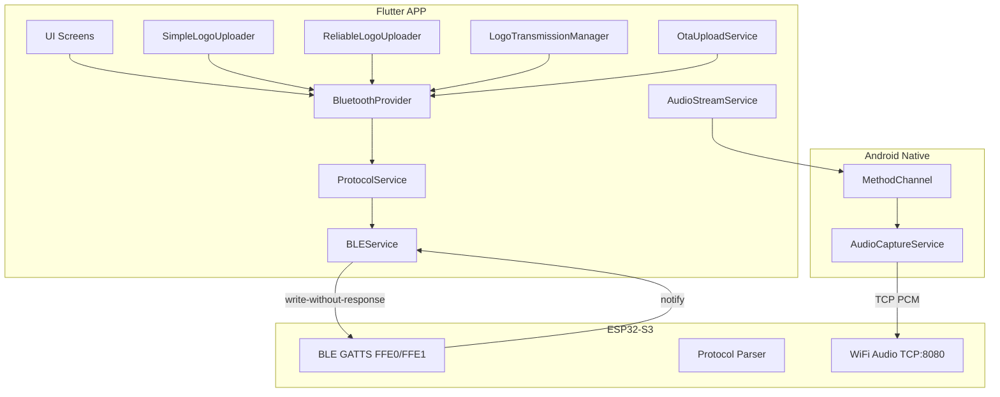
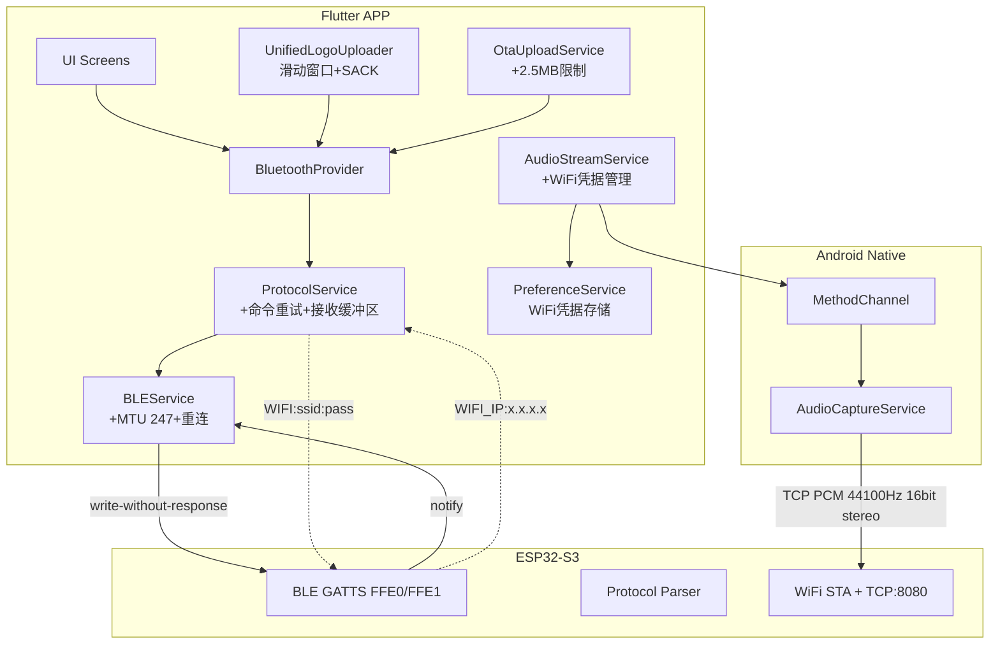
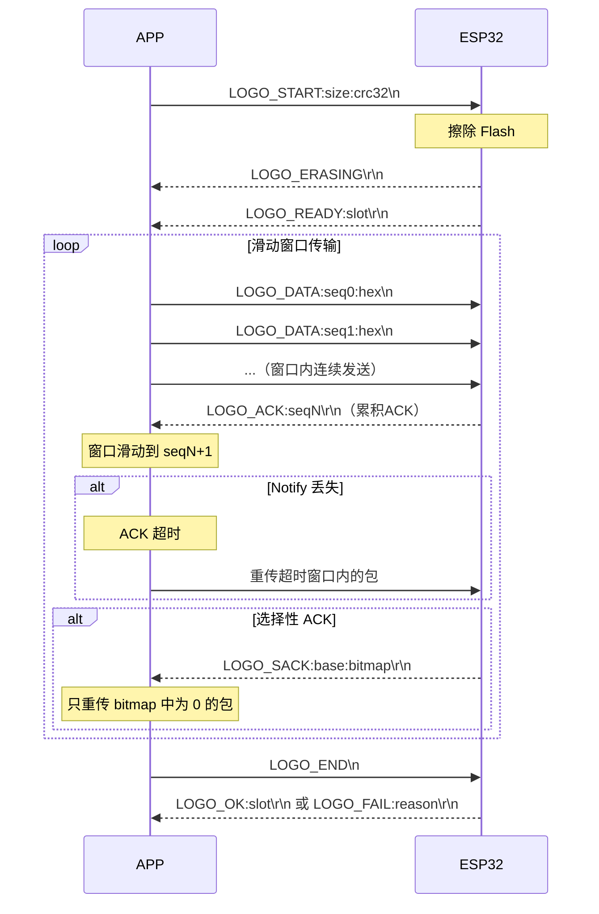

# 设计文档：Flutter APP 适配 ESP32 硬件

## 概述

本设计文档描述 RideWind Flutter APP 适配 ESP32-S3 硬件所需的全部架构变更和实现方案。核心目标是在保持与 F4 旧设备兼容的前提下，适配 ESP32 的新特性：片上 BLE（notify 可能丢失）、WiFi 音频投射（替代 A2DP）、14 色预设、统一 Logo 上传协议、新音量命令格式等。

### 设计原则

1. **ESP 端兼容 APP 现有协议** — APP 端做针对性适配，不重写协议层
2. **向后兼容** — 同时支持 ESP32（T1）和 F4（JDY/BT05/HC）设备
3. **统一实现** — 合并三个 Logo 上传器为一个可靠的滑动窗口实现
4. **可靠通信** — 针对 ESP32 片上 BLE 的 notify 丢失问题增加超时重试
5. **渐进式修改** — 在现有架构上修改，不引入新的状态管理框架

### 影响范围

| 模块 | 变更类型 | 影响文件 |
|------|---------|---------|
| BLE 服务层 | 修改 | `ble_service.dart` |
| 协议服务层 | 修改 | `protocol_service.dart` |
| Logo 上传 | 重构+删除 | `logo_transmission_manager.dart`, 删除 `simple_logo_uploader.dart`, `reliable_logo_uploader.dart` |
| 音频投射 | 修改 | `audio_stream_service.dart`, `audio_stream_screen.dart` |
| OTA 升级 | 修改 | `ota_upload_service.dart` |
| 蓝牙 Provider | 修改 | `bluetooth_provider.dart` |
| 预设 UI | 修改 | `color_ring_screen.dart` 及相关 |
| 旧代码清理 | 删除 | `jdy08_bluetooth_service.dart`, `bluetooth_service.dart` 等 |

## 架构

### 当前架构



### 目标架构



### 关键架构决策

**决策 1：保留 BLEService + ProtocolService 分层架构**
- 理由：现有分层清晰，BLEService 负责物理连接，ProtocolService 负责协议解析
- 修改方式：在 ProtocolService 中增加命令重试和接收缓冲区管理

**决策 2：统一 Logo 上传器为 LogoTransmissionManager**
- 理由：三个实现维护成本高，且 LogoTransmissionManager 已有最完善的滑动窗口实现
- 方案：以 LogoTransmissionManager 为基础重构，删除 SimpleLogoUploader 和 ReliableLogoUploader

**决策 3：WiFi 音频投射保持 Android MethodChannel 架构**
- 理由：AudioPlaybackCapture 是 Android 原生 API，必须通过 MethodChannel 调用
- 增强：在 Flutter 层增加 WiFi 凭据管理（SharedPreferences）

**决策 4：设备类型自动检测而非手动选择**
- 理由：用户不应关心硬件版本
- 方案：通过设备名（T1 = ESP32，JDY/BT05/HC = F4）自动判断，调整协议行为

## 组件与接口

### 1. BLEService 修改

现有 BLEService 已基本满足需求（MTU 247、write-without-response、指数退避重连）。需要的修改：

```dart
/// BLEService 新增/修改接口
class BLEService {
  // 现有接口保持不变

  /// 设备类型枚举（新增）
  DeviceType get deviceType; // esp32 | f4 | unknown

  /// 连接后根据设备名自动判断设备类型
  /// T1 → esp32, JDY/BT05/HC → f4
  Future<bool> _connectInternal(BluetoothDevice device);
}

enum DeviceType { esp32, f4, unknown }
```

### 2. ProtocolService 修改

ProtocolService 是变更最大的模块，需要：
- 增加命令重试机制（需求 6.1）
- 增加接收缓冲区溢出保护（需求 6.4, 6.5）
- 扩展预设范围 1-14（需求 3）
- 新增 ESP32 响应格式解析（需求 2）
- 音量命令格式切换（需求 8）
- 移除 F4 特有音频命令（需求 8.3）

```dart
/// ProtocolService 新增接口
class ProtocolService {
  // ── 命令重试机制（需求 6.1）──
  /// 发送命令并等待响应，超时自动重试（最多 2 次）
  Future<String?> sendCommandWithRetry(
    String command, {
    String expectedPrefix,    // 期望响应前缀
    Duration timeout = const Duration(seconds: 3),
    int maxRetries = 2,
  });

  // ── ESP32 新响应解析（需求 2）──
  /// 解析 LOGO_SLOTS:v0:v1:v2:active 响应
  Map<String, dynamic>? parseLogoSlots(String response);

  /// 解析 OK:STREAMLIGHT:x 响应
  bool? parseStreamlightOkResponse(String response);

  /// 解析 WIFI_IP:x.x.x.x 响应
  String? parseWifiIp(String response);

  /// 解析 AUDIO_READY:ip:port 响应
  Map<String, dynamic>? parseAudioReady(String response);

  /// 解析 WIFI_ERR:reason 响应
  String? parseWifiError(String response);

  /// 解析 VOL:xx 响应（需求 8）
  int? parseVolumeResponse(String response);

  // ── 音量命令适配（需求 8）──
  /// 设置音量 — ESP32 用 VOL:xx，F4 用 AUDIO:VOL:xx
  Future<bool> setVolume(int volume);

  /// 查询音量 — ESP32 用 GET:VOL
  Future<bool> getVolume();

  // ── 预设范围扩展（需求 3）──
  /// setLEDPreset 范围从 1-12 扩展为 1-14
  /// parsePresetReport 范围从 1-12 扩展为 1-14
}
```

### 3. UnifiedLogoUploader（统一 Logo 上传器）

以现有 LogoTransmissionManager 为基础重构，整合三个实现的优点：

```dart
/// 统一 Logo 上传器
class UnifiedLogoUploader {
  final BluetoothProvider btProvider;

  // ── 配置参数 ──
  int windowSize;           // 默认 40，可配置
  static const int chunkSize = 16;  // 每包 16 字节
  static const int maxRetries = 10; // 最大重试次数

  // ── 回调接口（需求 4.7）──
  Function(double)? onProgress;       // 0.0-1.0
  Function(TransmissionState)? onStateChange;
  Function(String)? onError;
  Function(TransmissionStats)? onComplete;

  /// 上传 Logo 图片
  /// [imageData] 240×240 RGB565 格式，115200 字节
  /// [slot] 目标槽位（0-2），null 表示自动分配
  Future<bool> upload(Uint8List imageData, {int? slot});

  /// 取消上传
  void cancel();
}
```

**滑动窗口协议流程：**



### 4. AudioStreamService 增强

```dart
/// WiFi 音频投射服务增强
class AudioStreamService {
  // 现有 MethodChannel 接口保持不变

  // ── WiFi 凭据管理（需求 11）──
  /// 保存 WiFi 凭据到 SharedPreferences
  static Future<void> saveWifiCredentials(String ssid, String password);

  /// 加载已保存的 WiFi 凭据
  static Future<Map<String, String>?> loadWifiCredentials();

  /// 清除已保存的 WiFi 凭据
  static Future<void> clearWifiCredentials();
}
```

### 5. OtaUploadService 修改

```dart
/// OTA 升级服务修改
class OtaUploadService {
  // 需求 7.4：最大固件大小从 960KB 调整为 2.5MB
  static const int maxFirmwareSize = 2560 * 1024; // 2.5MB

  // 需求 7.1：OTA_START 命令增加 CRC32
  // 格式: OTA_START:size:crc32\n
}
```

### 6. BluetoothProvider 修改

```dart
/// BluetoothProvider 修改
class BluetoothProvider {
  // ── 设备类型感知 ──
  DeviceType get deviceType;

  // ── 连接后状态同步增强（需求 10）──
  Future<void> _syncHardwareStateOnConnect() async {
    await sendCommand('GET:ALL\n');
    await sendCommand('GET:PRESET\n');
    await sendCommand('GET:LOGO_SLOTS\n');  // 新增
    await sendCommand('GET:VOL\n');          // 新增
    await sendCommand('GET:STREAMLIGHT\n');
  }

  // ── 音量控制适配（需求 8）──
  /// 设置音量（自动选择 VOL:xx 或 AUDIO:VOL:xx）
  Future<bool> setVolume(int volume);

  // ── 移除 F4 特有音频方法（需求 8.3）──
  // audioPlay, audioStop, audioPause, audioResume, audioNext, audioPrev
  // 标记为 @deprecated 或直接移除
}
```

## 数据模型

### 协议命令格式对照表

| 功能 | APP → ESP32 | ESP32 → APP | 备注 |
|------|------------|-------------|------|
| 风扇速度 | `FAN:xx\n` | `OK:FAN:xx\r\n` | 不变 |
| 雾化器 | `WUHUA:x\n` | `OK:WUHUA:x\r\n` | 不变 |
| 亮度 | `BRIGHT:xx\n` | `OK:BRIGHT:xx\r\n` | 不变 |
| 预设 | `PRESET:xx\n` | `OK:PRESET:xx\r\n` | 范围 1-14 |
| 流水灯 | `STREAMLIGHT:x\n` | `OK:STREAMLIGHT:x\r\n` | 新增 OK 格式 |
| 音量 | `VOL:xx\n` | `VOL:xx\r\n` | **新格式**，替代 AUDIO:VOL:xx |
| LED 颜色 | `LED:s:r:g:b\n` | `OK:LED\r\n` | 不变 |
| LED 渐变 | `LED_GRADIENT:s:r:g:b:speed\n` | `OK:LED_GRADIENT\r\n` | 不变 |
| 速度 | `SPEED:xxx\n` | `OK:SPEED\r\n` | 不变 |
| WiFi 连接 | `WIFI:ssid:pass\n` | `WIFI_IP:x.x.x.x\r\n` | **新增** |
| WiFi 错误 | — | `WIFI_ERR:reason\r\n` | **新增** |
| WiFi 扫描 | `WIFI_SCAN\n` | `WIFI_SCAN:USE_PHONE\r\n` | **新增** |
| 音频就绪 | — | `AUDIO_READY:ip:port\r\n` | **新增** |
| 查询全部 | `GET:ALL\n` | `STATUS:FAN:x:WUHUA:x:BRIGHT:x\r\n` | 不变 |
| 查询预设 | `GET:PRESET\n` | `PRESET_REPORT:x\r\n` | 范围 1-14 |
| 查询 Logo | `GET:LOGO_SLOTS\n` | `LOGO_SLOTS:v0:v1:v2:active\r\n` | **新格式** |
| 查询音量 | `GET:VOL\n` | `VOL:xx\r\n` | **新增** |
| 查询流水灯 | `GET:STREAMLIGHT\n` | `STREAMLIGHT:x\r\n` | 不变 |
| Logo 开始 | `LOGO_START:size:crc32\n` | `LOGO_READY:slot\r\n` | 支持自动/指定槽位 |
| Logo 数据 | `LOGO_DATA:seq:hex\n` | `LOGO_ACK:seq\r\n` | 累积 ACK |
| Logo SACK | — | `LOGO_SACK:base:bitmap\r\n` | **新增**选择性 ACK |
| Logo 结束 | `LOGO_END\n` | `LOGO_OK:slot\r\n` | 含槽位信息 |
| Logo 删除 | `LOGO_DELETE:slot\n` | `OK:LOGO_DELETE\r\n` | 不变 |
| Logo 错误 | — | `LOGO_ERROR:reason\r\n` | MEM/INVALID_SLOT/SIZE_MISMATCH |
| OTA 开始 | `OTA_START:size:crc32\n` | `OTA_READY\r\n` | 增加 CRC32 |
| OTA 数据 | `OTA_DATA:seq:hex\n` | `OTA_ACK:seq\r\n` | 不变 |
| OTA 结束 | `OTA_END\n` | `OTA_OK\r\n` | 不变 |
| OTA 失败 | — | `OTA_FAIL:reason\r\n` | 不变 |

### 响应行终止符规则

- **命令确认**（OK:xxx）：以 `\r\n` 结尾
- **事件报告**（SPEED_REPORT、PRESET_REPORT 等）：以 `\n` 结尾
- **APP 发送的命令**：以 `\n` 结尾

ProtocolService 的接收缓冲区必须同时处理 `\r\n` 和 `\n` 两种行终止符。当前实现已在 `_handleReceivedData` 中按 `\n` 分割并 `trim()` 处理 `\r`，无需修改分割逻辑。

### Logo 槽位数据模型

```dart
/// Logo 槽位状态
class LogoSlotStatus {
  final bool slot0Valid;  // 槽位 0 是否有有效 Logo
  final bool slot1Valid;  // 槽位 1 是否有有效 Logo
  final bool slot2Valid;  // 槽位 2 是否有有效 Logo
  final int activeSlot;   // 当前活跃槽位索引 (0-2, -1=无)

  LogoSlotStatus({
    required this.slot0Valid,
    required this.slot1Valid,
    required this.slot2Valid,
    required this.activeSlot,
  });

  /// 从 "LOGO_SLOTS:v0:v1:v2:active" 解析
  factory LogoSlotStatus.fromProtocol(String response);
}
```

### 预设颜色扩展数据

```dart
/// 14 种预设颜色定义
const List<PresetColor> presetColors = [
  // 1-12: 与 F4 相同
  PresetColor(1, 'Red', Color(0xFFFF0000)),
  PresetColor(2, 'Orange', Color(0xFFFF8000)),
  // ... 省略 3-12
  // 13-14: ESP32 新增
  PresetColor(13, 'Ocean Blue', Color(0xFF0066CC)),
  PresetColor(14, 'Warm Amber', Color(0xFFFFBF00)),
];
```

### WiFi 凭据存储模型

```dart
/// WiFi 凭据（存储在 SharedPreferences）
class WifiCredentials {
  final String ssid;
  final String password;
  final DateTime savedAt;

  // SharedPreferences key: 'wifi_ssid', 'wifi_password', 'wifi_saved_at'
}
```


## 正确性属性

*属性（Property）是在系统所有有效执行中都应成立的特征或行为——本质上是对系统应做什么的形式化陈述。属性是人类可读规范与机器可验证正确性保证之间的桥梁。*

### Property 1: BLE 扫描过滤器正确性

*For any* BLE 扫描结果列表，过滤函数应满足：
- 设备名为 "T1" 的结果必须被包含
- 广播数据中包含 Service UUID FFE0 的结果必须被包含
- 设备名包含 "JDY"、"BT05" 或 "HC" 的结果必须被包含（向后兼容）
- 不满足以上任何条件的结果必须被排除

**Validates: Requirements 1.1, 1.4**

### Property 2: 命令超时重试机制

*For any* 需要响应的 BLE 命令，当在 3 秒内未收到预期响应时，系统应自动重发该命令，最多重试 2 次。总共最多发送 3 次（1 次原始 + 2 次重试），且每次重试间隔不少于 3 秒。

**Validates: Requirements 1.5, 6.1**

### Property 3: 协议响应解析往返一致性

*For any* 有效的协议响应参数组合（包括 LOGO_SLOTS 的 v0/v1/v2/active、WIFI_IP 的 IP 地址、VOL 的音量值 0-100），将参数格式化为协议字符串后再解析，应得到与原始参数相同的值。

**Validates: Requirements 2.1, 2.3, 2.5**

### Property 4: 未知响应鲁棒性

*For any* 不符合已知协议格式的随机字符串，ProtocolService 的解析流程不应抛出异常，不应导致状态损坏，且后续正常协议响应仍能被正确解析。

**Validates: Requirements 2.6**

### Property 5: 行终止符等价性

*For any* 有效的协议命令字符串，无论以 `\r\n` 还是 `\n` 结尾，ProtocolService 的接收缓冲区分割和解析结果应完全相同。

**Validates: Requirements 2.7**

### Property 6: 预设索引范围验证

*For any* 整数值 n：
- 当 1 ≤ n ≤ 14 时，`setLEDPreset(n)` 应接受该值并发送命令
- 当 n < 1 或 n > 14 时，`setLEDPreset(n)` 应拒绝该值
- 当 1 ≤ n ≤ 14 时，`parsePresetReport("PRESET_REPORT:$n")` 应返回 n
- 当 n < 1 或 n > 14 时，`parsePresetReport("PRESET_REPORT:$n")` 应返回 null

**Validates: Requirements 3.1, 3.2, 3.3**

### Property 7: 滑动窗口不变量

*For any* 滑动窗口状态和任意序列的 ACK/超时事件，以下不变量必须始终成立：
`sendBase ≤ nextSeqNum ≤ sendBase + windowSize`
且 `sendBase ≤ totalPackets`。

**Validates: Requirements 4.2**

### Property 8: CRC32 算法一致性

*For any* 字节数组，APP 端 `Crc32.calculate()` 的输出应与 ESP32 端 `crc32_calculate()` 使用相同查找表（多项式 0xEDB88320）计算的结果完全一致。可通过已知测试向量和随机数据双重验证。

**Validates: Requirements 4.4**

### Property 9: 上传进度单调性

*For any* Logo 或 OTA 上传过程中的 ACK 事件序列，进度回调值应满足：
- 始终在 [0.0, 1.0] 范围内
- 单调非递减（每次回调值 ≥ 上次回调值）
- 传输完成时最终值为 1.0

**Validates: Requirements 4.7**

### Property 10: MTU 分片重组正确性

*For any* 有效的协议命令字符串，将其拆分为任意大小的片段（模拟 BLE MTU 分片），依次送入 ProtocolService 的接收缓冲区后，应能正确重组并解析出与原始命令相同的结果。

**Validates: Requirements 6.4**

### Property 11: 十六进制编码往返一致性

*For any* 字节数组（长度 1-16），将其编码为十六进制字符串后再解码，应得到与原始字节数组完全相同的数据。这确保 LOGO_DATA 和 OTA_DATA 的数据完整性。

**Validates: Requirements 7.2**

### Property 12: 音量命令格式设备适配

*For any* 音量值 v（0-100）和设备类型：
- ESP32 设备应生成 `VOL:$v\n` 格式命令
- F4 设备应生成 `AUDIO:VOL:$v\n` 格式命令
- 无论设备类型，v < 0 或 v > 100 应被拒绝

**Validates: Requirements 8.1**

### Property 13: WiFi 凭据存储往返一致性

*For any* 有效的 WiFi SSID 和密码字符串对，保存到 SharedPreferences 后再加载，应得到与原始值完全相同的 SSID 和密码。

**Validates: Requirements 11.1**

### Property 14: Logo 图片转换输出尺寸

*For any* 输入图片（任意尺寸），经过 240×240 裁剪/缩放和 RGB565 编码后，输出字节数组的长度应恒等于 115200 字节（240 × 240 × 2）。

**Validates: Requirements 14.3**

## 错误处理

### BLE 通信错误

| 错误场景 | 处理策略 | 用户反馈 |
|---------|---------|---------|
| BLE 连接断开 | 指数退避自动重连（最多 5 次） | 显示 "正在重连..." 状态 |
| 命令响应超时 | 自动重试 2 次，每次 3 秒超时 | 重试耗尽后显示 "设备响应超时" |
| MTU 协商失败 | 回退到默认 20 字节有效载荷 | 无用户提示，日志记录 |
| 扫描无结果 | 提示用户检查设备电源和距离 | 显示 "未找到设备" |

### Logo 上传错误

| 错误场景 | ESP32 响应 | APP 处理 | 用户反馈 |
|---------|-----------|---------|---------|
| 内存不足 | `LOGO_ERROR:MEM` | 中止上传 | "设备内存不足" |
| 槽位无效 | `LOGO_ERROR:INVALID_SLOT` | 中止上传 | "Logo 槽位无效" |
| 大小不匹配 | `LOGO_ERROR:SIZE_MISMATCH` | 中止上传 | "图片大小不匹配" |
| CRC 校验失败 | `LOGO_FAIL:CRC` | 可重试 | "数据校验失败，请重试" |
| 写入失败 | `LOGO_FAIL:WRITE` | 可重试 | "写入失败，请重试" |
| ACK 超时（10 次） | — | 中止上传 | "传输超时，请检查连接" |
| BLE 断连 | — | 中止上传 | "蓝牙连接断开" |

### OTA 升级错误

| 错误场景 | 处理策略 | 用户反馈 |
|---------|---------|---------|
| 固件过大（>2.5MB） | 拒绝上传 | "固件文件过大，最大支持 2.5MB" |
| OTA_FAIL:CRC | 中止，ESP32 自动回滚 | "校验失败，设备已回滚到上一版本" |
| BLE 断连 | 中止，ESP32 自动回滚 | "连接断开，设备将自动回滚" |
| ACK 超时 | 重试 3 次后中止 | "传输超时" |

### WiFi 音频错误

| 错误场景 | ESP32 响应 | APP 处理 | 用户反馈 |
|---------|-----------|---------|---------|
| WiFi 密码错误 | `WIFI_ERR:CONNECT_FAILED` | 允许重试 | "WiFi 连接失败，请检查密码" |
| TCP 连接失败 | — | 自动重连 | "连接失败，确认已连 WiFi" |
| Android < 10 | — | 禁用功能 | "音频投射需要 Android 10 或更高版本" |

### 接收缓冲区保护

- 缓冲区超过 512 字节未收到 `\n`：清空缓冲区，记录警告日志
- BluetoothProvider 层缓冲区超过 1024 字节：清空缓冲区，记录警告日志
- 两层缓冲区独立保护，防止内存泄漏

## 测试策略

### 测试框架选择

- **单元测试**：`flutter_test`（Flutter 内置）
- **属性测试**：`glados`（Dart 属性测试库）
- **集成测试**：`integration_test`（Flutter 内置）
- **Mock**：`mockito` + `build_runner`

### 属性测试配置

- 每个属性测试最少运行 **100 次迭代**
- 每个属性测试必须以注释引用设计文档中的属性编号
- 标签格式：`// Feature: flutter-esp32-adaptation, Property N: 属性描述`

### 测试分层

#### 属性测试（Property-Based Tests）

| 属性 | 测试文件 | 生成器 |
|------|---------|--------|
| P1: BLE 扫描过滤器 | `test/services/ble_scan_filter_test.dart` | 随机设备名 + UUID 组合 |
| P2: 命令重试机制 | `test/services/command_retry_test.dart` | 随机命令类型 + 超时序列 |
| P3: 协议解析往返 | `test/services/protocol_parse_roundtrip_test.dart` | 随机参数值 |
| P4: 未知响应鲁棒性 | `test/services/protocol_robustness_test.dart` | 随机字符串 |
| P5: 行终止符等价 | `test/services/line_terminator_test.dart` | 随机命令 + 随机终止符 |
| P6: 预设范围验证 | `test/services/preset_range_test.dart` | 随机整数 |
| P7: 滑动窗口不变量 | `test/services/sliding_window_invariant_test.dart` | 随机 ACK/超时事件序列 |
| P8: CRC32 一致性 | `test/utils/crc32_consistency_test.dart` | 随机字节数组 |
| P9: 进度单调性 | `test/services/progress_monotonicity_test.dart` | 随机 ACK 序列 |
| P10: MTU 分片重组 | `test/services/mtu_reassembly_test.dart` | 随机命令 + 随机分片大小 |
| P11: 十六进制往返 | `test/utils/hex_roundtrip_test.dart` | 随机字节数组 (1-16 字节) |
| P12: 音量命令适配 | `test/services/volume_command_test.dart` | 随机音量值 + 设备类型 |
| P13: WiFi 凭据往返 | `test/services/wifi_credentials_test.dart` | 随机 SSID/密码字符串 |
| P14: 图片转换尺寸 | `test/services/image_conversion_test.dart` | 随机尺寸图片 |

#### 单元测试（Example-Based Tests）

- **ProtocolService 解析**：各种 OK:xxx 响应格式、边界值
- **BLEService 配置**：MTU 值、连接参数、write 模式
- **OTA 流程**：状态机转换、固件大小校验
- **音频投射 UI**：状态指示器、WiFi 列表渲染
- **设备状态同步**：连接后 GET:ALL 等查询序列
- **错误消息映射**：各种 LOGO_ERROR/LOGO_FAIL/OTA_FAIL 原因

#### 集成测试

- **BLE 连接全流程**：扫描 → 连接 → MTU 协商 → 服务发现 → 状态同步
- **Logo 上传全流程**：图片选择 → 转换 → 上传 → 校验
- **WiFi 音频全流程**：WiFi 扫描 → 连接 → 音频投射 → 停止
- **OTA 升级全流程**：固件选择 → 上传 → 校验 → 重启

### Mock 策略

- **BLEService**：Mock `flutter_blue_plus` 的 `BluetoothDevice`、`BluetoothCharacteristic`
- **SharedPreferences**：使用 `SharedPreferences.setMockInitialValues({})`
- **MethodChannel**：使用 `TestDefaultBinaryMessengerBinding` mock Android 原生调用
- **滑动窗口测试**：Mock BLE 发送/接收，模拟 ACK 丢失和延迟
