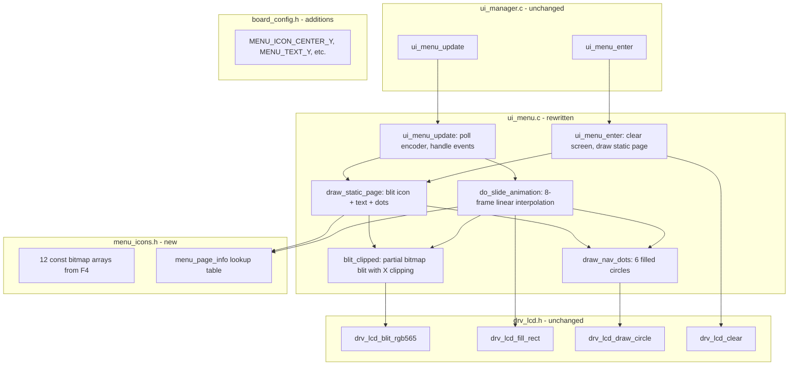

# Design Document: Menu Wheel Redesign

## Overview

This design replaces the current UI5 scanline-compositing text menu with a full-screen bitmap-based menu using slide transition animations on the 240×240 GC9A01 round LCD. Each menu page displays one centered icon bitmap and one centered text bitmap (both from the F4 STM32 project's existing arrays), plus 6 navigation dots. Page transitions use an 8-frame linear slide animation at 12ms per frame (~96ms total).

The redesign touches three files:
- `menu_icons.h` — new file: bitmap data + lookup table
- `ui_menu.c` — complete rewrite: bitmap blit rendering, slide animation, encoder handling
- `board_config.h` — additions: menu layout constants

`ui_manager.c` remains unchanged — it already dispatches `ui_menu_enter()` / `ui_menu_update()` for UI5.

## Architecture



### Data Flow

1. `ui_manager_update()` calls `ui_menu_update()` every 20ms (LCD refresh cycle)
2. `ui_menu_update()` checks `auto_enter` flag first, then polls encoder events
3. Encoder rotation accumulates delta; when threshold (±2) reached with 150ms debounce, triggers `do_slide_animation()`
4. `do_slide_animation()` clears the icon+text zone, then renders 8 frames with linearly interpolated X positions for outgoing and incoming bitmaps
5. Each frame uses `blit_clipped()` to handle partially off-screen bitmaps during animation
6. After animation completes, `draw_static_page()` renders the final centered state
7. Encoder click triggers `ui_manager_set_ui()` to enter the selected sub-UI

## Components and Interfaces

### menu_icons.h

Contains the 12 F4 bitmap arrays (6 icons + 6 text labels) as `const uint16_t` arrays in Flash, plus a lookup table struct.

```c
#pragma once
#include <stdint.h>

/* ── Bitmap arrays (from F4 取模数组/) ── */
/* Icons */
extern const uint16_t gImage_fengsu_68_58[];      /* Speed icon:  68×58 */
extern const uint16_t gImage_tiaosepan_74_74[];    /* Color icon:  74×74 */
extern const uint16_t gImage_rgbtubiao[];          /* RGB icon:    65×68 */
extern const uint16_t gImage_brighttubiao[];       /* Bright icon: 72×72 */
extern const uint16_t gImage_logotubiao[];         /* Logo icon:   68×68 */
extern const uint16_t gImage_voicetubiao[];        /* Volume icon: 73×58 */

/* Text labels */
extern const uint16_t gImage_speed_99_33[];        /* "Speed":  99×33 */
extern const uint16_t gImage_new_color[];          /* "Color":  88×31 */
extern const uint16_t gImage_rgb[];                /* "RGB":    72×27 */
extern const uint16_t gImage_bright[];             /* "Bright": 103×33 */
extern const uint16_t gImage_logo[];               /* "Logo":   79×33 */
extern const uint16_t gImage_voice[];              /* "Volume": 90×27 */

/* ── Lookup table ── */
typedef struct {
    const uint16_t *icon;
    uint16_t        icon_w;
    uint16_t        icon_h;
    const uint16_t *text;
    uint16_t        text_w;
    uint16_t        text_h;
    uint8_t         target_ui;   /* Sub-UI to enter on click */
} menu_page_info_t;

#define MENU_PAGE_COUNT  6

extern const menu_page_info_t menu_pages[MENU_PAGE_COUNT];
```

The actual bitmap data will be included in a `.c` file that `#include`s the raw array files from `取模数组/`, casting from `unsigned char` to `uint16_t` pointer. The lookup table:

| Index | Page   | Icon Array              | Icon W×H | Text Array           | Text W×H | Target UI |
|-------|--------|-------------------------|-----------|----------------------|-----------|-----------|
| 0     | Speed  | gImage_fengsu_68_58     | 68×58     | gImage_speed_99_33   | 99×33     | 1         |
| 1     | Color  | gImage_tiaosepan_74_74  | 74×74     | gImage_new_color     | 88×31     | 2         |
| 2     | RGB    | gImage_rgbtubiao        | 65×68     | gImage_rgb           | 72×27     | 3         |
| 3     | Bright | gImage_brighttubiao     | 72×72     | gImage_bright        | 103×33    | 4         |
| 4     | Logo   | gImage_logotubiao       | 68×68     | gImage_logo          | 79×33     | 6         |
| 5     | Volume | gImage_voicetubiao      | 73×58     | gImage_voice         | 90×27     | 7         |

Note: The F4 arrays are declared as `const unsigned char[]`. Since `drv_lcd_blit_rgb565()` expects `const uint16_t *`, the lookup table stores cast pointers: `(const uint16_t *)gImage_fengsu_68_58`.

### board_config.h additions

```c
/* ── Menu layout (matching F4 parameters) ── */
#define MENU_ICON_CENTER_Y      90
#define MENU_TEXT_Y             155
#define MENU_DOT_Y              205
#define MENU_DOT_SPACING        15
#define MENU_DOT_RADIUS         3
#define MENU_DOT_ACTIVE_COLOR   0xFFFF   /* White */
#define MENU_DOT_INACTIVE_COLOR 0x4208   /* Dark gray */
#define MENU_ANIM_FRAMES        8
#define MENU_ANIM_FRAME_DELAY   12       /* ms */
#define MENU_PAGE_COUNT         6

/* Animation zone: vertical region cleared during slide */
#define MENU_ANIM_ZONE_TOP      50
#define MENU_ANIM_ZONE_BOTTOM   190
```

The existing `MENU_SWITCH_DEBOUNCE_MS` (150) and `MENU_DELTA_THRESHOLD` (2) in board_config.h are already defined and will be reused.

### ui_menu.c — Rewritten Module

#### Static State

```c
static int16_t  s_accum     = 0;       /* Encoder accumulator */
static uint32_t s_last_tick = 0;       /* Last page-switch timestamp (ms) */
static uint8_t  s_need_redraw = 0;     /* Flag: full redraw needed */
```

#### Key Functions

**`ui_menu_enter(void)`**
- Reset `s_accum = 0`, set `s_need_redraw = 1`

**`ui_menu_update(void)`**
1. Check `auto_enter` → if set, call `ui_manager_set_ui()` and return
2. If `s_need_redraw`, call `drv_lcd_clear(0x0000)` then `draw_static_page()`
3. Poll encoder events in a loop:
   - `ENC_EVT_ROTATE`: accumulate delta, check threshold + debounce → trigger slide
   - `ENC_EVT_CLICK`: enter selected sub-UI via `ui_manager_set_ui()`

**`draw_static_page(uint8_t page_idx)`**
1. Look up `menu_pages[page_idx]`
2. Compute icon X: `(240 - icon_w) / 2`
3. Compute icon Y: `MENU_ICON_CENTER_Y - icon_h / 2`
4. Call `drv_lcd_blit_rgb565(icon_x, icon_y, icon_w, icon_h, icon_data)`
5. Compute text X: `(240 - text_w) / 2`
6. Call `drv_lcd_blit_rgb565(text_x, MENU_TEXT_Y, text_w, text_h, text_data)`
7. Call `draw_nav_dots(page_idx)`

**`draw_nav_dots(uint8_t active_idx)`**
1. Clear dot row: `drv_lcd_fill_rect(0, MENU_DOT_Y - MENU_DOT_RADIUS, 240, MENU_DOT_RADIUS * 2 + 1, 0x0000)`
2. Compute start X to center 6 dots: `start_x = 120 - (5 * MENU_DOT_SPACING) / 2`
3. For each dot i=0..5:
   - `cx = start_x + i * MENU_DOT_SPACING`
   - If `i == active_idx`: `drv_lcd_draw_circle(cx, MENU_DOT_Y, MENU_DOT_RADIUS, MENU_DOT_ACTIVE_COLOR, true)`
   - Else: `drv_lcd_draw_circle(cx, MENU_DOT_Y, MENU_DOT_RADIUS, MENU_DOT_INACTIVE_COLOR, true)`

**`do_slide_animation(uint8_t cur_page, int8_t direction)`** → returns new page index
1. Compute `new_page = (cur_page + direction + MENU_PAGE_COUNT) % MENU_PAGE_COUNT`
2. Update dots immediately: `draw_nav_dots(new_page)`
3. For frame = 0..7:
   - `progress = frame * 240 / (MENU_ANIM_FRAMES - 1)` (0 to 240)
   - Outgoing X offset: `direction > 0 ? -progress : +progress`
   - Incoming X offset: `direction > 0 ? (240 - progress) : -(240 - progress)`
   - Clear animation zone: `drv_lcd_fill_rect(0, MENU_ANIM_ZONE_TOP, 240, MENU_ANIM_ZONE_BOTTOM - MENU_ANIM_ZONE_TOP, 0x0000)`
   - Blit outgoing icon+text at offset positions (with clipping)
   - Blit incoming icon+text at offset positions (with clipping)
   - `vTaskDelay(pdMS_TO_TICKS(MENU_ANIM_FRAME_DELAY))`
4. Draw final static page: `draw_static_page(new_page)`
5. Return `new_page`

**`blit_clipped(const uint16_t *data, uint16_t w, uint16_t h, int16_t x, uint16_t y)`**
Handles partial off-screen blitting during animation:
1. If `x + w <= 0` or `x >= 240`: skip entirely (fully off-screen)
2. Compute visible region:
   - `src_x_offset = (x < 0) ? -x : 0`
   - `dst_x = (x < 0) ? 0 : x`
   - `visible_w = min(w - src_x_offset, 240 - dst_x)`
3. For each row `r = 0..h-1`:
   - `drv_lcd_blit_rgb565(dst_x, y + r, visible_w, 1, &data[r * w + src_x_offset])`

This row-by-row approach is necessary because `drv_lcd_blit_rgb565` expects contiguous pixel data, but clipped rows are non-contiguous in the source array.

### Animation Algorithm Detail

The slide animation uses linear interpolation of X positions across 8 frames:

```
Frame 0: progress = 0     → outgoing centered, incoming fully off-screen
Frame 1: progress = 34    → outgoing shifted 34px, incoming 206px from edge
Frame 2: progress = 68    → ...
...
Frame 7: progress = 240   → outgoing fully off-screen, incoming centered
```

For a rightward scroll (direction = +1, next page slides in from right):
- Outgoing icon center X: `120 - progress`
- Incoming icon center X: `120 + (240 - progress)`

For a leftward scroll (direction = -1, next page slides in from left):
- Outgoing icon center X: `120 + progress`
- Incoming icon center X: `120 - (240 - progress)`

The icon and text X positions are computed from their center X by subtracting half their width. The `blit_clipped()` function handles the case where part of the bitmap is off-screen.

### Circular Wrap

```c
static uint8_t wrap_page(int8_t idx) {
    return (uint8_t)((idx % MENU_PAGE_COUNT + MENU_PAGE_COUNT) % MENU_PAGE_COUNT);
}
```

## Data Models

### menu_page_info_t

```c
typedef struct {
    const uint16_t *icon;       /* Pointer to icon bitmap array in Flash */
    uint16_t        icon_w;     /* Icon width in pixels */
    uint16_t        icon_h;     /* Icon height in pixels */
    const uint16_t *text;       /* Pointer to text label bitmap array in Flash */
    uint16_t        text_w;     /* Text width in pixels */
    uint16_t        text_h;     /* Text height in pixels */
    uint8_t         target_ui;  /* UI index to enter on click (1,2,3,4,6,7) */
} menu_page_info_t;
```

### Static Lookup Table (const, in Flash)

```c
const menu_page_info_t menu_pages[MENU_PAGE_COUNT] = {
    { (const uint16_t *)gImage_fengsu_68_58,    68, 58,
      (const uint16_t *)gImage_speed_99_33,     99, 33, 1 },
    { (const uint16_t *)gImage_tiaosepan_74_74, 74, 74,
      (const uint16_t *)gImage_new_color,       88, 31, 2 },
    { (const uint16_t *)gImage_rgbtubiao,       65, 68,
      (const uint16_t *)gImage_rgb,             72, 27, 3 },
    { (const uint16_t *)gImage_brighttubiao,    72, 72,
      (const uint16_t *)gImage_bright,         103, 33, 4 },
    { (const uint16_t *)gImage_logotubiao,      68, 68,
      (const uint16_t *)gImage_logo,            79, 33, 6 },
    { (const uint16_t *)gImage_voicetubiao,     73, 58,
      (const uint16_t *)gImage_voice,           90, 27, 7 },
};
```

### Flash Footprint

| Array                    | Bytes  |
|--------------------------|--------|
| gImage_fengsu_68_58      | 7,888  |
| gImage_tiaosepan_74_74   | 10,952 |
| gImage_rgbtubiao         | 8,840  |
| gImage_brighttubiao      | 10,368 |
| gImage_logotubiao        | 9,248  |
| gImage_voicetubiao       | 8,468  |
| gImage_speed_99_33       | 6,534  |
| gImage_new_color         | 5,464  |
| gImage_rgb               | 3,888  |
| gImage_bright            | 6,798  |
| gImage_logo              | 5,214  |
| gImage_voice             | 4,860  |
| **Total**                | **88,522** (~86KB) |

Note: Total is ~86KB, higher than the ~50-60KB estimate in requirements. This is the actual size of the F4 arrays. The larger icons (74×74, 72×72, 68×68) contribute significantly. This is acceptable for an ESP32-S3 with several MB of Flash.

### RAM Usage

- No bitmap RAM buffers needed — all bitmaps are blitted directly from Flash via `drv_lcd_blit_rgb565()`
- Static variables: ~8 bytes (`s_accum`, `s_last_tick`, `s_need_redraw`)
- Stack during animation: minimal (local variables for position calculations)


## Correctness Properties

*A property is a characteristic or behavior that should hold true across all valid executions of a system — essentially, a formal statement about what the system should do. Properties serve as the bridge between human-readable specifications and machine-verifiable correctness guarantees.*

### Property 1: Bitmap centering computation

*For any* valid bitmap width w in [1, 240], the centering formula `x = (240 - w) / 2` SHALL produce an X coordinate such that the bitmap's horizontal midpoint is within 1 pixel of the screen center (120).

**Validates: Requirements 1.1, 1.3**

### Property 2: Animation position interpolation

*For any* frame index f in [0, MENU_ANIM_FRAMES-1] and any direction d in {-1, +1}, the animation displacement SHALL equal `f * 240 / (MENU_ANIM_FRAMES - 1)`, the outgoing page SHALL move away from center, the incoming page SHALL move toward center, and at frame 0 both pages overlap their start positions while at the final frame the incoming page is centered.

**Validates: Requirements 2.2, 2.4**

### Property 3: Encoder trigger condition

*For any* accumulator value a and time delta t (ms since last switch), the page switch SHALL trigger if and only if `|a| >= MENU_DELTA_THRESHOLD` AND `t >= MENU_SWITCH_DEBOUNCE_MS`.

**Validates: Requirements 4.1**

### Property 4: Circular page wrap

*For any* integer i, `wrap_page(i)` SHALL return a value in [0, MENU_PAGE_COUNT-1], and `wrap_page(i + MENU_PAGE_COUNT)` SHALL equal `wrap_page(i)` (periodicity).

**Validates: Requirements 4.4**

## Error Handling

| Scenario | Handling |
|----------|----------|
| `menu_selected` out of range (0 or >6) | Clamp to valid range 1-6 before converting to 0-based index |
| `auto_enter` with invalid `menu_selected` | Ignore (don't transition), clear `auto_enter` flag |
| Encoder poll returns no events | No-op, return from update normally |
| Bitmap blit partially off-screen during animation | `blit_clipped()` computes visible region; fully off-screen bitmaps are skipped |
| `blit_clipped` called with x + w ≤ 0 or x ≥ 240 | Early return, no LCD call |
| vTaskDelay returns early | Animation frame timing is best-effort; no correction needed |

## Testing Strategy

### Unit Tests (example-based)

1. **Lookup table correctness**: Verify all 6 `menu_pages[]` entries have correct target_ui values (1,2,3,4,6,7) and non-null icon/text pointers
2. **Static page rendering sequence**: Mock LCD driver, verify `draw_static_page()` calls `blit_rgb565` twice (icon + text) with correct coordinates
3. **Navigation dot positions**: Verify 6 dots are drawn at expected X positions (83, 98, 113, 128, 143, 158) at Y=205
4. **Active/inactive dot colors**: Verify active dot uses 0xFFFF, inactive uses 0x4208
5. **Dots updated before animation**: Verify `draw_nav_dots()` is called before the animation frame loop
6. **Click enters correct sub-UI**: For each page 0-5, verify click triggers `ui_manager_set_ui()` with the correct target
7. **Auto-enter flag handling**: Set `auto_enter=1`, verify transition occurs and flag is cleared
8. **Encoder drain after switch**: Verify all pending encoder events are consumed after a page switch
9. **Enter clears screen**: Verify `drv_lcd_clear(0x0000)` is called on `ui_menu_enter()`

### Property-Based Tests

Using a C property-based testing approach (e.g., [theft](https://github.com/silentbicycle/theft) or manual randomized test harness):

- Minimum 100 iterations per property test
- Each test tagged with: **Feature: menu-wheel-redesign, Property {N}: {title}**

| Property | Test Description | Generator |
|----------|-----------------|-----------|
| Property 1 | Centering computation | Random uint16_t w in [1, 240] |
| Property 2 | Animation interpolation | Random frame index [0,7] × direction {-1, +1} |
| Property 3 | Encoder trigger condition | Random int16_t accum × uint32_t time_delta |
| Property 4 | Circular page wrap | Random int8_t values including negatives and large values |

### Integration Tests

1. **Full slide animation**: Trigger a page switch and verify the correct sequence of LCD calls (clear zone → blit × 2 per frame × 8 frames → final static draw)
2. **End-to-end encoder → page switch**: Feed encoder rotation events, verify page transitions and `menu_selected` state updates
3. **Build verification**: Compile with all 12 bitmap arrays included, verify no linker errors
