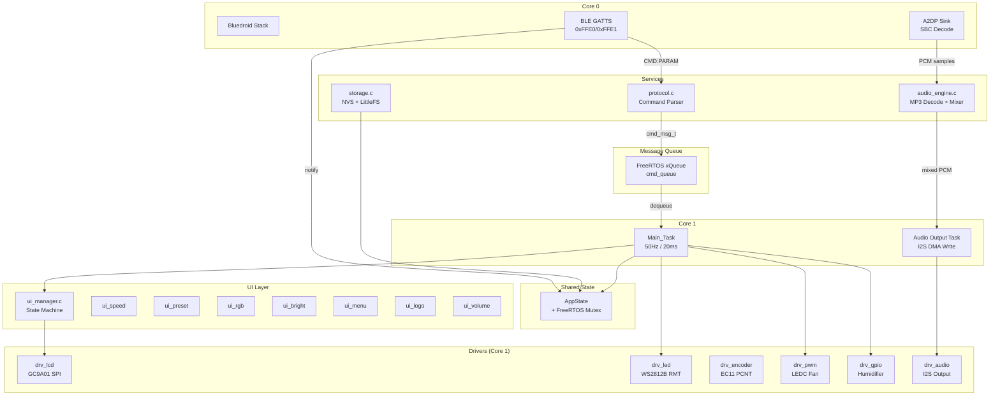
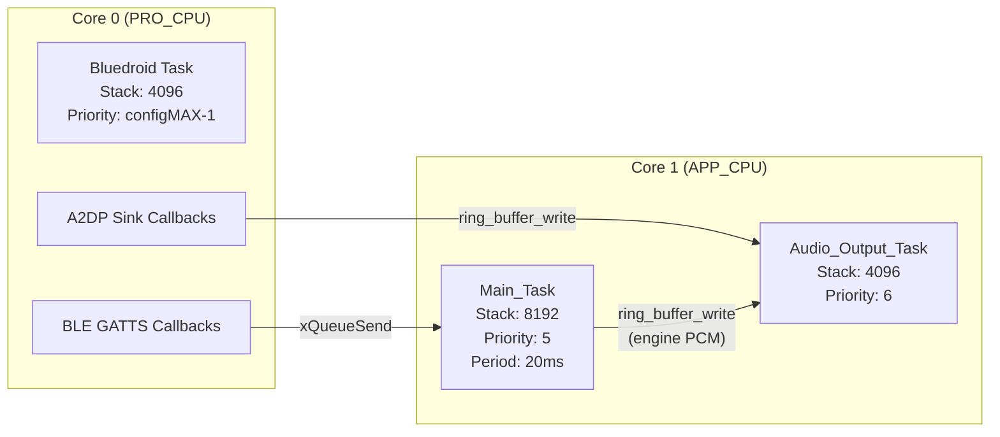
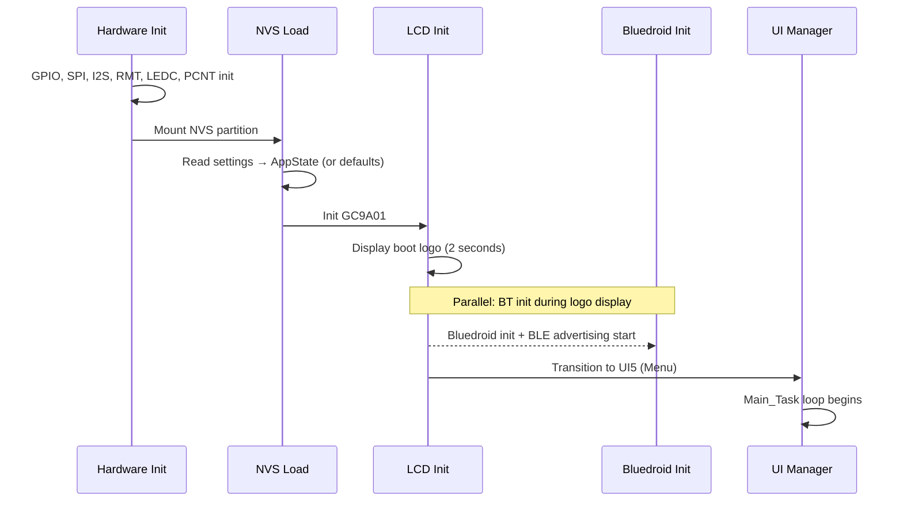
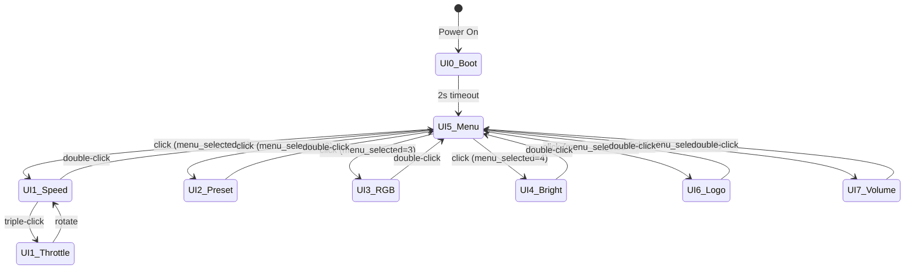
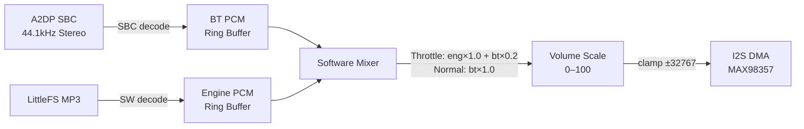

# Design Document: STM32-to-ESP32-S3 Migration

## Overview

This design describes the complete firmware migration of the RideWind smart LED fan controller from STM32F405RGTx + JDY-08 BLE module to ESP32-S3, using ESP-IDF v5.3.5 with Bluedroid dual-mode Bluetooth. The migration replicates all existing functionality (BLE control, LCD UI, LED effects, fan/humidifier control, encoder input, logo management, OTA) while adding A2DP Bluetooth speaker capability and replacing external W25Q128 Flash with ESP32-S3 internal flash (NVS + LittleFS).

The system runs two FreeRTOS cores: Core 0 hosts the Bluedroid stack (BLE GATTS + A2DP Sink), Core 1 hosts the Main_Task (50Hz control loop), audio I2S output, and all peripheral drivers. A single `AppState` struct protected by a FreeRTOS mutex serves as the sole mutable state, with BLE commands routed through a FreeRTOS message queue to ensure the Main_Task is the only writer.

### Key Design Decisions

| Decision | Choice | Rationale |
|----------|--------|-----------|
| BT Stack | Bluedroid dual-mode | Supports both BLE GATTS and Classic A2DP Sink simultaneously |
| Audio Codec | Software MP3 decode + SBC decode | ESP32-S3 has enough CPU; no external VS1003 needed |
| LED Driver | RMT peripheral | Hardware-timed WS2812B protocol, no CPU bit-banging |
| Flash Storage | NVS + LittleFS (internal 8MB) | Replaces external W25Q128; simpler BOM, native ESP-IDF support |
| LCD Driver | SPI DMA with dirty-region tracking | Minimizes SPI bandwidth; 50ms full-frame budget |
| Encoder | PCNT peripheral | Hardware pulse counting, zero CPU overhead for rotation |
| State Management | Single AppState + mutex | Eliminates scattered globals from STM32 codebase |

## Architecture

### System Block Diagram



### Task Architecture



| Task | Core | Stack | Priority | Period | Responsibility |
|------|------|-------|----------|--------|----------------|
| Bluedroid | 0 | 4096 | configMAX-1 | Event-driven | BLE GATTS + A2DP callbacks |
| Main_Task | 1 | 8192 | 5 | 20ms | Encoder, UI, LED effects, command dispatch |
| Audio_Output | 1 | 4096 | 6 | Continuous | Mix engine+A2DP PCM → I2S DMA |

### Boot Sequence



## Components and Interfaces

### Directory Structure

```
ridewind-esp/main/
├── main.c                    // app_main: init sequence, task creation
├── config/
│   ├── pin_config.h          // All GPIO pin definitions
│   ├── board_config.h        // Hardware constants (LED counts, PWM freq, timing)
│   └── preset_colors.h       // 14 color presets (single source of truth)
├── drivers/
│   ├── drv_lcd.c/h           // GC9A01 SPI + DMA driver
│   ├── drv_led.c/h           // WS2812B RMT driver (2 channels)
│   ├── drv_encoder.c/h       // EC11 PCNT + button GPIO ISR
│   ├── drv_pwm.c/h           // LEDC PWM (fan)
│   ├── drv_gpio.c/h          // GPIO output (humidifier)
│   └── drv_audio.c/h         // I2S output to MAX98357
├── services/
│   ├── ble_service.c/h       // Bluedroid GATTS (0xFFE0/0xFFE1)
│   ├── a2dp_service.c/h      // A2DP Sink + SBC decode
│   ├── protocol.c/h          // Text command parser + formatter
│   ├── storage.c/h           // NVS + LittleFS unified API
│   └── audio_engine.c/h      // MP3 decode, ring buffers, mixer
├── ui/
│   ├── ui_manager.c/h        // UI state machine dispatcher
│   ├── ui_menu.c/h           // UI5: sliding menu
│   ├── ui_speed.c/h          // UI1: speed + throttle mode
│   ├── ui_preset.c/h         // UI2: 14 color presets + streamlight
│   ├── ui_rgb.c/h            // UI3: 3-layer RGB custom
│   ├── ui_bright.c/h         // UI4: brightness + breathing
│   ├── ui_logo.c/h           // UI6: logo management
│   ├── ui_volume.c/h         // UI7: volume control
│   └── ui_common.c/h         // Shared drawing primitives
├── app/
│   ├── app_state.c/h         // AppState struct + mutex + accessors
│   ├── led_effects.c/h       // Gradient, streamlight, breathing
│   └── encoder_handler.c/h   // Button state machine (click/double/triple/long)
└── resources/
    ├── font_8x16.h           // Bitmap font data
    ├── menu_icons.h           // Menu page icon arrays
    └── default_logo.h         // Default boot logo (154×154 RGB565)
```

### Component Interface Definitions

#### 1. drv_lcd.h — LCD Driver

```c
#pragma once
#include <stdint.h>
#include <stdbool.h>

// Initialization
void drv_lcd_init(void);

// Primitive drawing
void drv_lcd_fill_rect(uint16_t x, uint16_t y, uint16_t w, uint16_t h, uint16_t color);
void drv_lcd_draw_circle(uint16_t cx, uint16_t cy, uint16_t r, uint16_t color, bool filled);
void drv_lcd_draw_line(uint16_t x0, uint16_t y0, uint16_t x1, uint16_t y1, uint16_t color);
void drv_lcd_draw_char(uint16_t x, uint16_t y, char c, uint16_t fg, uint16_t bg, uint8_t size);
void drv_lcd_draw_string(uint16_t x, uint16_t y, const char *str, uint16_t fg, uint16_t bg, uint8_t size);
void drv_lcd_draw_number(uint16_t x, uint16_t y, int32_t num, uint8_t digits, uint16_t fg, uint16_t bg, uint8_t size);

// Image blitting
void drv_lcd_blit_rgb565(uint16_t x, uint16_t y, uint16_t w, uint16_t h, const uint16_t *data);
void drv_lcd_blit_rgb565_dma(uint16_t x, uint16_t y, uint16_t w, uint16_t h, const uint16_t *data);

// Region update (dirty-region optimization)
void drv_lcd_set_window(uint16_t x0, uint16_t y0, uint16_t x1, uint16_t y1);
void drv_lcd_write_data(const uint8_t *data, uint32_t len);

// Screen control
void drv_lcd_clear(uint16_t color);
void drv_lcd_set_backlight(bool on);
```

#### 2. drv_led.h — LED Strip Driver

```c
#pragma once
#include <stdint.h>

#define LED_STRIP1_COUNT  10  // IO41: Left(2) + Main(6) + Right(2)
#define LED_STRIP2_COUNT  3   // IO16: Tail(3)

// Logical strip indices
typedef enum {
    LED_STRIP_MAIN  = 0,  // Strip1[2..7]
    LED_STRIP_LEFT  = 1,  // Strip1[0..1]
    LED_STRIP_RIGHT = 2,  // Strip1[8..9]
    LED_STRIP_TAIL  = 3,  // Strip2[0..2]
} led_strip_id_t;

void drv_led_init(void);

// Set individual pixel (physical index on physical strip)
void drv_led_set_pixel(uint8_t phys_strip, uint16_t index, uint8_t r, uint8_t g, uint8_t b);

// Set all pixels on a logical strip
void drv_led_set_strip_color(led_strip_id_t strip, uint8_t r, uint8_t g, uint8_t b);

// Apply brightness scaling (0–100) and transmit
void drv_led_set_brightness(uint8_t brightness);
void drv_led_refresh(void);  // Transmit all LED data via RMT
```

#### 3. drv_encoder.h — Encoder Driver

```c
#pragma once
#include <stdint.h>
#include <stdbool.h>

typedef enum {
    ENC_EVT_NONE = 0,
    ENC_EVT_ROTATE,       // delta in event data
    ENC_EVT_CLICK,        // single click
    ENC_EVT_DOUBLE_CLICK, // double click within 400ms
    ENC_EVT_TRIPLE_CLICK, // triple click within 400ms
    ENC_EVT_LONG_PRESS,   // held > 800ms
    ENC_EVT_PRESS,        // button pressed (for throttle mode)
    ENC_EVT_RELEASE,      // button released (for throttle mode)
} encoder_event_type_t;

typedef struct {
    encoder_event_type_t type;
    int16_t delta;  // rotation delta (only valid for ENC_EVT_ROTATE)
} encoder_event_t;

void drv_encoder_init(void);

// Poll for events (called from Main_Task every 20ms)
bool drv_encoder_poll(encoder_event_t *evt);

// Get raw button state (for throttle mode continuous hold detection)
bool drv_encoder_button_pressed(void);
```

#### 4. drv_pwm.h — Fan PWM

```c
#pragma once
#include <stdint.h>

void drv_pwm_init(void);                    // LEDC init, 1kHz on IO40
void drv_pwm_set_duty(uint8_t percent);     // 0–100 → duty cycle
uint8_t drv_pwm_get_duty(void);
```

#### 5. drv_gpio.h — Humidifier GPIO

```c
#pragma once
#include <stdint.h>
#include <stdbool.h>

void drv_gpio_init(void);
void drv_gpio_set_humidifier(bool enable);  // IO10 high/low
bool drv_gpio_get_humidifier(void);
```

#### 6. drv_audio.h — I2S Output

```c
#pragma once
#include <stdint.h>
#include <stdbool.h>

// I2S config: 44100Hz, 16-bit stereo, DIN=IO13, BCLK=IO12, LRC=IO11
void drv_audio_init(void);
void drv_audio_write(const int16_t *samples, uint32_t sample_count);  // Blocking write to I2S DMA
void drv_audio_set_volume(uint8_t volume);  // 0–100 master volume
void drv_audio_stop(void);
```

#### 7. ble_service.h — BLE GATTS

```c
#pragma once
#include <stdint.h>
#include <stdbool.h>

void ble_service_init(void);   // Register GATTS app, create service/char
void ble_service_start(void);  // Start advertising with name "T1"
void ble_service_stop(void);

// Send notification to connected client
void ble_service_notify(const char *data, uint16_t len);
void ble_service_notify_str(const char *str);  // Convenience: notify null-terminated string

// Connection state
bool ble_service_is_connected(void);
```

#### 8. a2dp_service.h — A2DP Sink

```c
#pragma once
#include <stdint.h>
#include <stdbool.h>

void a2dp_service_init(void);   // Register A2DP Sink with device name "T1"
bool a2dp_service_is_streaming(void);

// Ring buffer for decoded PCM (written by A2DP callback, read by audio output task)
// Internal: uses a2dp_pcm_ringbuf
```

#### 9. protocol.h — Command Parser

```c
#pragma once
#include <stdint.h>
#include <stdbool.h>

// Command types
typedef enum {
    CMD_NONE = 0,
    CMD_FAN,            // FAN:xx
    CMD_SPEED,          // SPEED:xxx
    CMD_WUHUA,          // WUHUA:x
    CMD_LED,            // LED:s:r:g:b
    CMD_PRESET,         // PRESET:x
    CMD_BRIGHT,         // BRIGHT:xx
    CMD_UI,             // UI:x
    CMD_LCD,            // LCD:x
    CMD_UNIT,           // UNIT:x
    CMD_THROTTLE,       // THROTTLE:x
    CMD_STREAMLIGHT,    // STREAMLIGHT:x
    CMD_LED_GRADIENT,   // LED_GRADIENT:s:r:g:b:speed
    CMD_GET_FAN,
    CMD_GET_WUHUA,
    CMD_GET_BRIGHT,
    CMD_GET_STREAMLIGHT,
    CMD_GET_PRESET,
    CMD_GET_ALL,
    CMD_GET_UI,
    CMD_GET_LOGO,
    CMD_LOGO_START,     // LOGO_START:slot:size
    CMD_LOGO_DATA,      // LOGO_DATA:hex
    CMD_LOGO_END,       // LOGO_END
    CMD_LOGO_DELETE,    // LOGO_DELETE:slot
    CMD_OTA_START,      // OTA_START:size
    CMD_OTA_DATA,       // OTA_DATA:hex
    CMD_OTA_END,        // OTA_END
    CMD_VOLUME,         // VOL:xx
    CMD_GET_VOLUME,
} cmd_type_t;

// Parsed command message (sent through FreeRTOS queue)
typedef struct {
    cmd_type_t type;
    union {
        uint8_t  u8_val;       // FAN, BRIGHT, PRESET, UI, LCD, UNIT, THROTTLE, STREAMLIGHT, WUHUA, VOL
        int16_t  i16_val;      // SPEED
        struct {
            uint8_t strip;
            uint8_t r, g, b;
        } led;                 // LED
        struct {
            uint8_t strip;
            uint8_t r, g, b;
            uint8_t speed;     // 0=fast, 1=normal, 2=slow
        } led_gradient;        // LED_GRADIENT
        struct {
            uint8_t slot;
            uint32_t size;
        } logo_start;          // LOGO_START
        struct {
            uint8_t *data;
            uint16_t len;
        } binary_data;         // LOGO_DATA, OTA_DATA
        uint32_t ota_size;     // OTA_START
    } param;
} cmd_msg_t;

// Parse a raw text command string into cmd_msg_t
// Returns true if parsing succeeded
bool protocol_parse(const char *raw, uint16_t len, cmd_msg_t *out);

// Format outgoing responses
int protocol_format_response(char *buf, uint32_t buf_size, const char *cmd, const char *param);
int protocol_format_report(char *buf, uint32_t buf_size, const char *report_type, const char *data);

// Format a cmd_msg_t back to text (for round-trip testing)
int protocol_format_cmd(const cmd_msg_t *cmd, char *buf, uint32_t buf_size);
```

#### 10. storage.h — NVS + LittleFS

```c
#pragma once
#include <stdint.h>
#include <stdbool.h>

// NVS settings keys
typedef struct {
    uint8_t led_colors[4][3];   // [strip][r,g,b]
    uint8_t brightness;         // 0–100
    uint8_t volume;             // 0–100
    uint8_t preset_index;       // 1–14
    uint8_t speed_unit;         // 0=km/h, 1=mph
    uint8_t streamlight;        // 0=off, 1=on
    uint8_t breath_mode;        // 0=off, 1=on
    uint8_t active_logo_slot;   // 0–2
} nvs_settings_t;

void storage_init(void);                          // Mount NVS + LittleFS
void storage_load_settings(nvs_settings_t *out);  // Read from NVS (or defaults)
void storage_save_settings(const nvs_settings_t *settings);

// LittleFS logo operations
bool storage_logo_exists(uint8_t slot);            // 0–2
bool storage_logo_read(uint8_t slot, uint8_t *buf, uint32_t buf_size, uint32_t *out_size);
bool storage_logo_write(uint8_t slot, const uint8_t *data, uint32_t size, uint32_t crc32);
bool storage_logo_delete(uint8_t slot);
uint8_t storage_logo_count_valid(void);
uint8_t storage_logo_find_empty(void);

// LittleFS MP3 file access
bool storage_mp3_read(const char *filename, uint8_t **out_data, uint32_t *out_size);
```

#### 11. audio_engine.h — Audio Pipeline

```c
#pragma once
#include <stdint.h>
#include <stdbool.h>

void audio_engine_init(void);
void audio_engine_start_task(void);  // Create audio output FreeRTOS task

// Engine sound control
void audio_engine_play_start_sound(void);   // One-shot start sound
void audio_engine_start_throttle(void);     // Loop acceleration sound
void audio_engine_stop_throttle(void);

// Mixer configuration
// Throttle mode: engine 100% + BT 20%
// Normal mode: BT 100% + engine 0%
void audio_engine_set_throttle_mode(bool active);

// Volume
void audio_engine_set_volume(uint8_t volume);  // 0–100

// A2DP PCM input (called from A2DP callback on Core 0)
void audio_engine_feed_a2dp_pcm(const int16_t *samples, uint32_t count);
```

#### 12. app_state.h — Global State

```c
#pragma once
#include <stdint.h>
#include <stdbool.h>
#include "freertos/FreeRTOS.h"
#include "freertos/semphr.h"

typedef struct {
    // UI state
    uint8_t ui;                 // Current UI screen (0–7)
    uint8_t chu;                // UI init flag
    uint8_t menu_selected;      // Menu selection (1–6)

    // Speed / Fan
    uint8_t fan_speed;          // 0–100 (Num)
    int16_t current_speed_kmh;  // 0–340
    uint8_t speed_unit;         // 0=km/h, 1=mph

    // Humidifier / Throttle
    uint8_t wuhuaqi_state;      // 0=off, 1=on, 2=throttle
    uint8_t wuhuaqi_state_saved;

    // LED colors (actual applied values)
    uint8_t led_colors[4][3];   // [strip_index][r,g,b]

    // LED colors (temporary edit values for UI3)
    int16_t led_colors_edit[4][3];

    // LED effects
    uint8_t preset_index;       // 1–14
    uint8_t streamlight_active; // 0=off, 1=on
    uint8_t breath_mode;        // 0=off, 1=on
    float   breath_phase;       // 0.0–2π
    uint8_t breath_color_index; // 1–14

    // Brightness & Volume
    uint8_t brightness;         // 0–100
    uint8_t volume;             // 0–100

    // UI3 RGB custom state machine
    uint8_t ui3_mode;           // 0=select strip, 1=select channel, 2=adjust value
    uint8_t ui3_channel;        // 0=R, 1=G, 2=B
    uint8_t ui3_strip;          // 0–3 (Main/Left/Right/Tail)

    // Encoder
    int16_t encoder_delta;

    // Button state machine
    uint8_t key_state;
    uint32_t key_tick;
    uint8_t key_click_count;

    // Remote control
    uint32_t remote_active_tick;
    uint8_t  preset_dirty;      // Flag: preset changed by BLE, LCD needs refresh

    // Logo
    uint8_t active_logo_slot;   // 0–2
    uint8_t logo_view_slot;     // Currently viewed slot in UI6

    // Throttle timing
    uint32_t throttle_last_tick;

    // LED gradient state (per strip)
    struct {
        uint8_t active;
        uint8_t current_r, current_g, current_b;
        uint8_t target_r, target_g, target_b;
        uint16_t step;
        uint16_t total_steps;
    } gradient[4];

    // Streamlight state
    uint16_t streamlight_step;
    uint8_t  streamlight_from_index;
    uint8_t  streamlight_to_index;

} app_state_t;

extern app_state_t g_app_state;
extern SemaphoreHandle_t g_app_state_mutex;

// Thread-safe accessors
void app_state_init(void);
void app_state_lock(void);
void app_state_unlock(void);

// Convenience macros
#define APP_STATE_LOCK()   xSemaphoreTake(g_app_state_mutex, portMAX_DELAY)
#define APP_STATE_UNLOCK() xSemaphoreGive(g_app_state_mutex)
```

#### 13. led_effects.h — LED Effect Engine

```c
#pragma once
#include <stdint.h>
#include <stdbool.h>

// LED effect priority (highest first)
typedef enum {
    LED_EFFECT_RGB_CUSTOM = 0,   // UI3 active: direct color control
    LED_EFFECT_BREATHING  = 1,   // UI4 toggle: sine-wave brightness
    LED_EFFECT_STREAMLIGHT = 2,  // UI2 toggle: gradient color cycling
    LED_EFFECT_STATIC     = 3,   // Default: static preset colors
} led_effect_priority_t;

void led_effects_init(void);

// Called every 20ms from Main_Task
void led_effects_process(void);

// Gradient transition
void led_effects_start_gradient(uint8_t strip, uint8_t r, uint8_t g, uint8_t b, uint8_t speed_mode);
bool led_effects_gradient_active(void);

// Streamlight (30ms frame rate → called every 20ms, internally rate-limited)
void led_effects_streamlight_start(void);
void led_effects_streamlight_stop(void);

// Breathing (50fps → called every 20ms)
void led_effects_breathing_start(void);
void led_effects_breathing_stop(void);

// Priority resolution
led_effect_priority_t led_effects_get_active_priority(void);
```

#### 14. encoder_handler.h — Button State Machine

```c
#pragma once
#include "drv_encoder.h"

typedef enum {
    BTN_ACTION_NONE = 0,
    BTN_ACTION_CLICK,
    BTN_ACTION_DOUBLE_CLICK,
    BTN_ACTION_TRIPLE_CLICK,
    BTN_ACTION_LONG_PRESS,
} btn_action_t;

// Process raw encoder events into UI actions
// Called from Main_Task every 20ms
void encoder_handler_init(void);
void encoder_handler_process(void);
```

#### 15. ui_manager.h — UI State Machine

```c
#pragma once
#include <stdint.h>

void ui_manager_init(void);

// Called every 20ms from Main_Task
void ui_manager_update(void);

// Force UI transition (from BLE command)
void ui_manager_set_ui(uint8_t target_ui);

// Get current UI
uint8_t ui_manager_get_ui(void);
```


## Data Models

### Flash Partition Table (8MB)

```
# Name,     Type,  SubType,  Offset,    Size
nvs,        data,  nvs,      0x9000,    0x6000     # 24KB
otadata,    data,  ota,      0xF000,    0x2000     # 8KB
phy_init,   data,  phy,      0x11000,   0x1000     # 4KB
ota_0,      app,   ota_0,    0x20000,   0x280000   # 2.5MB
ota_1,      app,   ota_1,    0x2A0000,  0x280000   # 2.5MB
storage,    data,  spiffs,   0x520000,  0x200000   # 2MB (LittleFS)
coredump,   data,  coredump, 0x720000,  0x10000    # 64KB
```

### NVS Key-Value Schema

| Key | Type | Size | Default | Description |
|-----|------|------|---------|-------------|
| `led_m_rgb` | blob | 3 | {150,20,0} | Main strip RGB |
| `led_l_rgb` | blob | 3 | {255,0,0} | Left strip RGB |
| `led_r_rgb` | blob | 3 | {33,126,222} | Right strip RGB |
| `led_t_rgb` | blob | 3 | {255,0,0} | Tail strip RGB |
| `brightness` | u8 | 1 | 100 | Global brightness 0–100 |
| `volume` | u8 | 1 | 50 | Audio volume 0–100 |
| `preset` | u8 | 1 | 1 | Active preset index 1–14 |
| `speed_unit` | u8 | 1 | 0 | 0=km/h, 1=mph |
| `streamlight` | u8 | 1 | 0 | 0=off, 1=on |
| `breath_mode` | u8 | 1 | 0 | 0=off, 1=on |
| `logo_slot` | u8 | 1 | 0 | Active logo slot 0–2 |

### LittleFS File Layout

```
/littlefs/
├── logo_0.bin          # Logo slot 0 (16-byte header + 115200 bytes RGB565 + CRC32)
├── logo_1.bin          # Logo slot 1
├── logo_2.bin          # Logo slot 2
├── engine_start.mp3    # Engine start sound (~40KB)
└── engine_accel.mp3    # Engine acceleration loop (~193KB)
```

### Logo File Format

```c
typedef struct __attribute__((packed)) {
    uint16_t magic;      // 0xAA55
    uint16_t width;      // 240
    uint16_t height;     // 240
    uint16_t reserved;   // 0
    uint32_t data_size;  // 115200 (240×240×2)
    uint32_t checksum;   // CRC32 of pixel data
} logo_header_t;
// Followed by: uint8_t pixel_data[115200]; // RGB565 big-endian
```

### 14 Color Presets (preset_colors.h)

```c
typedef struct {
    const char *name;
    uint8_t lr, lg, lb;   // Left/Right strip color
    uint8_t mr, mg, mb;   // Main/Tail strip color
} color_preset_t;

static const color_preset_t COLOR_PRESETS[14] = {
    // idx  Name              Left/Right RGB       Main/Tail RGB
    {  "Cyber Neon",         138, 43, 226,         0, 255, 128   },  // 1
    {  "Ice Crystal",          0,234, 255,         0, 234, 255   },  // 2
    {  "Sunset Lava",        255,100,   0,         0, 200, 255   },  // 3
    {  "Racing Gold",        255,210,   0,       255, 210,   0   },  // 4
    {  "Flame Red",          255,  0,   0,       255,   0,   0   },  // 5
    {  "Police Flash",       255,  0,   0,         0,  80, 255   },  // 6
    {  "Sakura Pink",        255,105, 180,       255,   0,  80   },  // 7
    {  "Aurora Purple",      180,  0, 255,         0, 255, 200   },  // 8
    {  "Amethyst",           148,  0, 211,       148,   0, 211   },  // 9
    {  "Mint Breeze",          0,255, 180,       100, 200, 255   },  // 10
    {  "Jungle Green",         0,255,  65,         0, 255,  65   },  // 11
    {  "Pure White",         225,225, 225,       225, 225, 225   },  // 12
    {  "Ocean Blue",          33,126, 222,        33, 126, 222   },  // 13
    {  "Warm Amber",         255,160,   0,       255,  80,   0   },  // 14
};
```

### BLE Protocol Command Table

#### APP → Device Commands

| Command | Format | Parameters | Response |
|---------|--------|------------|----------|
| FAN | `FAN:xx\n` | xx: 0–100 | `OK:FAN\r\n` |
| SPEED | `SPEED:xxx\n` | xxx: 0–340 | (none) |
| WUHUA | `WUHUA:x\n` | x: 0/1 | `OK:WUHUA\r\n` |
| LED | `LED:s:r:g:b\n` | s:1–4, rgb:0–255 | `OK:LED\r\n` |
| PRESET | `PRESET:x\n` | x: 1–14 | `OK:PRESET\r\n` |
| BRIGHT | `BRIGHT:xx\n` | xx: 0–100 | `OK:BRIGHT\r\n` |
| UI | `UI:x\n` | x: 0–7 | `OK:UI\r\n` |
| LCD | `LCD:x\n` | x: 0/1 | `OK:LCD\r\n` |
| UNIT | `UNIT:x\n` | x: 0/1 | `OK:UNIT\r\n` |
| THROTTLE | `THROTTLE:x\n` | x: 0/1 | `OK:THROTTLE\r\n` |
| STREAMLIGHT | `STREAMLIGHT:x\n` | x: 0/1 | `OK:STREAMLIGHT:x\r\n` |
| LED_GRADIENT | `LED_GRADIENT:s:r:g:b:spd\n` | s:1–4, rgb:0–255, spd:0–2 | `OK:LED_GRADIENT\r\n` |
| VOL | `VOL:xx\n` | xx: 0–100 | `OK:VOL\r\n` |
| GET:xxx | `GET:FAN\n` etc. | (see GET table) | value response |
| LOGO_START | `LOGO_START:slot:size\n` | slot:0–2, size:bytes | `OK:LOGO_START\r\n` |
| LOGO_DATA | `LOGO_DATA:hex\n` | hex-encoded chunk | `OK:LOGO_DATA:offset\r\n` |
| LOGO_END | `LOGO_END\n` | (none) | `OK:LOGO_END\r\n` or `ERR:CRC\r\n` |
| LOGO_DELETE | `LOGO_DELETE:slot\n` | slot:0–2 | `OK:LOGO_DELETE\r\n` |
| OTA_START | `OTA_START:size\n` | size:bytes | `OK:OTA_START\r\n` |
| OTA_DATA | `OTA_DATA:hex\n` | hex-encoded chunk | `OK:OTA_DATA:offset\r\n` |
| OTA_END | `OTA_END\n` | (none) | `OK:OTA_END\r\n` or `ERR:OTA_VERIFY\r\n` |

#### Device → APP Reports

| Report | Format | Trigger |
|--------|--------|---------|
| SPEED_REPORT | `SPEED_REPORT:speed:unit\n` | Speed change from encoder |
| KNOB | `KNOB:delta\n` | Encoder rotation |
| BTN | `BTN:KNOB:action\n` | Button event (CLICK/DOUBLE/TRIPLE/LONG) |
| THROTTLE_REPORT | `THROTTLE_REPORT:state\n` | Throttle mode change |
| UNIT_REPORT | `UNIT_REPORT:unit\n` | Unit toggle |
| PRESET_REPORT | `PRESET_REPORT:index\n` | Preset change from encoder |
| STATUS | `STATUS:FAN:x:WUHUA:x:BRIGHT:x\r\n` | GET:ALL response |

### Message Queue Item

```c
// Queue depth: 32 items
// Item size: sizeof(cmd_msg_t) ≈ 20 bytes
static QueueHandle_t cmd_queue;
// Created in main.c: cmd_queue = xQueueCreate(32, sizeof(cmd_msg_t));
```

### Timing Constants (board_config.h)

```c
#define MAIN_TASK_PERIOD_MS       20    // 50Hz main loop
#define LCD_REFRESH_PERIOD_MS     50    // LCD update rate
#define PWM_UPDATE_PERIOD_MS      100   // Fan PWM update rate
#define ENCODER_POLL_PERIOD_MS    20    // Encoder polling (same as main loop)
#define BUTTON_TIMEOUT_MS         400   // Multi-click detection window
#define LONG_PRESS_MS             800   // Long press threshold
#define LED_GRADIENT_PERIOD_MS    20    // 50fps gradient
#define STREAMLIGHT_PERIOD_MS     30    // ~33fps streamlight
#define BREATHING_PERIOD_MS       20    // 50fps breathing
#define BLE_RX_TIMEOUT_MS         50    // BLE receive timeout
#define THROTTLE_ACCEL_MS         18    // Throttle acceleration step
#define THROTTLE_DECEL_MS         12    // Throttle deceleration step
#define REMOTE_FREEZE_WINDOW_MS   500   // Remote command freeze window
#define MENU_SWITCH_DEBOUNCE_MS   150   // Menu encoder debounce
#define MENU_DELTA_THRESHOLD      2     // Accumulated delta for menu switch
#define BOOT_LOGO_DURATION_MS     2000  // Boot logo display time
#define GRADIENT_SPEED_FAST       25    // 0.5s transition (steps)
#define GRADIENT_SPEED_NORMAL     75    // 1.5s transition
#define GRADIENT_SPEED_SLOW       150   // 3.0s transition
#define STREAMLIGHT_INTERP_STEPS  100   // Steps per color transition
#define BREATHING_PERIOD_SEC      3.0f  // Breathing cycle period
#define BREATHING_MIN_SCALE       0.6f  // Minimum brightness scale
#define BREATHING_MAX_SCALE       1.0f  // Maximum brightness scale
```

### UI State Machine Transitions



### Audio Pipeline Data Flow




## Correctness Properties

*A property is a characteristic or behavior that should hold true across all valid executions of a system — essentially, a formal statement about what the system should do. Properties serve as the bridge between human-readable specifications and machine-verifiable correctness guarantees.*

### Property 1: Protocol Round-Trip

*For any* valid command string in the set of all supported command types (FAN, SPEED, WUHUA, LED, PRESET, BRIGHT, UI, LCD, UNIT, THROTTLE, STREAMLIGHT, LED_GRADIENT, VOL, GET:xxx, LOGO_START, OTA_START), parsing the string into a `cmd_msg_t` then formatting it back to a string then parsing again shall produce an equivalent `cmd_msg_t`.

**Validates: Requirements 7.1, 7.2, 7.5**

### Property 2: Malformed Command Rejection

*For any* random byte string that does not match any valid command format (no valid CMD: prefix, missing parameters, out-of-range values, binary garbage), the Protocol_Parser shall return `false` from `protocol_parse()` and the output `cmd_msg_t` shall have type `CMD_NONE`, leaving no side effects on system state.

**Validates: Requirements 7.3**

### Property 3: Response Line Termination

*For any* formatted command acknowledgment produced by `protocol_format_response()`, the output string shall end with `\r\n`. *For any* formatted event report produced by `protocol_format_report()`, the output string shall end with `\n` (without preceding `\r`).

**Validates: Requirements 7.4**

### Property 4: Logical Strip to Physical LED Mapping

*For any* logical strip ID (Main, Left, Right, Tail) and any RGB color (r, g, b each 0–255), calling `drv_led_set_strip_color(strip, r, g, b)` shall set exactly the correct physical LED indices on the correct physical RMT channel: Left→Strip1[0:1], Main→Strip1[2:7], Right→Strip1[8:9], Tail→Strip2[0:2].

**Validates: Requirements 3.2**

### Property 5: Brightness Scaling

*For any* RGB color (r, g, b each 0–255) and any brightness value (0–100), the output color sent to the RMT peripheral shall equal `(r × brightness / 100, g × brightness / 100, b × brightness / 100)` with integer truncation, and each channel shall remain in the range [0, 255].

**Validates: Requirements 3.3**

### Property 6: Button Event Classification

*For any* sequence of button press and release events with timestamps, the encoder button state machine shall classify the sequence as: single click if exactly 1 press < 400ms with no subsequent press within 400ms; double click if exactly 2 presses within 400ms; triple click if exactly 3 presses within 400ms; long press if a single press exceeds 800ms. The 400ms timeout after the last release shall be respected before dispatching the final event.

**Validates: Requirements 4.2, 4.3**

### Property 7: Encoder-Adjusted Bounded Value Clamping

*For any* current value within a valid range [min, max], any encoder delta (positive or negative), and any step size, the resulting value after applying `new_value = clamp(current + delta × step, min, max)` shall always remain within [min, max]. This applies to: speed (0–340), fan speed (0–100), brightness (0–100), volume (0–100), and RGB channel values (0–255 with step 2).

**Validates: Requirements 9.1, 12.1, 15.1, 11.6, 5.2**

### Property 8: Boolean State Toggle

*For any* boolean state variable (speed_unit, streamlight_active, breath_mode), applying a toggle action shall flip the value: 0→1 or 1→0. Applying toggle twice shall restore the original value (involution property).

**Validates: Requirements 9.2, 10.2, 12.2**

### Property 9: Cyclic Index Wrapping

*For any* cyclic index with bounds [min, max] (preset 1–14, menu_selected 1–6), and any encoder delta, the resulting index shall wrap around correctly: incrementing past max returns to min, decrementing below min returns to max. The index shall never be outside [min, max].

**Validates: Requirements 10.1, 13.2**

### Property 10: UI3 State Machine Transitions

*For any* current UI3 state (mode ∈ {0, 1, 2}), a single-click event shall transition: mode 0→1, mode 1→2, mode 2→1. A double-click at any mode shall exit to UI5. Rotation in mode 0 shall cycle strip selection (0–3), in mode 1 shall cycle channel (0–2), in mode 2 shall adjust the selected channel value by ±2 per step clamped to [0, 255].

**Validates: Requirements 11.1, 11.4**

### Property 11: Menu Click Dispatches Correct UI

*For any* menu_selected value in {1, 2, 3, 4, 5, 6}, a single-click in UI5 shall transition to the UI screen corresponding to that index: 1→UI1, 2→UI2, 3→UI3, 4→UI4, 5→UI6, 6→UI7.

**Validates: Requirements 13.3**

### Property 12: Encoder Delta Cleared on UI Transition

*For any* UI transition (from any UI screen to any other UI screen), the encoder_delta field in AppState shall be reset to 0 after the transition completes.

**Validates: Requirements 13.4**

### Property 13: LED Effect Priority Resolution

*For any* combination of active LED effects (RGB Custom active/inactive, Breathing active/inactive, Streamlight active/inactive), the effect actually applied to the LEDs shall be the one with the highest priority among active effects: RGB Custom > Breathing > Streamlight > Static. Activating a higher-priority effect shall immediately suppress lower ones. Deactivating the highest active effect shall resume the next highest.

**Validates: Requirements 16.1, 16.2, 16.3**

### Property 14: Linear Color Interpolation

*For any* start color (r0, g0, b0), target color (r1, g1, b1), and interpolation step k out of N total steps, the interpolated color at step k shall equal `(r0 + (r1-r0)×k/N, g0 + (g1-g0)×k/N, b0 + (b1-b0)×k/N)` with each channel clamped to [0, 255]. At step 0 the color shall equal the start, at step N the color shall equal the target.

**Validates: Requirements 17.1, 10.4**

### Property 15: Gradient Restart from Current Color

*For any* in-progress gradient at step k of N (with interpolated color C_k), starting a new gradient to a different target color shall use C_k as the new start color, not the original start color of the previous gradient.

**Validates: Requirements 17.3**

### Property 16: Audio Mixer Weighted Sum with Clipping Prevention

*For any* two PCM sample arrays (A2DP and engine), any throttle mode flag, and any master volume (0–100): in throttle mode the output sample shall equal `clamp((engine×1.0 + bt×0.2) × volume/100, -32768, 32767)`; in normal mode the output shall equal `clamp(bt×1.0 × volume/100, -32768, 32767)`. The output shall never exceed the 16-bit signed PCM range.

**Validates: Requirements 20.1, 20.2, 20.3, 20.4, 20.5**

### Property 17: NVS Settings Round-Trip

*For any* valid `nvs_settings_t` struct (all fields within their valid ranges), calling `storage_save_settings()` followed by `storage_load_settings()` shall produce an identical struct.

**Validates: Requirements 21.1**

### Property 18: Logo Storage Round-Trip with CRC Validation

*For any* valid logo data (240×240 RGB565 pixels with correct 16-byte header and matching CRC32), writing to a slot via `storage_logo_write()` then reading via `storage_logo_read()` shall return identical data. *For any* logo data with a corrupted CRC32 (any single bit flip in the data), `storage_logo_write()` shall reject the data and leave the slot unchanged.

**Validates: Requirements 22.2, 22.3, 22.4**

### Property 19: BLE Fragmentation Reassembly

*For any* valid command string split at arbitrary 20-byte boundaries into multiple BLE packets, the BLE_Service reassembly logic shall reconstruct the original complete command string before passing it to the Protocol_Parser.

**Validates: Requirements 6.5**

### Property 20: Breathing Effect Sine Wave Range

*For any* phase value in [0, 2π], the breathing brightness scale factor computed as `0.6 + 0.4 × (sin(phase) + 1) / 2` shall always be within the range [0.6, 1.0] inclusive.

**Validates: Requirements 12.4**

### Property 21: Streamlight Interpolation Completeness

*For any* two consecutive color presets in the 14-preset cycle, the streamlight effect shall produce exactly 100 interpolation steps between them. At step 0 the color shall match the source preset, at step 100 the color shall match the destination preset.

**Validates: Requirements 10.4**

## Error Handling

### BLE Communication Errors

| Error Condition | Response | Recovery |
|----------------|----------|----------|
| Malformed command | `ERR:UNKNOWN_CMD\r\n` | Discard input, continue listening |
| Parameter out of range | `ERR:PARAM\r\n` | Clamp or reject, no state change |
| BLE disconnect | Internal event | Stop notifications, continue local operation, restart advertising |
| BLE MTU fragmentation | Internal reassembly | Buffer until `\n` delimiter, timeout after 50ms |
| Command queue full | Drop command | Log warning, BLE_Service retries not needed (fire-and-forget) |

### Storage Errors

| Error Condition | Response | Recovery |
|----------------|----------|----------|
| NVS read failure | Use factory defaults | Log error, continue with defaults |
| NVS write failure | `ERR:NVS\r\n` | Retry once, log error |
| LittleFS mount failure | Disable logo/MP3 features | Log error, boot continues without file storage |
| Logo CRC mismatch | `ERR:CRC\r\n` | Discard partial data, slot unchanged |
| Logo slot full | `ERR:SLOT_FULL\r\n` | Inform app, no overwrite without explicit delete |

### OTA Errors

| Error Condition | Response | Recovery |
|----------------|----------|----------|
| OTA write failure | `ERR:OTA_WRITE\r\n` | Abort session, retain current firmware |
| OTA verify failure | `ERR:OTA_VERIFY\r\n` | Abort session, retain current firmware |
| OTA boot failure | Automatic rollback | ESP-IDF rollback to previous partition |
| OTA timeout (no data for 30s) | Auto-abort | Return to IDLE state |

### Audio Errors

| Error Condition | Response | Recovery |
|----------------|----------|----------|
| A2DP disconnect | Internal event | Stop audio output, mixer outputs silence |
| Ring buffer overflow | Drop oldest samples | Continue mixing with available data |
| MP3 decode error | Skip corrupted frame | Continue with next valid frame |
| I2S DMA underrun | Output silence | Refill buffer on next cycle |

### Hardware Driver Errors

| Error Condition | Response | Recovery |
|----------------|----------|----------|
| SPI LCD timeout | Retry once | If persistent, log error and skip frame |
| RMT LED timeout | Retry once | If persistent, log error |
| PCNT overflow | Reset counter | Continue counting from 0 |

## Testing Strategy

### Dual Testing Approach

This project uses both unit tests and property-based tests for comprehensive coverage:

- **Unit tests**: Verify specific examples, edge cases, integration points, and error conditions
- **Property-based tests**: Verify universal properties across randomly generated inputs (minimum 100 iterations each)

### Property-Based Testing Library

**Library**: [Theft](https://github.com/silentbicycle/theft) (C property-based testing library)

Alternative: Custom lightweight PBT harness using ESP-IDF's Unity test framework with random seed generation, since Theft may need adaptation for embedded targets. Each property test will:
- Generate random inputs using a seeded PRNG
- Run minimum 100 iterations per property
- Log the seed on failure for reproducibility
- Tag each test with a comment referencing the design property

### Test Tag Format

```c
// Feature: stm32-to-esp32-migration, Property 1: Protocol Round-Trip
```

### Test Organization

```
ridewind-esp/test/
├── unit/
│   ├── test_protocol_parse.c      // Specific command parsing examples
│   ├── test_protocol_format.c     // Response formatting examples
│   ├── test_app_state.c           // AppState init, defaults, mutex
│   ├── test_led_effects.c         // Effect priority examples, gradient speed modes
│   ├── test_encoder_handler.c     // Button event edge cases
│   ├── test_storage.c             // NVS defaults, logo header validation
│   ├── test_audio_mixer.c         // Specific mixing scenarios
│   └── test_ui_transitions.c      // UI state machine specific transitions
├── property/
│   ├── test_prop_protocol.c       // Properties 1, 2, 3 (round-trip, rejection, termination)
│   ├── test_prop_led.c            // Properties 4, 5, 13, 14, 15, 20, 21 (mapping, brightness, priority, interpolation, breathing)
│   ├── test_prop_encoder.c        // Property 6 (button classification)
│   ├── test_prop_values.c         // Properties 7, 8, 9 (clamping, toggle, cycling)
│   ├── test_prop_ui.c             // Properties 10, 11, 12 (UI3 state machine, menu dispatch, delta clear)
│   ├── test_prop_audio.c          // Property 16 (mixer weighted sum)
│   ├── test_prop_storage.c        // Properties 17, 18 (NVS round-trip, logo CRC)
│   └── test_prop_ble.c            // Property 19 (fragmentation reassembly)
└── CMakeLists.txt
```

### Property Test Configuration

- Minimum 100 iterations per property test
- Seeded PRNG for reproducibility (seed logged on failure)
- Each property test references its design document property number
- Tests run on host (Linux/macOS) using mock drivers, not on target hardware
- ESP-IDF Unity framework for test runner

### Unit Test Coverage Focus

Unit tests should focus on:
- Boot sequence verification (specific order of init calls)
- Factory default values (exact RGB values, brightness, volume)
- Specific command parsing examples (each command type with known input/output)
- UI transition edge cases (double-click from throttle mode, entering UI3 deactivates effects)
- OTA state machine transitions (START → RECEIVING → VERIFYING → COMPLETE)
- Logo upload state machine (START → DATA × N → END with CRC check)
- Error response formatting (specific error strings)

### Integration Test Notes

Integration tests requiring hardware (BLE connection, LCD rendering, LED output, audio playback) should be performed manually on the target ESP32-S3 board. The property-based tests and unit tests focus on logic that can be tested without hardware.
