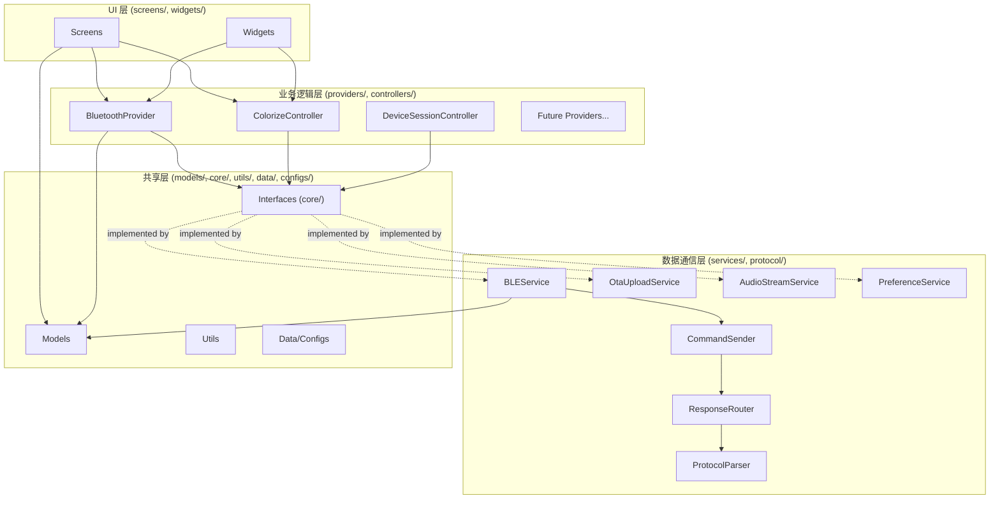
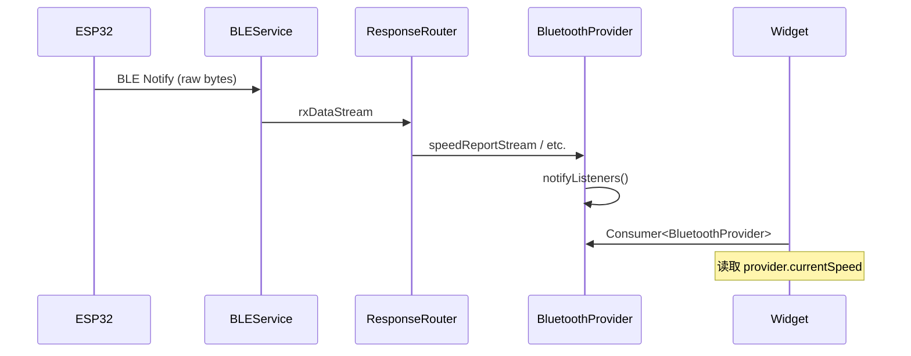

# Design Document: Engineering Refactor

## Overview

本设计文档定义 RideWind Flutter APP (`RideWind/lib/`) 的系统性工程化重构方案。重构目标是将当前存在大文件、模块边界模糊、死代码堆积的代码库，转变为分层清晰、接口抽象、状态统一、文件精简的可维护架构。

**核心约束：**
- 500+ 现有用户不受影响（BLE 协议、公开 API 不变）
- 51 个协议测试必须持续通过
- ESP32 固件代码不在范围内
- 每个重构阶段独立可验证

**重构执行顺序（固定）：**
1. 死代码清除
2. 接口抽象引入
3. 分层架构建立
4. 状态管理统一
5. 大文件拆分

## Architecture

### 目标分层架构



### 依赖规则矩阵

| 源层 | 可导入 | 禁止导入 |
|------|--------|----------|
| UI (screens/, widgets/) | Business, Shared | Data (services/, protocol/) |
| Business (providers/, controllers/) | Data, Shared | UI |
| Data (services/, protocol/) | Shared | UI, Business |
| Shared (models/, core/, utils/, data/, configs/) | 其他 Shared, core/ 中的接口定义 | UI, Business |

**豁免：** `main.dart` 作为入口点可导入所有层（负责组装依赖注入）。

### 目录结构（重构后）

```
RideWind/lib/
├── main.dart                    # 入口点（豁免层规则）
├── core/
│   ├── service_locator.dart     # GetIt DI 容器
│   ├── interfaces/              # 抽象接口定义
│   │   ├── ble_interface.dart
│   │   ├── ota_interface.dart
│   │   ├── audio_interface.dart
│   │   └── preference_interface.dart
│   ├── result.dart
│   ├── platform_capability.dart
│   └── platform_channel_registry.dart
├── screens/                     # UI 层
├── widgets/                     # UI 层
├── providers/                   # 业务逻辑层
│   ├── bluetooth_provider.dart
│   ├── led_provider.dart        # 从 BluetoothProvider 拆出
│   └── audio_provider.dart      # 从 BluetoothProvider 拆出
├── controllers/                 # 业务逻辑层
├── services/                    # 数据通信层
├── protocol/                    # 数据通信层
├── models/                      # 共享层
├── utils/                       # 共享层
├── data/                        # 共享层
└── configs/                     # 共享层
```

## Components and Interfaces

### 抽象接口定义

#### 1. BLE 通信接口

```dart
/// core/interfaces/ble_interface.dart
/// 
/// BLE 底层通信抽象接口
/// 隔离 flutter_blue_plus 具体实现，允许测试时 mock
abstract class IBleService {
  /// 当前连接状态
  BleConnectionState get state;
  
  /// 设备类型
  DeviceType get deviceType;
  
  /// 有效 MTU
  int get effectiveMtu;
  
  /// 接收数据流
  Stream<List<int>> get rxDataStream;
  
  /// 连接状态流
  Stream<bool> get connectionStream;
  
  /// 详细状态流
  Stream<BleConnectionState> get stateStream;
  
  /// 扫描设备
  Future<void> startScan({Duration timeout});
  
  /// 停止扫描
  Future<void> stopScan();
  
  /// 连接设备
  Future<bool> connect(String deviceId);
  
  /// 断开连接
  Future<void> disconnect();
  
  /// 发送数据
  Future<bool> sendData(List<int> data);
  
  /// 用户主动断开（不触发自动重连）
  Future<void> userDisconnect();
}
```

#### 2. OTA 上传接口

```dart
/// core/interfaces/ota_interface.dart
///
/// OTA 固件上传抽象接口
abstract class IOtaService {
  /// 开始 OTA 上传
  Future<void> startUpload(Uint8List firmware);
  
  /// 取消上传
  Future<void> cancelUpload();
  
  /// 上传进度流 (0.0 - 1.0)
  Stream<double> get progressStream;
  
  /// 状态流
  Stream<OtaState> get stateStream;
  
  /// 当前状态
  OtaState get currentState;
}
```

#### 3. 音频流接口

```dart
/// core/interfaces/audio_interface.dart
///
/// 音频投射抽象接口
abstract class IAudioStreamService {
  /// 开始音频捕获并流式传输到指定 IP
  Future<bool> startCapture({String ip});
  
  /// 停止捕获
  Future<void> stopCapture();
  
  /// 是否正在捕获
  Future<bool> isCapturing();
  
  /// 保存 WiFi 凭据
  Future<void> saveWifiCredentials(String ssid, String password);
  
  /// 获取已保存的 WiFi 凭据
  Future<(String?, String?)> getSavedWifiCredentials();
}
```

#### 4. 偏好存储接口

```dart
/// core/interfaces/preference_interface.dart
///
/// 用户偏好持久化抽象接口
abstract class IPreferenceService {
  /// 保存颜色预设索引
  Future<void> saveColorPreset(int index);
  
  /// 获取颜色预设索引
  Future<int?> getColorPreset();
  
  /// 保存速度值
  Future<void> saveSpeedValue(int speed);
  
  /// 获取速度值
  Future<int?> getSpeedValue();
  
  /// 保存雾化器状态
  Future<void> saveAtomizerState(bool enabled);
  
  /// 获取雾化器状态
  Future<bool?> getAtomizerState();
  
  /// 保存设备特定设置
  Future<void> saveDeviceSettings(String deviceId, Map<String, dynamic> settings);
  
  /// 获取设备特定设置
  Future<Map<String, dynamic>?> getDeviceSettings(String deviceId);
}
```

### Service Locator 改造

```dart
/// core/service_locator.dart（重构后）
void setupServiceLocator() {
  // 数据通信层 — 注册抽象接口
  sl.registerLazySingleton<IBleService>(() => BLEService());
  sl.registerLazySingleton<IPreferenceService>(() => PreferenceService());
  sl.registerLazySingleton<IAudioStreamService>(() => AudioStreamServiceImpl());
  
  // 协议层
  sl.registerLazySingleton<CommandSender>(() => CommandSender(sl<IBleService>()));
  sl.registerLazySingleton<ResponseRouter>(() => ResponseRouter(sl<CommandSender>()));
  
  // 业务逻辑层
  sl.registerLazySingleton<BluetoothProvider>(
    () => BluetoothProvider.withDependencies(
      bleService: sl<IBleService>(),
      commandSender: sl<CommandSender>(),
      responseRouter: sl<ResponseRouter>(),
    ),
  );
  
  // OTA — 按需创建（每次升级一个实例）
  sl.registerFactory<IOtaService>(
    () => OtaUploadService(sl<BluetoothProvider>()),
  );
}
```

### 文件拆分策略

#### 拆分算法

对于超过 400 行的文件：
1. **识别顶层声明**：每个 class、mixin、enum、extension 为一个拆分单元
2. **分组私有辅助**：与某个 class 紧密耦合的私有函数/类归入同一文件
3. **生成 barrel 文件**：原文件路径变为 barrel，re-export 所有拆分后的公开符号
4. **命名规则**：`ClassName` → `class_name.dart`

#### 最大文件拆分计划

| 原文件 | 当前行数 | 拆分方案 |
|--------|----------|----------|
| `running_mode_widget.dart` | ~1560 | → `running_mode_config.dart` (布局配置类) + `running_mode_controls.dart` (控制按钮) + `running_mode_display.dart` (速度显示) + `running_mode_widget.dart` (barrel) |
| `bluetooth_provider.dart` | ~800+ | → `bluetooth_provider.dart` (核心连接/状态) + `led_provider.dart` (LED/颜色) + `audio_provider.dart` (音频/音量) + `logo_provider.dart` (Logo 管理) |
| 其他 >400 行文件 | 各异 | 按"一个类一个文件"原则拆分 |

#### Barrel 文件模式

```dart
/// widgets/running_mode_widget.dart (barrel)
///
/// 原 RunningModeWidget 拆分后的 barrel 文件
/// 保持向后兼容：所有现有 import 无需修改
library running_mode_widget;

export 'running_mode/running_mode_config.dart';
export 'running_mode/running_mode_controls.dart';
export 'running_mode/running_mode_display.dart';
export 'running_mode/running_mode_state.dart';
```

### 状态管理统一方案

#### Provider 职责划分

| Provider | 职责域 | 管理的状态 |
|----------|--------|-----------|
| `BluetoothProvider` | BLE 连接 + 协议通信 | 连接状态、设备信息、速度、传感器数据 |
| `LedProvider` | LED/颜色控制 | 预设索引、RGB 值、流光状态 |
| `AudioProvider` | 音频投射 | WiFi 状态、音频流状态、音量 |
| `PreferenceProvider` | 用户偏好 | 持久化设置的内存缓存 |

#### BluetoothProvider 作为单一数据源



**禁止模式：**
```dart
// ❌ 错误：Widget 本地缓存 BLE 状态
class _MyWidgetState extends State<MyWidget> {
  bool _isConnected = false; // 禁止！
  
  void _onConnectionChanged(bool connected) {
    setState(() => _isConnected = connected); // 禁止！
  }
}

// ✅ 正确：通过 Provider 读取
class _MyWidgetState extends State<MyWidget> {
  @override
  Widget build(BuildContext context) {
    return Consumer<BluetoothProvider>(
      builder: (_, bt, __) => Text(bt.isConnected ? '已连接' : '未连接'),
    );
  }
}
```

## Data Models

### 层级映射模型

```dart
/// 层级定义（用于静态分析脚本）
enum ArchitectureLayer {
  ui,       // screens/, widgets/
  business, // providers/, controllers/
  data,     // services/, protocol/
  shared,   // models/, core/, utils/, data/, configs/
}

/// 目录到层级的映射
const Map<String, ArchitectureLayer> directoryLayerMap = {
  'screens': ArchitectureLayer.ui,
  'widgets': ArchitectureLayer.ui,
  'providers': ArchitectureLayer.business,
  'controllers': ArchitectureLayer.business,
  'services': ArchitectureLayer.data,
  'protocol': ArchitectureLayer.data,
  'models': ArchitectureLayer.shared,
  'core': ArchitectureLayer.shared,
  'utils': ArchitectureLayer.shared,
  'data': ArchitectureLayer.shared,
  'configs': ArchitectureLayer.shared,
};

/// 允许的导入方向矩阵
/// key: 源层, value: 允许导入的目标层列表
const Map<ArchitectureLayer, Set<ArchitectureLayer>> allowedImports = {
  ArchitectureLayer.ui: {ArchitectureLayer.business, ArchitectureLayer.shared},
  ArchitectureLayer.business: {ArchitectureLayer.data, ArchitectureLayer.shared},
  ArchitectureLayer.data: {ArchitectureLayer.shared},
  ArchitectureLayer.shared: {ArchitectureLayer.shared},
};
```

### 文件度量模型

```dart
/// 文件度量结果
class FileMetric {
  final String path;
  final int totalLines;
  final FileMetricStatus status;
  
  const FileMetric({
    required this.path,
    required this.totalLines,
    required this.status,
  });
}

enum FileMetricStatus {
  ok,      // <= 400 lines
  warning, // 401-500 lines
  error,   // > 500 lines
}
```

### 层级违规模型

```dart
/// 层级违规记录
class LayerViolation {
  final String filePath;
  final String importStatement;
  final ArchitectureLayer sourceLayer;
  final ArchitectureLayer targetLayer;
  final int lineNumber;
  
  const LayerViolation({
    required this.filePath,
    required this.importStatement,
    required this.sourceLayer,
    required this.targetLayer,
    required this.lineNumber,
  });
  
  @override
  String toString() => '$filePath:$lineNumber — $importStatement '
      '(${sourceLayer.name} → ${targetLayer.name} is forbidden)';
}
```


## Correctness Properties

*A property is a characteristic or behavior that should hold true across all valid executions of a system — essentially, a formal statement about what the system should do. Properties serve as the bridge between human-readable specifications and machine-verifiable correctness guarantees.*

### Property 1: File split size bounds

*For any* source file with N lines where N > 400, the splitting algorithm SHALL produce chunks where each chunk contains between 200 and 400 lines (inclusive), and the sum of all chunk line counts equals N.

**Validates: Requirements 1.1, 1.5**

### Property 2: Barrel file symbol preservation

*For any* set of public symbols (classes, functions, typedefs, enums) extracted from a source file before splitting, the generated barrel file SHALL re-export every symbol in that set, ensuring the barrel's exported symbol set is a superset of the original public symbol set.

**Validates: Requirements 1.2**

### Property 3: One-declaration-per-file splitting

*For any* source file containing multiple top-level declarations (classes, mixins, enums, extensions), after splitting, each output file SHALL contain exactly one primary top-level declaration (plus its tightly-coupled private helpers), and no two output files SHALL contain the same top-level declaration.

**Validates: Requirements 1.3**

### Property 4: Cycle resolution produces DAG

*For any* dependency graph produced by a file split that contains one or more import cycles, after applying the cycle resolution algorithm (extracting shared types into `_common.dart`), the resulting dependency graph SHALL be a directed acyclic graph (DAG) — i.e., no import cycles exist.

**Validates: Requirements 1.4**

### Property 5: Class-to-filename conversion

*For any* valid Dart PascalCase class name, the file naming function SHALL produce a string that: (a) is entirely lowercase with underscores separating words, (b) ends with `.dart`, and (c) round-trips correctly — i.e., converting the filename back to PascalCase yields the original class name.

**Validates: Requirements 1.6**

### Property 6: Layer dependency matrix correctness

*For any* pair of (source file path, import statement) where the source file belongs to a known architecture layer, the layer violation checker SHALL report a violation if and only if the import target belongs to a layer that is NOT in the allowed-imports set for the source layer — with the sole exception of `main.dart` which is exempt from all layer restrictions.

**Validates: Requirements 2.1, 2.2, 2.3, 2.7, 4.2, 4.6, 8.1**

### Property 7: Dead method body detection

*For any* Dart method declaration, the dead-method detector SHALL classify it as "dead" if and only if: (a) the method body is empty or contains only comments, AND (b) the method is not annotated with `@override`, AND (c) the method is not required by an implemented interface or abstract class.

**Validates: Requirements 3.1**

### Property 8: Commented-import pattern detection

*For any* line of Dart source code, the commented-import detector SHALL identify it as a commented-out import if and only if the line matches the pattern of a comment followed by an import statement (e.g., `// import ...` or `/* import ... */`), and SHALL NOT flag regular comments that happen to contain the word "import" in prose.

**Validates: Requirements 3.3**

### Property 9: Generated file exclusion filter

*For any* file path string, the generated-file filter SHALL return `true` (exclude) if and only if the path matches one of the patterns `*.g.dart`, `*.freezed.dart`, or `*.mocks.dart`, and SHALL return `false` for all other paths including paths that partially match (e.g., `my_g.dart` should NOT be excluded).

**Validates: Requirements 3.6**

### Property 10: File length threshold classification

*For any* file with a known line count, the file-length checker SHALL classify it as: `ok` if lines ≤ 400, `warning` if 401 ≤ lines ≤ 500, `error` if lines > 500. The checker SHALL exit with non-zero code if any file is classified as `error`.

**Validates: Requirements 8.3**

## Error Handling

### 重构过程中的错误处理

| 错误场景 | 处理策略 |
|----------|----------|
| 拆分后出现循环导入 | 提取共享类型到 `_common.dart`，重新验证 |
| `flutter analyze` 报错 | 回退当前步骤，尝试替代方案（最多 3 次） |
| 协议测试失败 | 立即回退，不继续下一步 |
| 删除声明导致编译错误 | 保留该声明，记录为 skipped item |
| barrel 文件导出遗漏 | 自动检测：对比拆分前后的公开符号集 |

### 质量脚本错误处理

```dart
// 层级违规脚本
// - 找到违规：输出每条违规详情，exit(1)
// - 无违规：exit(0)
// - 脚本自身错误（如路径不存在）：stderr 输出错误信息，exit(2)

// 文件长度脚本
// - 有文件超 500 行：输出错误文件列表，exit(1)
// - 有文件超 400 行但 ≤500：输出警告，exit(0)
// - 所有文件 ≤400 行：exit(0)
// - 脚本自身错误：exit(2)
```

### CI 门禁失败处理

当 CI 门禁脚本失败时：
1. 构建标记为 failed
2. PR 无法合并
3. 输出具体违规信息供开发者修复
4. 不阻塞其他无关 PR

## Testing Strategy

### 测试分层

```
┌─────────────────────────────────────────────┐
│  Property-Based Tests (质量脚本逻辑)         │
│  - 层级检查器、文件长度检查器、拆分算法      │
│  - 100+ iterations per property             │
│  - 使用 dart_check 或 glados 库             │
├─────────────────────────────────────────────┤
│  Unit Tests (具体示例 + 边界情况)            │
│  - 已有 51 个协议测试（必须持续通过）        │
│  - 接口契约验证                             │
│  - 命名转换边界情况                         │
├─────────────────────────────────────────────┤
│  Integration / Smoke Tests                   │
│  - flutter analyze 零错误                    │
│  - flutter test 全部通过                     │
│  - CI 门禁脚本集成验证                       │
└─────────────────────────────────────────────┘
```

### Property-Based Testing 配置

**库选择：** `glados` (Dart 生态中成熟的 PBT 库)

**配置：**
- 每个 property test 最少 100 次迭代
- 每个 test 标注对应的 design property
- Tag 格式：`Feature: engineering-refactor, Property {N}: {title}`

**测试文件组织：**
```
test/
├── protocol/                    # 已有 51 个测试（不动）
├── quality_scripts/
│   ├── layer_checker_property_test.dart    # Property 6
│   ├── file_length_checker_property_test.dart  # Property 10
│   ├── file_split_property_test.dart       # Properties 1, 2, 3
│   ├── cycle_resolver_property_test.dart   # Property 4
│   ├── naming_convention_property_test.dart # Property 5
│   ├── dead_code_detector_property_test.dart # Properties 7, 8
│   └── generated_file_filter_property_test.dart # Property 9
└── ...
```

### 质量门禁脚本设计

#### 1. 层级违规检查脚本 (`scripts/check_layer_violations.dart`)

```dart
/// 扫描 lib/ 下所有 .dart 文件
/// 解析 import 语句，判断是否违反层级规则
/// 输出格式：{file}:{line} — {import} ({source_layer} → {target_layer} forbidden)
/// Exit code: 0 = 无违规, 1 = 有违规, 2 = 脚本错误
```

**逻辑：**
1. 遍历 `lib/` 下所有 `.dart` 文件（排除生成文件）
2. 根据文件路径确定所属层级
3. 解析每个 `import` 语句，确定目标层级
4. 对照允许导入矩阵，报告违规

#### 2. 文件长度检查脚本 (`scripts/check_file_length.dart`)

```dart
/// 统计 lib/ 下所有 .dart 文件行数（排除生成文件）
/// 400+ 行 = warning, 500+ 行 = error
/// Exit code: 0 = 无 error, 1 = 有 error, 2 = 脚本错误
```

#### 3. CI 集成

在现有 `multi-platform-build.yml` 的 `analyze` job 中添加：

```yaml
- name: Check layer violations
  run: dart run scripts/check_layer_violations.dart
  working-directory: RideWind

- name: Check file lengths
  run: dart run scripts/check_file_length.dart
  working-directory: RideWind
```

这两个步骤放在 `flutter analyze` 和 `flutter test` 之后，作为额外的架构门禁。

### 现有测试保护

- **51 个协议测试**：每个重构 commit 后必须通过 `flutter test test/protocol/`
- **其他已有测试**：widget tests、service tests 同样必须通过
- **新增测试**：仅针对质量脚本逻辑编写 property tests，不为 UI 编写测试（投入产出比低）

### 每阶段验证清单

每个重构阶段完成后，必须通过：
1. `flutter analyze` — 零 error
2. `flutter test` — 全部通过（含 51 个协议测试）
3. `dart run scripts/check_layer_violations.dart` — 零违规（阶段 3 之后）
4. `dart run scripts/check_file_length.dart` — 零 error（阶段 5 之后）
