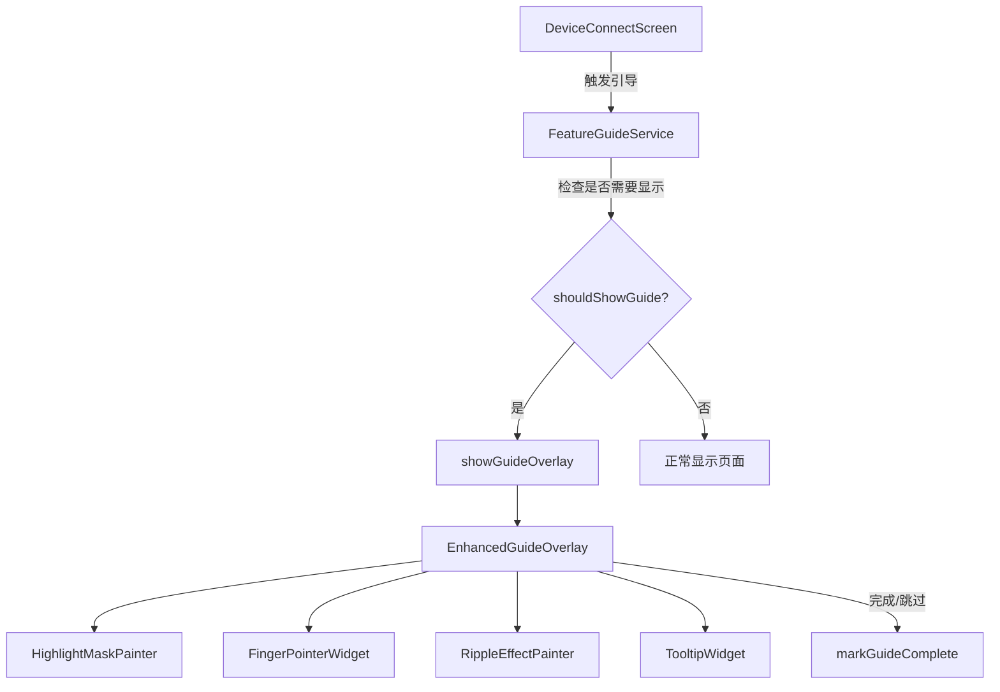
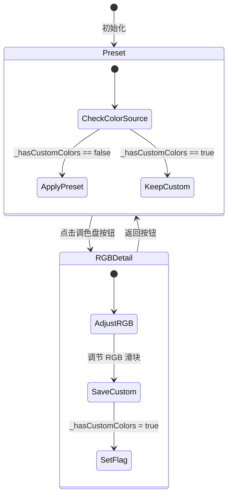

# 设计文档：应用 UX 引导升级与颜色 Bug 修复

## 概述

本设计涵盖两个独立但相关的改进：

1. **交互式引导系统升级**：将现有的简单文字弹窗引导（`GuideOverlay`）升级为带有手指指针动画、水波纹效果和智能定位提示框的分步交互式引导。在现有架构（`GuideStep`、`GuideConfiguration`、`FeatureGuideService`）基础上扩展，不改变引导服务的状态管理逻辑。

2. **RGB 颜色覆盖 Bug 修复**：修复从 `ColorizeState.rgbDetail` 返回 `ColorizeState.preset` 时，`_syncPresetToHardware()` 调用 `_applyPresetToLocalColors()` 导致自定义 RGB 值被预设颜色覆盖的问题。引入颜色来源标志位和自定义颜色持久化机制。

## 架构

### 引导系统架构



现有架构保持不变：
- `FeatureGuideService` 继续管理引导完成状态
- `GuideStep` 模型扩展以支持新的动画配置
- `GuideOverlay` 重构为 `EnhancedGuideOverlay`，增加手指指针和水波纹动画

### 颜色状态架构



## 组件与接口

### 1. EnhancedGuideOverlay（增强引导覆盖层）

替换现有的 `GuideOverlay`，新增手指指针和水波纹动画子组件。

```dart
class EnhancedGuideOverlay extends StatefulWidget {
  final List<GuideStep> steps;
  final VoidCallback onComplete;
  final VoidCallback? onSkip;
  final bool canSkip;
}
```

内部使用多个 `AnimationController`：
- `_fadeController`：步骤切换淡入淡出（300ms）
- `_fingerController`：手指指针上下浮动（800ms 循环）
- `_rippleController`：水波纹扩散（1500ms 循环）

### 2. FingerPointerWidget（手指指针组件）

```dart
class FingerPointerWidget extends StatelessWidget {
  final Rect targetRect;
  final Animation<double> bounceAnimation;
}
```

- 使用 `Icons.touch_app` 图标
- 定位在目标元素高亮区域的右下角偏移位置
- 通过 `bounceAnimation` 驱动上下浮动，幅度 8px，周期 0.8s

### 3. RippleEffectPainter（水波纹绘制器）

```dart
class RippleEffectPainter extends CustomPainter {
  final Rect targetRect;
  final double rippleProgress; // 0.0 ~ 1.0
  final Color rippleColor;     // 0xFF25C485
}
```

- 从高亮区域中心向外扩散
- 绘制两圈同心波纹（相位差 0.5）
- 不透明度从 0.4 渐变到 0.0
- 扩散半径：高亮区域边缘 + 30px

### 4. 颜色状态管理扩展（DeviceConnectScreen 内部）

```dart
// 新增状态标志
bool _hasCustomColors = false;

// 修改返回逻辑
void _handleBackFromRGBDetail() {
  setState(() => _colorizeState = ColorizeState.preset);
  if (!_hasCustomColors) {
    _syncPresetToHardware(_selectedColorIndex);
  }
  // 如果有自定义颜色，不调用 _applyPresetToLocalColors
}
```

### 5. PreferenceService 扩展

```dart
// 新增方法
Future<void> saveCustomRGBColors(Map<String, Map<String, int>> zoneColors);
Future<Map<String, Map<String, int>>?> getCustomRGBColors();
Future<void> clearCustomRGBColors();
```

存储格式（JSON）：
```json
{
  "L": {"r": 255, "g": 128, "b": 0},
  "M": {"r": 255, "g": 128, "b": 0},
  "R": {"r": 0, "g": 200, "b": 100},
  "B": {"r": 0, "g": 200, "b": 100}
}
```

## 数据模型

### GuideStep 扩展

现有 `GuideStep` 模型无需修改，已包含 `targetKey`、`title`、`description`、`position`、`icon` 字段，足以支持增强引导的需求。动画参数（浮动幅度、波纹颜色等）在 `EnhancedGuideOverlay` 内部以常量定义。

### 颜色持久化数据模型

```dart
/// 自定义 RGB 颜色数据
/// 键为区域标识（L/M/R/B），值为 RGB 颜色值
typedef ZoneColorMap = Map<String, Map<String, int>>;

// SharedPreferences 键
static const String _keyCustomRGBColors = 'custom_rgb_colors';
static const String _keyHasCustomColors = 'has_custom_colors';
```


## 正确性属性

*属性是系统在所有有效执行中应保持为真的特征或行为——本质上是关于系统应该做什么的形式化陈述。属性是人类可读规范与机器可验证正确性保证之间的桥梁。*

### Property 1: Tooltip 定位始终在屏幕可见区域内

*For any* 目标元素矩形区域和屏幕尺寸，Tooltip 的计算位置应确保提示框完全位于屏幕可见区域内（即 left >= padding, top >= padding, right <= screenWidth - padding, bottom <= screenHeight - padding）。

**Validates: Requirements 1.5**

### Property 2: 不可定位步骤自动跳过

*For any* 引导步骤列表，其中部分步骤的目标元素不可定位（targetKey 对应的 RenderBox 为 null），引导系统应跳过所有不可定位的步骤，最终只展示可定位的步骤。

**Validates: Requirements 1.9**

### Property 3: 引导完成状态持久化往返一致性

*For any* GuideType，调用 `markGuideComplete(type)` 后，`shouldShowGuide(type)` 应返回 `false`；未标记完成的 GuideType，`shouldShowGuide(type)` 应返回 `true`。

**Validates: Requirements 1.7**

### Property 4: 自定义 RGB 颜色在状态切换中保持不变

*For any* 有效的自定义 RGB 颜色值（各通道 0-255），在 rgbDetail 状态下设置自定义颜色并将 `_hasCustomColors` 标记为 true 后，从 rgbDetail 返回 preset 状态时，本地颜色映射（`_redValues`、`_greenValues`、`_blueValues`）应与返回前的值完全一致。

**Validates: Requirements 3.1, 3.2**

### Property 5: 颜色来源标志位正确追踪

*For any* 操作序列，当用户调节自定义 RGB 颜色时 `_hasCustomColors` 应为 `true`；当用户主动选择预设颜色时 `_hasCustomColors` 应为 `false` 且本地 RGB 值应与所选预设颜色一致。

**Validates: Requirements 3.3, 3.4**

### Property 6: 自定义 RGB 颜色持久化往返一致性

*For any* 有效的区域颜色映射（L/M/R/B 各区域的 R/G/B 值均在 0-255 范围内），调用 `saveCustomRGBColors(colors)` 后再调用 `getCustomRGBColors()` 应返回与保存时完全相同的颜色映射。

**Validates: Requirements 4.1, 4.2, 4.4**

## 错误处理

### 引导系统错误处理

| 错误场景 | 处理方式 |
|---------|---------|
| 目标元素 RenderBox 为 null | 跳过该步骤，自动前进到下一个可定位步骤（需求 1.9） |
| 所有步骤的目标元素均不可定位 | 直接调用 onComplete 回调，标记引导完成 |
| SharedPreferences 读写失败 | 静默处理，默认显示引导（与现有 FeatureGuideService 行为一致） |
| 动画控制器在 dispose 后被访问 | 在所有动画回调中检查 mounted 状态 |

### 颜色状态错误处理

| 错误场景 | 处理方式 |
|---------|---------|
| 预设索引越界 | `_applyPresetToLocalColors` 已有边界检查，直接 return |
| SharedPreferences 读取自定义颜色失败 | 返回 null，使用预设颜色作为降级方案 |
| JSON 解析自定义颜色数据失败 | 捕获异常，返回 null，清除损坏的数据 |
| RGB 值超出 0-255 范围 | 使用 `clamp(0, 255)` 强制约束 |

## 测试策略

### 测试框架

- **单元测试**：使用 Flutter 内置 `flutter_test` 框架
- **属性测试**：使用 `glados` 包（Dart 的属性测试库），每个属性测试至少运行 100 次迭代
- **Widget 测试**：使用 `flutter_test` 的 `WidgetTester` 进行组件测试

### 双重测试方法

**属性测试**（验证通用正确性）：
- Property 1: 生成随机目标矩形和屏幕尺寸，验证 Tooltip 定位逻辑
- Property 3: 生成随机 GuideType，验证完成状态持久化
- Property 4: 生成随机 RGB 值，验证状态切换后颜色保持
- Property 5: 生成随机操作序列，验证标志位正确性
- Property 6: 生成随机区域颜色映射，验证持久化往返一致性

**单元测试**（验证具体示例和边界情况）：
- 引导步骤切换的正确索引递增
- 跳过按钮触发 onComplete 回调
- 预设颜色索引边界值（0、8、越界值）
- 空步骤列表的处理
- `_hasCustomColors` 标志位在各种操作后的状态

**属性测试标注格式**：
每个属性测试必须包含注释引用设计文档中的属性编号：
```dart
// Feature: app-ux-and-color-bug-fix, Property 6: 自定义 RGB 颜色持久化往返一致性
```
