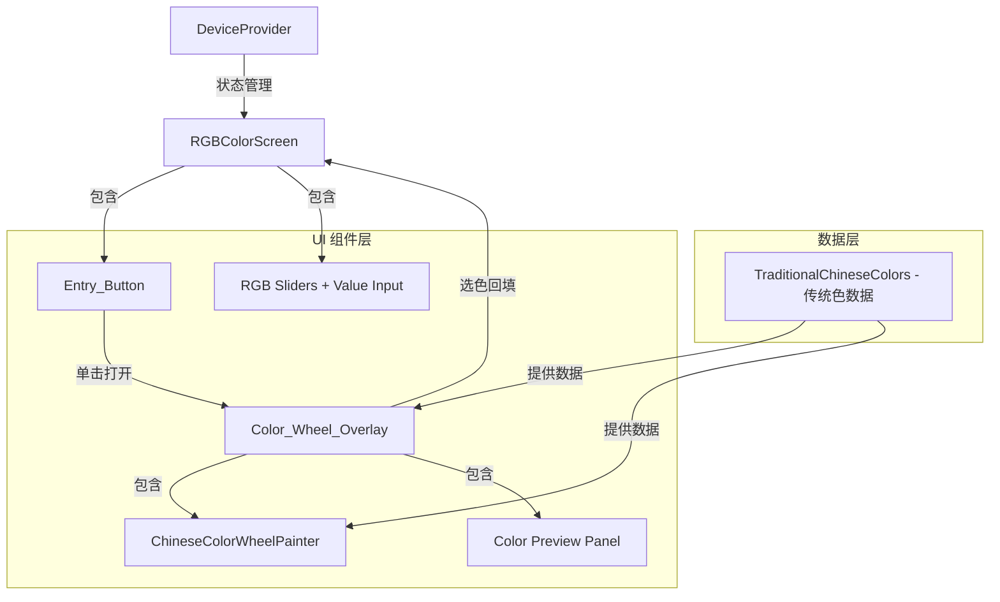

# 设计文档：中华传统色彩圆盘

## Overview

本设计为 ridewind 应用的 `RGBColorScreen` 添加中华传统色彩圆盘功能。核心组件包括：

1. 一个位于左上角的圆形入口按钮（Entry Button）
2. 一个全屏覆盖层色彩圆盘（Color Wheel Overlay），采用径向扇形布局展示中国传统色
3. RGB 滑块数值手动输入功能
4. 可选的 RGB 圆弧调色器

技术栈：Flutter + Provider 状态管理，使用 `CustomPainter` 绘制径向色彩圆盘，`GestureDetector` 处理旋转手势。

## Architecture



### 架构决策

1. **CustomPainter 绘制圆盘**：使用 `CustomPainter` 而非堆叠 Widget 来绘制径向扇形布局，性能更优且支持精确的扇形几何计算。
2. **数据与 UI 解耦**：传统色数据以独立常量类 `TraditionalChineseColors` 存放，方便后续扩展和维护。
3. **覆盖层使用 Navigator push**：Color Wheel Overlay 使用 `Navigator.push` 以全屏 `PageRoute` 方式打开，而非 `Overlay`，确保手势不与底层界面冲突。
4. **手动输入使用 inline 编辑**：RGB 数值点击后原地切换为 `TextField`，避免弹出对话框打断操作流程。

## Components and Interfaces

### 1. TraditionalChineseColors（数据类）

文件：`lib/data/traditional_chinese_colors.dart`

```dart
/// 单个传统色数据模型
class ChineseColor {
  final String name;       // 中文名称，如 "朱砂"
  final int r;
  final int g;
  final int b;
  final String family;     // 色系标识，如 "red", "yellow"

  const ChineseColor({
    required this.name,
    required this.r,
    required this.g,
    required this.b,
    required this.family,
  });

  Color toColor() => Color.fromARGB(255, r, g, b);

  /// 根据背景亮度返回适合的文字颜色
  Color get textColor {
    final luminance = 0.299 * r + 0.587 * g + 0.114 * b;
    return luminance > 128 ? Colors.black : Colors.white;
  }
}

/// 色系分类
class ColorFamily {
  final String id;          // "red", "yellow", etc.
  final String name;        // "红色系", "黄色系", etc.
  final List<ChineseColor> colors;

  const ColorFamily({
    required this.id,
    required this.name,
    required this.colors,
  });
}

/// 传统色数据集（静态常量）
class TraditionalChineseColors {
  static const List<ColorFamily> families = [...];
  static List<ChineseColor> get allColors => families.expand((f) => f.colors).toList();
}
```

### 2. ChineseColorWheelPainter（圆盘绘制器）

文件：`lib/widgets/chinese_color_wheel_painter.dart`

```dart
class ChineseColorWheelPainter extends CustomPainter {
  final List<ColorFamily> families;
  final double rotationAngle;    // 当前旋转角度
  final ChineseColor? selectedColor;

  /// 绘制径向扇形布局
  /// - 每个 ColorFamily 占据 360° / familyCount 的扇形
  /// - 同一扇形内，颜色从内到外按明度排列（深→浅）
  /// - 选中色块高亮显示
  @override
  void paint(Canvas canvas, Size size) { ... }

  /// 根据触摸坐标计算命中的颜色
  ChineseColor? hitTest(Offset position, Size size) { ... }
}
```

### 3. ChineseColorWheelOverlay（色彩圆盘覆盖层）

文件：`lib/widgets/chinese_color_wheel_overlay.dart`

```dart
class ChineseColorWheelOverlay extends StatefulWidget {
  final Function(int r, int g, int b) onColorSelected;

  const ChineseColorWheelOverlay({required this.onColorSelected});
}

class _ChineseColorWheelOverlayState extends State<ChineseColorWheelOverlay>
    with SingleTickerProviderStateMixin {
  double _rotationAngle = 0.0;
  ChineseColor? _selectedColor;
  late AnimationController _snapController;

  /// 处理旋转手势
  void _onPanUpdate(DragUpdateDetails details) { ... }

  /// 释放后自动对齐到最近的色系
  void _onPanEnd(DragEndDetails details) { ... }

  /// 处理色块点击
  void _onTapUp(TapUpDetails details) { ... }

  /// 确认选择并回填
  void _confirmSelection() {
    if (_selectedColor != null) {
      widget.onColorSelected(
        _selectedColor!.r,
        _selectedColor!.g,
        _selectedColor!.b,
      );
      Navigator.of(context).pop();
    }
  }
}
```

### 4. RGBColorScreen 修改

文件：`lib/screens/rgb_color_screen.dart`（修改现有文件）

变更点：
- 顶部栏左侧添加 Entry_Button（圆形按钮），位于返回按钮旁
- RGB 滑块右侧数值文本改为可点击，点击后切换为 `TextField` 输入框
- 新增 `_openColorWheel()` 方法，使用 `Navigator.push` 打开覆盖层
- 新增 `_onColorSelected(int r, int g, int b)` 回调，更新当前 Zone 的滑块值

```dart
// Entry Button - 左上角圆形按钮
Widget _buildEntryButton(BuildContext context) {
  return GestureDetector(
    onTap: _openColorWheel,
    child: Container(
      width: 36, height: 36,
      decoration: BoxDecoration(
        shape: BoxShape.circle,
        border: Border.all(color: Colors.white54, width: 1.5),
        gradient: SweepGradient(colors: [...]), // 彩色渐变提示
      ),
    ),
  );
}

// RGB 数值手动输入
Widget _buildEditableValue(int channelIndex) {
  // 点击数值 → 切换为 TextField
  // 输入完成 → 校验 0-255 → 更新滑块
}
```

### 5. RGB 圆弧调色器（可选）

文件：`lib/widgets/rgb_arc_picker.dart`

```dart
class RGBArcPicker extends StatelessWidget {
  final double r, g, b;
  final Function(double r, double g, double b) onChanged;

  /// 使用 CustomPainter 绘制三段圆弧（R/G/B）
  /// 用户沿圆弧拖动调整数值
}
```

## Data Models

### ChineseColor 数据结构

| 字段 | 类型 | 说明 |
|------|------|------|
| name | String | 中文颜色名称 |
| r | int | 红色通道值 (0-255) |
| g | int | 绿色通道值 (0-255) |
| b | int | 蓝色通道值 (0-255) |
| family | String | 所属色系标识 |

### ColorFamily 数据结构

| 字段 | 类型 | 说明 |
|------|------|------|
| id | String | 色系标识（"red", "yellow" 等） |
| name | String | 色系中文名称（"红色系" 等） |
| colors | List\<ChineseColor\> | 该色系下的所有颜色，按明度从深到浅排列 |

### 传统色数据示例

```dart
// 红色系示例
ColorFamily(
  id: 'red',
  name: '红色系',
  colors: [
    ChineseColor(name: '暗红', r: 101, g: 25, b: 11, family: 'red'),
    ChineseColor(name: '朱砂', r: 255, g: 46, b: 0, family: 'red'),
    ChineseColor(name: '胭脂', r: 157, g: 41, b: 51, family: 'red'),
    ChineseColor(name: '妃色', r: 237, g: 87, b: 54, family: 'red'),
    ChineseColor(name: '海棠红', r: 219, g: 90, b: 107, family: 'red'),
    ChineseColor(name: '银红', r: 196, g: 99, b: 108, family: 'red'),
    ChineseColor(name: '桃红', r: 240, g: 173, b: 160, family: 'red'),
    ChineseColor(name: '粉红', r: 255, g: 179, b: 167, family: 'red'),
    // ... 更多颜色
  ],
),
```

### 圆盘几何模型

```
圆盘参数：
- 外半径 = min(screenWidth, screenHeight) * 0.42
- 内半径 = 外半径 * 0.25（中心预览区域）
- 每个色系扇形角度 = 360° / colorFamilyCount
- 每个色块径向厚度 = (外半径 - 内半径) / maxColorsPerFamily
- 色块排列：内圈 = 深色，外圈 = 浅色
```


## Correctness Properties

*A property is a characteristic or behavior that should hold true across all valid executions of a system — essentially, a formal statement about what the system should do. Properties serve as the bridge between human-readable specifications and machine-verifiable correctness guarantees.*

### Property 1: 扇形角度均分

*For any* set of N color families, each family's sector angle in the radial layout SHALL equal 360° / N, and the sum of all sector angles SHALL equal 360°.

**Validates: Requirements 2.2**

### Property 2: 色块明度排序（内深外浅）

*For any* color family, the colors arranged from inner ring to outer ring SHALL have non-decreasing luminance values (computed as 0.299*R + 0.587*G + 0.114*B).

**Validates: Requirements 2.3**

### Property 3: 文字颜色对比度

*For any* ChineseColor, the `textColor` property SHALL return black (Color(0xFF000000)) when the color's luminance (0.299*R + 0.587*G + 0.114*B) is greater than 128, and white (Color(0xFFFFFFFF)) otherwise.

**Validates: Requirements 3.4**

### Property 4: 旋转对齐（Snap-to-sector）

*For any* rotation angle in [0°, 360°) and N color families, the snap function SHALL return the nearest sector boundary angle (a multiple of 360°/N), and the snapped angle SHALL be within 360°/(2*N) of the input angle.

**Validates: Requirements 4.3**

### Property 5: 颜色选择回填一致性

*For any* ChineseColor selected from the wheel, after confirmation the RGB slider values (R, G, B) on RGBColorScreen SHALL exactly equal the selected color's (r, g, b) values.

**Validates: Requirements 5.2**

### Property 6: 传统色数据完整性

*For any* ColorFamily in TraditionalChineseColors, the family SHALL contain at least 8 colors, and *for any* ChineseColor in the dataset, the name SHALL be a non-empty string, and R, G, B values SHALL each be integers in the range [0, 255].

**Validates: Requirements 6.2, 6.3**

### Property 7: RGB 输入值域校验

*For any* integer input value, the RGB value clamping function SHALL return a value in [0, 255], specifically: if input < 0 then 0, if input > 255 then 255, otherwise the input value unchanged. This is an idempotence property: clamping an already-valid value produces the same value.

**Validates: Requirements 7.2, 7.3**

## Error Handling

| 场景 | 处理方式 |
|------|----------|
| 传统色数据为空 | Color_Wheel_Overlay 显示空状态提示，不崩溃 |
| hitTest 未命中任何色块 | 忽略点击，不改变选中状态 |
| RGB 输入非数字字符 | TextField inputFormatter 过滤非数字字符，仅允许数字输入 |
| RGB 输入空字符串后失焦 | 保持原有数值不变 |
| 旋转手势计算角度异常（NaN） | 回退到上一个有效角度 |
| 屏幕尺寸过小导致色块不可见 | 设置最小色块尺寸阈值，低于阈值时减少显示的颜色数量 |

## Testing Strategy

### 单元测试（Unit Tests）

- **ChineseColor.textColor** 计算：测试具体的亮色/暗色边界值
- **hitTest** 方法：测试圆盘中心、边缘、扇形边界等特定坐标
- **snap-to-sector** 函数：测试边界角度（0°、正好在两个扇形中间等）
- **RGB 输入校验**：测试边界值 -1, 0, 255, 256, 空字符串等
- **传统色数据**：验证数据集完整性（色系数量、颜色数量、RGB 范围）

### Property-Based Tests（属性测试）

使用 `dart_quickcheck` 或手动随机生成测试数据，每个属性测试至少运行 100 次迭代。

| Property | 测试方法 |
|----------|----------|
| Property 1: 扇形角度均分 | 生成随机数量的色系（1-20），验证角度均分和总和 |
| Property 2: 色块明度排序 | 生成随机 RGB 颜色列表，排序后验证明度递增 |
| Property 3: 文字颜色对比度 | 生成随机 RGB 值，验证 textColor 与手动计算的亮度阈值一致 |
| Property 4: 旋转对齐 | 生成随机角度和色系数量，验证 snap 结果在正确范围内 |
| Property 5: 颜色选择回填 | 生成随机 ChineseColor，模拟选择后验证滑块值匹配 |
| Property 6: 传统色数据完整性 | 遍历所有数据验证约束（这是对静态数据的全量检查） |
| Property 7: RGB 输入值域校验 | 生成随机整数（-1000 到 1000），验证 clamp 结果在 [0, 255] |

每个属性测试须标注注释：
```dart
// Feature: chinese-color-wheel, Property 1: 扇形角度均分
// Validates: Requirements 2.2
```

### 测试框架

- 使用 Flutter 内置 `flutter_test` 进行 widget 测试和单元测试
- Property-based testing 使用 `dart` 的 `Random` 类生成随机输入，循环 100+ 次
- Widget 测试覆盖：Entry Button 点击、Overlay 打开/关闭、颜色选择回填流程
