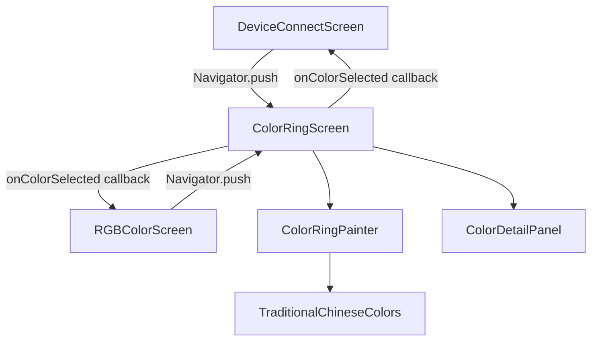
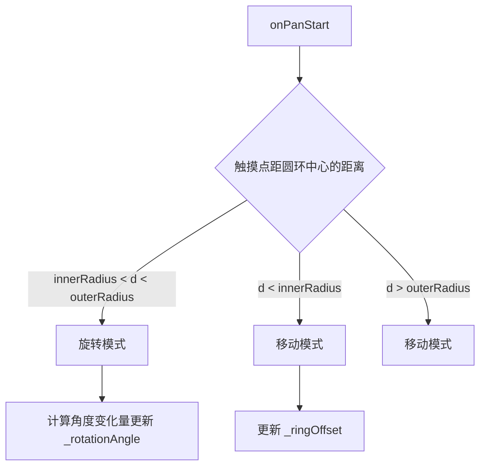

# 设计文档：色彩圆环重新设计

## 概述

本设计将现有的 COPIC 风格色彩圆盘（`ChineseColorWheelPainter` + `ChineseColorWheelOverlay`）替换为参考 COPIC 色轮 App 的圆环布局。核心变化：

1. **布局**：从"扇形梯形色块 + InteractiveViewer 缩放平移"改为"圆环 + 旋转手势"
2. **导航**：从 Overlay 改为独立的 `ColorRingScreen`（通过 `Navigator.push` 进入）
3. **动画**：圆环从左上角以缩放+淡入弹出，支持拖动移动到任意位置
4. **交互**：单指弧形拖动旋转圆环（带惯性），点击选色，双击/确认回填 RGB

数据源不变，仍使用 `TraditionalChineseColors.families`（6 个色系，每个 8-9 种颜色）。本阶段仅实现 UI 和交互演示，不涉及蓝牙硬件同步。

### 关键设计决策

| 决策 | 选择 | 理由 |
|------|------|------|
| 绘制方式 | `CustomPainter` | 需要精确控制弧形色块的绘制和命中检测，与现有方案一致 |
| 页面导航 | `Navigator.push` + `MaterialPageRoute` | 用户要求独立全屏页面，与现有入口方式一致 |
| 旋转实现 | `GestureDetector` + `AnimationController` | 需要自定义弧形拖动检测和惯性动画，`RotationGestureDetector` 不适用于单指操作 |
| 拖动移动 | `Offset` 状态 + `GestureDetector.onPan` | 简单直接，圆环位置用 `Offset` 管理 |
| 弹出动画 | `AnimationController` + `ScaleTransition` + `FadeTransition` | 需要从左上角展开，需自定义 `alignment` |

## 架构

### 组件关系图



### 文件结构

```
lib/
├── screens/
│   └── color_ring_screen.dart          # 新：圆环专属全屏页面（StatefulWidget）
├── widgets/
│   ├── color_ring_painter.dart          # 新：圆环 CustomPainter
│   ├── color_detail_panel.dart          # 新：选中颜色详情面板
│   ├── chinese_color_wheel_painter.dart # 旧：保留但不再使用
│   └── chinese_color_wheel_overlay.dart # 旧：保留但不再使用
├── data/
│   └── traditional_chinese_colors.dart  # 不变：色系数据
└── utils/
    └── responsive_utils.dart            # 不变：响应式工具
```

### 状态管理

`ColorRingScreen` 使用 `StatefulWidget` 管理以下状态：

| 状态 | 类型 | 说明 |
|------|------|------|
| `_rotationAngle` | `double` | 圆环当前旋转角度（弧度） |
| `_ringOffset` | `Offset` | 圆环中心在屏幕上的位置 |
| `_selectedColor` | `ChineseColor?` | 当前选中的颜色 |
| `_popupController` | `AnimationController` | 弹出/关闭缩放+淡入动画 |
| `_inertiaController` | `AnimationController` | 惯性旋转动画 |
| `_lastAngularVelocity` | `double` | 释放手势时的角速度，用于惯性计算 |


## 组件与接口

### 1. ColorRingScreen（色彩圆环页面）

**文件**：`lib/screens/color_ring_screen.dart`

**职责**：全屏深色背景页面，承载圆环绘制、手势交互、动画控制和颜色选择。

```dart
class ColorRingScreen extends StatefulWidget {
  /// 颜色选中回调，返回 R、G、B 值
  final Function(int r, int g, int b) onColorSelected;

  const ColorRingScreen({super.key, required this.onColorSelected});
}
```

**关键方法**：

| 方法 | 说明 |
|------|------|
| `_onPanStart(DragStartDetails)` | 判断触摸点在色块区域（旋转）还是中心空白区域（移动） |
| `_onPanUpdate(DragUpdateDetails)` | 根据模式执行旋转角度更新或位置偏移更新 |
| `_onPanEnd(DragEndDetails)` | 旋转模式下计算角速度并启动惯性动画 |
| `_onTapUp(TapUpDetails)` | 根据点击坐标计算命中色块，更新选中状态 |
| `_onDoubleTap()` | 双击确认选色并关闭页面 |
| `_confirmSelection()` | 调用 `onColorSelected` 回调并 `Navigator.pop` |
| `_playPopupAnimation()` | 正向播放弹出动画（缩放+淡入） |
| `_playDismissAnimation()` | 反向播放关闭动画（缩放+淡出），完成后 pop |

**手势判定逻辑**：



### 2. ColorRingPainter（圆环绘制器）

**文件**：`lib/widgets/color_ring_painter.dart`

**职责**：使用 `CustomPainter` 绘制圆环，包括色块、分隔线、色系标签、选中高亮和内圈代表色带。

```dart
class ColorRingPainter extends CustomPainter {
  final List<ColorFamily> families;
  final double rotationAngle;
  final ChineseColor? selectedColor;
  final double innerRadius;
  final double outerRadius;

  // 绘制方法
  void paint(Canvas canvas, Size size);
  bool shouldRepaint(covariant ColorRingPainter oldDelegate);

  // 命中检测（考虑旋转角度）
  ChineseColor? hitTest(Offset localPosition, Size size);
}
```

**绘制算法**：

1. 计算每个色系占据的扇形角度：`sectorAngle = 2π / familyCount`
2. 对每个色系，计算其内部颜色的层数 `layerCount = family.colors.length`
3. 每层的径向厚度：`layerThickness = (outerRadius - innerRadius) / maxLayerCount`
4. 第 `i` 层色块的内径：`rInner = innerRadius + i * layerThickness`
5. 第 `i` 层色块的外径：`rOuter = rInner + layerThickness - gap`
6. 所有角度加上 `rotationAngle` 偏移
7. 内圈绘制一条窄色带（高度约 3-4px），每段使用该色系最深色

**命中检测算法**：

1. 将触摸点转换为相对于圆环中心的极坐标 `(distance, angle)`
2. 减去 `rotationAngle` 得到未旋转的角度
3. 根据角度确定色系索引：`familyIndex = floor(normalizedAngle / sectorAngle)`
4. 根据距离确定颜色层索引：`layerIndex = floor((distance - innerRadius) / layerThickness)`
5. 返回 `families[familyIndex].colors[layerIndex]`（边界检查）

### 3. ColorDetailPanel（颜色详情面板）

**文件**：`lib/widgets/color_detail_panel.dart`

**职责**：显示选中颜色的名称、色块预览和 RGB 值，带过渡动画。

```dart
class ColorDetailPanel extends StatelessWidget {
  final ChineseColor? color;
  final VoidCallback? onConfirm;
}
```

**布局**：在圆环中心区域显示，包含：
- 颜色名称（中文）
- 圆形色块预览（带白色描边）
- RGB 数值（R:xxx G:xxx B:xxx）
- 确认按钮

### 4. 入口集成修改

**DeviceConnectScreen**（`lib/screens/device_connect_screen.dart`）：

修改 `_openChineseColorWheel` 方法，将 `ChineseColorWheelOverlay` 替换为 `ColorRingScreen`：

```dart
void _openChineseColorWheel() {
  Navigator.of(context).push(
    MaterialPageRoute(
      builder: (context) => ColorRingScreen(
        onColorSelected: (r, g, b) {
          final pos = _selectedLightPosition;
          setState(() {
            _redValues[pos] = r;
            _greenValues[pos] = g;
            _blueValues[pos] = b;
          });
          _syncLEDColor();
          _markCustomColors();
        },
      ),
    ),
  );
}
```

**RGBColorScreen**（`lib/screens/rgb_color_screen.dart`）：

修改 `_openColorWheel` 方法，同样替换为 `ColorRingScreen`。


## 数据模型

### 现有数据模型（不变）

数据层完全复用现有的 `TraditionalChineseColors`，无需修改：

```dart
// lib/data/traditional_chinese_colors.dart（现有，不变）

class ChineseColor {
  final String name;   // 中文名称
  final int r, g, b;   // RGB 值
  final String family;  // 色系标识

  Color toColor() => Color.fromARGB(255, r, g, b);
  Color get textColor;  // 根据亮度自动选择黑/白文字色
}

class ColorFamily {
  final String id;              // "red", "yellow", etc.
  final String name;            // "红色系", "黄色系", etc.
  final List<ChineseColor> colors;  // 按明度从深到浅排列
}

class TraditionalChineseColors {
  static const List<ColorFamily> families;  // 6 个色系
  static List<ChineseColor> get allColors;  // 扁平列表
}
```

**数据特征**：
- 6 个色系：红（9色）、黄（9色）、绿（8色）、蓝（8色）、紫（8色）、白灰黑（9色）
- 每个色系内颜色已按明度从深到浅排列（luminance 递增）
- 最大颜色数 `maxColors = 9`

### 圆环几何参数

以下参数在 `ColorRingPainter` 中定义为常量或根据屏幕尺寸动态计算：

| 参数 | 值/计算方式 | 说明 |
|------|------------|------|
| `familyCount` | `6` | 色系数量 |
| `sectorAngle` | `2π / 6 ≈ 1.047 rad (60°)` | 每个色系占据的扇形角度 |
| `sectorGap` | `0.015 rad (~0.86°)` | 相邻色系间的分隔角度 |
| `innerRadius` | `screenShortSide * 0.15` | 内圈半径（中心空白区域） |
| `outerRadius` | `innerRadius + maxLayers * layerThickness` | 外圈半径 |
| `layerThickness` | `screenShortSide * 0.035` | 每层色块的径向厚度 |
| `layerGap` | `1.0 px` | 层间间隔 |
| `innerBandHeight` | `3.0 px` | 内圈代表色带高度 |
| `maxLayers` | `9` | 最大层数（取所有色系中最多颜色数） |

### 动画参数

| 参数 | 值 | 说明 |
|------|------|------|
| 弹出动画时长 | `400ms` | 缩放+淡入 |
| 关闭动画时长 | `250ms` | 缩放+淡出 |
| 弹出曲线 | `Curves.easeOutBack` | 弹性回弹效果 |
| 关闭曲线 | `Curves.easeInCubic` | 快速收回 |
| 惯性动画时长 | `800ms - 1500ms`（根据角速度） | 减速旋转 |
| 惯性曲线 | `Curves.decelerate` | 自然减速 |
| 详情面板过渡 | `200ms` | 颜色切换时的淡入淡出 |

### 弹出动画原点

圆环初始位置在页面左上角区域（约 `Offset(80, 120)`），弹出动画的 `alignment` 设为 `Alignment.topLeft`，使缩放从左上角展开。用户可拖动圆环到任意位置。

