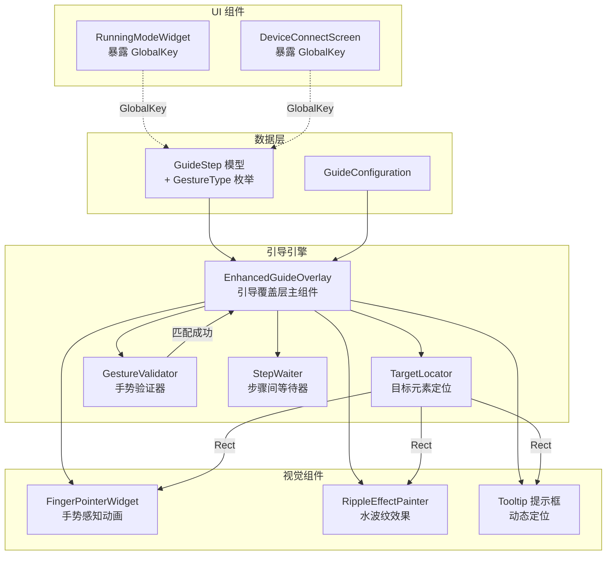

# 设计文档：交互式引导系统重构

## 概述

本设计将 RideWind 应用的引导覆盖层系统从"固定位置 + 任意点击推进"重构为"精确定位目标元素 + 手势验证推进"的真正交互式引导系统。核心变更包括：扩展 `GuideStep` 数据模型以支持手势类型、重构 `EnhancedGuideOverlay` 以实现目标元素精确定位、为 `FingerPointerWidget` 添加多种手势动画变体、实现手势匹配验证机制、以及从实际 UI 组件暴露 GlobalKey。

设计保持现有的 `FeatureGuideService`（引导完成状态持久化）、`GuideTooltipStyle`（毛玻璃/呼吸光边框两种样式）和 `RippleEffectPainter`（水波纹绘制）基本不变，重点重构覆盖层的定位逻辑和交互逻辑。

## 架构



### 数据流

1. UI 组件（RunningModeWidget、DeviceConnectScreen）将 GlobalKey 绑定到实际控件
2. 引导步骤定义引用这些 GlobalKey，并指定 GestureType
3. EnhancedGuideOverlay 通过 TargetLocator 获取目标元素的屏幕位置
4. FingerPointerWidget 根据 GestureType 播放对应动画
5. GestureValidator 监听用户手势，匹配成功后通知 Overlay 推进
6. StepWaiter 在需要 UI 状态变化的步骤间等待目标元素渲染完成

## 组件与接口

### 1. GestureType 枚举（扩展 guide_models.dart）

```dart
enum GestureType {
  tap,
  longPress,
  swipeLeft,
  swipeRight,
  swipeUp,
  swipeDown,
  dragHorizontal,
  dragVertical,
}
```

### 2. GuideStep 模型扩展

```dart
class GuideStep {
  final GlobalKey targetKey;
  final String title;
  final String description;
  final TooltipPosition position;
  final IconData? icon;
  final GestureType gestureType;  // 新增
  
  const GuideStep({
    required this.targetKey,
    required this.title,
    required this.description,
    this.position = TooltipPosition.bottom,
    this.icon,
    this.gestureType = GestureType.tap,  // 默认 tap
  });
}
```

### 3. GestureValidator（新增组件）

负责在目标区域检测用户手势并判断是否匹配当前步骤要求。

```dart
/// 手势验证结果回调
typedef GestureMatchCallback = void Function();

class GestureValidatorWidget extends StatelessWidget {
  final Rect targetRect;
  final GestureType expectedGesture;
  final GestureMatchCallback onGestureMatched;
  final double padding;

  /// 构建覆盖在目标区域上的手势检测层
  /// 匹配成功后调用 onGestureMatched 并将事件传递给底层
  Widget build(BuildContext context);
}
```

手势匹配逻辑：
- **tap**：`onTap` 触发即匹配
- **longPress**：`onLongPress` 触发即匹配（Flutter 默认 500ms 阈值）
- **swipeLeft/swipeRight**：`onHorizontalDragEnd` 中检查 `velocity.pixelsPerSecond.dx` 方向
- **swipeUp/swipeDown**：`onVerticalDragEnd` 中检查 `velocity.pixelsPerSecond.dy` 方向
- **dragHorizontal**：`onHorizontalDragUpdate` 累计位移超过阈值（30px）即匹配
- **dragVertical**：`onVerticalDragUpdate` 累计位移超过阈值（30px）即匹配

关键设计决策：手势事件需要同时传递给底层 UI 组件。使用 `HitTestBehavior.translucent` 确保事件穿透，同时在验证层记录手势结果。对于需要拦截的手势（如 swipe），使用 `GestureDetector` 的 `onHorizontalDragEnd` 等回调，在回调中先标记匹配，然后通过 `RawGestureDetector` 或手动调用底层组件的手势处理来传递事件。

### 4. FingerPointerWidget 重构

扩展现有组件以支持多种手势动画：

```dart
class FingerPointerWidget extends StatelessWidget {
  final Rect targetRect;
  final GestureType gestureType;  // 新增：决定动画类型
  final Animation<double> animation;
  final Color color;
  final double iconSize;

  /// 根据 gestureType 计算手指位置
  Offset calculatePosition(double animationValue);
}
```

动画变体设计：

| GestureType | 动画描述 | 动画参数 |
|-------------|---------|---------|
| tap | 上下弹跳（现有行为） | 振幅 10px，周期 800ms |
| longPress | 下压 → 停顿 → 抬起 | 下压 300ms，停顿 600ms，抬起 300ms |
| swipeLeft | 从目标右侧滑到左侧 | 水平位移 60px，周期 1000ms |
| swipeRight | 从目标左侧滑到右侧 | 水平位移 60px，周期 1000ms |
| swipeUp | 从目标下方滑到上方 | 垂直位移 60px，周期 1000ms |
| swipeDown | 从目标上方滑到下方 | 垂直位移 60px，周期 1000ms |
| dragHorizontal | 水平来回移动 | 位移 40px，周期 1200ms，repeat(reverse: true) |
| dragVertical | 垂直来回移动 | 位移 40px，周期 1200ms，repeat(reverse: true) |

### 5. EnhancedGuideOverlay 重构

核心变更：
- 移除"点击任意位置推进"逻辑
- 使用 GestureValidatorWidget 替代简单的 `GestureDetector(onTap: _nextStep)`
- 提示框定位改为基于目标元素位置动态计算
- 添加步骤间等待机制

```dart
class EnhancedGuideOverlayState extends State<EnhancedGuideOverlay>
    with TickerProviderStateMixin {
  
  /// 推进到下一步（由 GestureValidator 触发）
  Future<void> _nextStep() async {
    // 1. 淡出当前步骤
    // 2. 如果下一步需要等待 UI 状态变化，调用 _waitForTarget
    // 3. 更新步骤索引
    // 4. 更新目标位置
    // 5. 淡入新步骤
  }

  /// 等待目标元素渲染完成
  Future<bool> _waitForTarget(GlobalKey targetKey, {
    Duration pollInterval = const Duration(milliseconds: 100),
    Duration timeout = const Duration(milliseconds: 2000),
  }) async {
    final stopwatch = Stopwatch()..start();
    while (stopwatch.elapsed < timeout) {
      final renderBox = targetKey.currentContext?.findRenderObject() as RenderBox?;
      if (renderBox != null && renderBox.hasSize) {
        return true;
      }
      await Future.delayed(pollInterval);
    }
    return false; // 超时
  }

  /// 计算提示框位置
  Offset _calculateTooltipPosition(Rect targetRect, Size screenSize) {
    // 目标在上半屏 → 提示框在下方
    // 目标在下半屏 → 提示框在上方
    // 水平居中对齐目标，边界裁剪
  }
}
```

### 6. GlobalKey 暴露策略

**RunningModeWidget**：通过回调将 GlobalKey 传递给父组件。

```dart
class RunningModeWidget extends StatefulWidget {
  // 新增：GlobalKey 暴露回调
  final Function(Map<String, GlobalKey> keys)? onKeysReady;
  // ...
}
```

在 `initState` 的 `addPostFrameCallback` 中调用：
```dart
widget.onKeysReady?.call({
  'speedWheel': _speedWheelKey,
  'unitLabel': _unitLabelKey,
  'throttleButton': _throttleButtonKey,
  'emergencyStop': _emergencyStopKey,
});
```

**DeviceConnectScreen**：直接在 State 中定义 GlobalKey 并绑定到对应组件。

```dart
// 引导目标 GlobalKey
final GlobalKey _carImageKey = GlobalKey();
final GlobalKey _lowerHalfKey = GlobalKey();
final GlobalKey _colorCapsuleStripKey = GlobalKey();
final GlobalKey _startColoringButtonKey = GlobalKey();
final GlobalKey _paletteButtonKey = GlobalKey();
final GlobalKey _lmrbCapsulesKey = GlobalKey();
final GlobalKey _rgbSlidersKey = GlobalKey();
final GlobalKey _brightnessBarKey = GlobalKey();
```

## 数据模型

### GuideStep（扩展后）

| 字段 | 类型 | 说明 |
|------|------|------|
| targetKey | GlobalKey | 目标元素的唯一标识键 |
| title | String | 步骤标题 |
| description | String | 步骤描述文本 |
| position | TooltipPosition | 提示框位置偏好（自动覆盖） |
| icon | IconData? | 可选图标 |
| gestureType | GestureType | 所需手势类型，默认 tap |

### GestureType 枚举

| 值 | 说明 | 手指动画 |
|----|------|---------|
| tap | 点击 | 上下弹跳 |
| longPress | 长按 | 下压停顿 |
| swipeLeft | 向左滑动 | 右→左滑动 |
| swipeRight | 向右滑动 | 左→右滑动 |
| swipeUp | 向上滑动 | 下→上滑动 |
| swipeDown | 向下滑动 | 上→下滑动 |
| dragHorizontal | 水平拖动 | 水平来回 |
| dragVertical | 垂直拖动 | 垂直来回 |

### Running Mode 引导步骤配置

| 步骤 | targetKey | description | gestureType |
|------|-----------|-------------|-------------|
| 1 | lowerHalfKey | 点击进入调速界面 | tap |
| 2 | speedWheelKey | 上下滑动调节速度 | swipeDown |
| 3 | unitLabelKey | 点击切换 km/h 和 mph | tap |
| 4 | throttleButtonKey | 长按油门持续加速 | longPress |
| 5 | emergencyStopKey | 点击紧急停止归零 | tap |
| 6 | carImageKey | 点击开关雾化器 | tap |
| 7 | carImageKey | 长按可关机或重启 | tap |
| 8 | lowerHalfKey | 向左滑动进入颜色模式 | swipeLeft |

### Colorize Mode 引导步骤配置

| 步骤 | targetKey | description | gestureType |
|------|-----------|-------------|-------------|
| 1 | colorCapsuleStripKey | 左右滑动选择预设颜色 | swipeRight |
| 2 | startColoringButtonKey | 点击开始颜色循环动画 | tap |
| 3 | paletteButtonKey | 点击进入 RGB 详细调色 | tap |
| 4 | lmrbCapsulesKey | 点击选择灯带区域 | tap |
| 5 | lmrbCapsulesKey | 长按打开详细调色面板 | longPress |
| 6 | rgbSlidersKey | 拖动调节颜色值 | dragHorizontal |
| 7 | brightnessBarKey | 上下拖动调节亮度 | dragVertical |


## 正确性属性

*正确性属性是一种在系统所有有效执行中都应成立的特征或行为——本质上是关于系统应该做什么的形式化陈述。属性作为人类可读规范与机器可验证正确性保证之间的桥梁。*

以下属性从需求验收标准中提炼而来，每个属性都是可通过属性基测试（property-based testing）自动验证的通用量化陈述。

### Property 1: GuideStep 默认手势类型为 tap

*For any* GuideStep created without specifying a gestureType, the gestureType field should equal GestureType.tap.

**Validates: Requirements 1.3**

### Property 2: 提示框定位正确性

*For any* target rect within a screen of any valid size, the calculated tooltip position should satisfy all of the following conditions:
- When the target center is in the upper half of the screen, the tooltip top should be below the target bottom
- When the target center is in the lower half of the screen, the tooltip bottom should be above the target top
- The tooltip left edge should be >= screen padding (16px)
- The tooltip right edge should be <= screen width - screen padding (16px)
- The tooltip top edge should be >= screen padding (16px)
- The tooltip bottom edge should be <= screen height - screen padding (16px)
- The distance between the tooltip and the target rect should be >= the minimum spacing threshold

**Validates: Requirements 3.1, 3.2, 3.3, 3.4, 3.5**

### Property 3: 手指动画方向与手势类型一致

*For any* GestureType and any two animation progress values t1 < t2 within a single animation cycle (0.0 to 1.0), the finger position calculated by FingerPointerWidget should satisfy:
- For swipeLeft: position(t2).dx < position(t1).dx (x decreases)
- For swipeRight: position(t2).dx > position(t1).dx (x increases)
- For swipeUp: position(t2).dy < position(t1).dy (y decreases)
- For swipeDown: position(t2).dy > position(t1).dy (y increases)
- For tap: position varies only on the y-axis (x remains constant relative to target center)
- For longPress: position varies only on the y-axis (x remains constant relative to target center)
- For dragHorizontal: position varies primarily on the x-axis
- For dragVertical: position varies primarily on the y-axis

**Validates: Requirements 4.1, 4.2, 4.3, 4.4, 4.5, 4.6, 4.7**

### Property 4: 手势匹配正确性

*For any* gesture event data (velocity vector, cumulative displacement, gesture type) and any expected GestureType, the gesture matcher should return true if and only if the gesture data corresponds to the expected type:
- tap gesture data matches only GestureType.tap
- longPress gesture data matches only GestureType.longPress
- Horizontal swipe with negative dx matches only GestureType.swipeLeft
- Horizontal swipe with positive dx matches only GestureType.swipeRight
- Vertical swipe with negative dy matches only GestureType.swipeUp
- Vertical swipe with positive dy matches only GestureType.swipeDown
- Horizontal drag displacement matches only GestureType.dragHorizontal
- Vertical drag displacement matches only GestureType.dragVertical

**Validates: Requirements 5.3, 5.4, 5.5, 5.6, 5.7**

### Property 5: 步骤指示器格式正确性

*For any* current step index (0-based) and total step count (>= 1), the generated step indicator string should equal "{currentIndex + 1} / {totalCount}".

**Validates: Requirements 10.4**

## 错误处理

| 场景 | 处理方式 |
|------|---------|
| GlobalKey 对应的 RenderBox 不可用 | 跳过该步骤，自动推进到下一步（需求 2.4） |
| 步骤间等待目标元素超时（2000ms） | 跳过该步骤，继续后续引导（需求 9.3） |
| 引导步骤列表为空 | 直接调用 onComplete 回调，不显示覆盖层 |
| 所有步骤的目标元素均不可用 | 调用 onComplete 回调，静默结束引导 |
| FeatureGuideService 读写 SharedPreferences 失败 | 静默处理，读取失败时默认显示引导，写入失败时下次重新显示 |
| 动画控制器在 dispose 后被访问 | 使用 `mounted` 检查保护所有异步回调 |

## 测试策略

### 属性基测试（Property-Based Testing）

使用 Dart 的 `glados` 库进行属性基测试，每个属性至少运行 100 次迭代。

| 测试 | 对应属性 | 说明 |
|------|---------|------|
| Feature: interactive-guide-system, Property 1: GuideStep default gestureType | Property 1 | 生成随机 GuideStep（不指定 gestureType），验证默认值为 tap |
| Feature: interactive-guide-system, Property 2: Tooltip positioning | Property 2 | 生成随机 target rect 和 screen size，验证 calculateTooltipPosition 返回值满足所有约束 |
| Feature: interactive-guide-system, Property 3: Finger animation direction | Property 3 | 生成随机 GestureType、target rect 和动画进度对，验证位置变化方向正确 |
| Feature: interactive-guide-system, Property 4: Gesture matching | Property 4 | 生成随机手势数据和期望 GestureType，验证匹配逻辑正确 |
| Feature: interactive-guide-system, Property 5: Step indicator format | Property 5 | 生成随机 index 和 count，验证格式字符串正确 |

### 单元测试

| 测试 | 说明 |
|------|------|
| GestureType 枚举值完整性 | 验证枚举包含所有 8 个值 |
| GuideStep 向后兼容性 | 验证现有字段保留 |
| Running Mode 引导配置 | 验证 8 个步骤的 gestureType 和 description 正确 |
| Colorize Mode 引导配置 | 验证 7 个步骤的 gestureType 和 description 正确 |
| 提示框定位边界情况 | 目标在屏幕边缘、目标占满屏幕等 |
| 手势匹配边界情况 | 零速度滑动、极小位移拖动等 |

### Widget 测试

| 测试 | 说明 |
|------|------|
| EnhancedGuideOverlay 渲染 | 验证覆盖层正确渲染手指、波纹、提示框 |
| 手势验证推进 | 验证正确手势推进步骤，错误手势不推进 |
| 跳过引导功能 | 验证点击跳过按钮正确结束引导 |
| 步骤指示器显示 | 验证步骤编号正确显示 |
