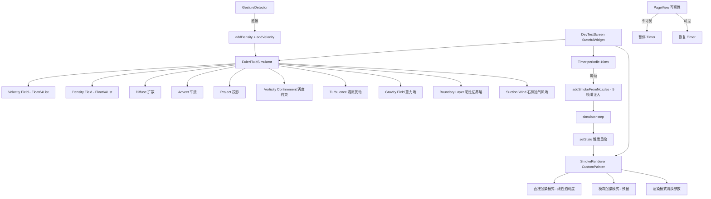

# 设计文档：逼真烟雾效果（风洞水雾模拟）

## 概述

本设计将 DevTestScreen 的烟雾效果从当前的 Canvas 路径绘制方案全面重构为基于 `EulerFluidSimulator` 的欧拉流体模拟方案。核心改造：

1. **模拟器增强**：在现有 `EulerFluidSimulator` 基础上新增风洞管道物理——无滑移壁面（上下）、开放边界（左右）、粘性边界层、恒定重力场、右侧抽气风场
2. **5 独立喷嘴**：左侧边缘 5 个均匀分布的喷嘴，各自独立注入密度和速度，形成 5 股分明射流
3. **直接渲染模式**：密度场线性映射为透明度，不施加模糊滤镜，便于观测调试；保留模式切换参数供后期启用模糊
4. **DevTestScreen 重构**：移除现有 `_SmokeStream` 路径绘制逻辑，改为驱动 `EulerFluidSimulator` + `SmokeRenderer`

整体架构保持 `EulerFluidSimulator` + `DevTestScreen` + `CustomPainter` 三层结构。

## 架构



### 数据流

1. Timer 每 16ms 触发一次循环
2. 5 个喷嘴在左侧边缘各自独立注入密度和正 x 方向速度
3. `EulerFluidSimulator.step()` 执行一步模拟：扩散→投影→平流→投影→涡度约束→湍流→重力→密度演化→衰减→边界层→抽气风场→清理
4. `setState` 触发 `SmokeRenderer` 重绘
5. `SmokeRenderer` 读取密度场，线性映射为透明度输出画面

## 组件与接口

### 1. EulerFluidSimulator（增强）

在现有模拟器基础上新增风洞管道物理能力。

```dart
class EulerFluidSimulator {
  // === 现有接口保持不变 ===
  void addDensity(int x, int y, double amount);
  void addVelocity(int x, int y, double amountX, double amountY);
  void step();
  double getDensity(int x, int y);
  (double, double) getVelocity(int x, int y);
  void reset();

  // === 现有增强（已实现） ===
  double vorticityStrength;           // 涡度约束强度，默认 0.1
  double decayRate;                   // 密度衰减系数，默认 0.99
  double velocityDecay;               // 速度衰减系数，默认 0.998
  double densityThreshold;            // 密度清零阈值，默认 0.005

  // === 新增：重力场 ===
  double gravityStrength;             // 重力加速度，默认 0.05
  void _applyGravity();              // 对 v 分量施加恒定正向增量

  // === 新增：无滑移壁面条件 ===
  // 修改 _setBoundary()：上下边界 u 和 v 均归零（无滑移）
  // 上边界：u[i,0] = 0, v[i,0] = -v[i,1]
  // 下边界：u[i,H-1] = 0, v[i,H-1] = -v[i,H-2]

  // === 新增：粘性边界层 ===
  double boundaryLayerDecay;          // 边界层衰减系数，默认 0.9
  int boundaryLayerThickness;         // 边界层厚度（网格单元数），默认 3
  void _applyBoundaryLayer();         // 对壁面附近速度施加额外衰减

  // === 新增：右侧抽气风场 ===
  double suctionStrength;             // 抽气强度，默认使水平流速增加 40%
  int suctionWidth;                   // 抽气区域宽度（网格单元数），默认 3
  void _applySuctionWind();           // 对右侧边界附近 u 施加正向增量
}
```

#### 无滑移壁面条件（修改 `_setBoundary`）

当前实现中上下边界对 v 分量取反、对其他分量复制。需要改为真正的无滑移条件：

```dart
void _setBoundary(int b, Float64List x) {
  // 上下边界：无滑移壁面
  for (int i = 1; i < gridWidth - 1; i++) {
    if (b == 1) {
      // u 分量：壁面处归零
      x[_idx(i, 0)] = 0;
      x[_idx(i, gridHeight - 1)] = 0;
    } else if (b == 2) {
      // v 分量：壁面处取反（反射）
      x[_idx(i, 0)] = -x[_idx(i, 1)];
      x[_idx(i, gridHeight - 1)] = -x[_idx(i, gridHeight - 2)];
    } else {
      // 密度等标量：Neumann 条件
      x[_idx(i, 0)] = x[_idx(i, 1)];
      x[_idx(i, gridHeight - 1)] = x[_idx(i, gridHeight - 2)];
    }
  }

  // 左右边界：开放 Neumann 条件（保持不变）
  for (int j = 1; j < gridHeight - 1; j++) {
    x[_idx(0, j)] = x[_idx(1, j)];
    x[_idx(gridWidth - 1, j)] = x[_idx(gridWidth - 2, j)];
  }

  // 四角取平均
  // ...（保持不变）
}
```

#### 粘性边界层

```dart
void _applyBoundaryLayer() {
  // 距上下壁面 1~boundaryLayerThickness 个网格内，对速度施加额外衰减
  for (int i = 0; i < gridWidth; i++) {
    for (int layer = 1; layer <= boundaryLayerThickness; layer++) {
      // 衰减系数随距离递增（越靠近壁面衰减越强）
      final decay = boundaryLayerDecay + (1.0 - boundaryLayerDecay) * (layer / (boundaryLayerThickness + 1));
      // 上壁面附近
      final topIdx = _idx(i, layer);
      _u[topIdx] *= decay;
      _v[topIdx] *= decay;
      // 下壁面附近
      final bottomIdx = _idx(i, gridHeight - 1 - layer);
      _u[bottomIdx] *= decay;
      _v[bottomIdx] *= decay;
    }
  }
}
```

#### 重力场

```dart
void _applyGravity() {
  // 对所有内部网格的 v 分量施加恒定正向增量（向下）
  for (int j = 1; j < gridHeight - 1; j++) {
    for (int i = 1; i < gridWidth - 1; i++) {
      _v[_idx(i, j)] += gravityStrength * dt;
    }
  }
}
```

#### 右侧抽气风场

```dart
void _applySuctionWind() {
  // 距右边界 1~suctionWidth 个网格内，对 u 施加正向增量
  for (int j = 1; j < gridHeight - 1; j++) {
    for (int layer = 1; layer <= suctionWidth; layer++) {
      final x = gridWidth - 1 - layer;
      if (x > 0) {
        _u[_idx(x, j)] += suctionStrength * dt;
      }
    }
  }
}
```

#### 修改后的 step() 流程

```dart
void step() {
  // 1. 速度场扩散
  _diffuse(1, _uPrev, _u, viscosity);
  _diffuse(2, _vPrev, _v, viscosity);
  _project(_uPrev, _vPrev, _u, _v);

  // 2. 速度场平流
  _advect(1, _u, _uPrev, _uPrev, _vPrev);
  _advect(2, _v, _vPrev, _uPrev, _vPrev);
  _project(_u, _v, _uPrev, _vPrev);

  // 3. 涡度约束
  _applyVorticityConfinement();

  // 4. 湍流扰动
  _applyTurbulence();

  // 5. 重力场（新增）
  _applyGravity();

  // 6. 右侧抽气风场（新增）
  _applySuctionWind();

  // 7. 粘性边界层（新增）
  _applyBoundaryLayer();

  // 8. 密度场演化
  _diffuse(0, _densityPrev, _density, diffusion);
  _advect(0, _density, _densityPrev, _u, _v);

  // 9. 衰减与清理
  _applyDecay();
  _cleanupLowDensity();
}
```


### 2. SmokeRenderer（新渲染器）

替代现有的 `_SmokeStreamPainter`，基于密度场进行网格渲染。

```dart
enum RenderMode { direct, blur }

class SmokeRenderer extends CustomPainter {
  final EulerFluidSimulator simulator;
  final int gridWidth;
  final int gridHeight;
  final RenderMode renderMode;

  SmokeRenderer({
    required this.simulator,
    required this.gridWidth,
    required this.gridHeight,
    this.renderMode = RenderMode.direct,
  });

  @override
  void paint(Canvas canvas, Size size) {
    // 黑色背景
    canvas.drawRect(Rect.fromLTWH(0, 0, size.width, size.height),
        Paint()..color = const Color(0xFF000000));

    switch (renderMode) {
      case RenderMode.direct:
        _renderDirect(canvas, size);
        break;
      case RenderMode.blur:
        _renderBlur(canvas, size);
        break;
    }
  }

  void _renderDirect(Canvas canvas, Size size) {
    final cellW = size.width / gridWidth;
    final cellH = size.height / gridHeight;

    for (int j = 0; j < gridHeight; j++) {
      for (int i = 0; i < gridWidth; i++) {
        final density = simulator.getDensity(i, j);
        if (density < 0.01) continue; // 跳过低密度单元

        // 线性透明度映射
        final alpha = density.clamp(0.0, 1.0);
        // 深灰→亮白颜色渐变
        final color = Color.lerp(
          const Color(0xFF404050), // 深灰（低密度）
          const Color(0xFFe0e0ff), // 亮白（高密度）
          density,
        )!.withValues(alpha: alpha);

        canvas.drawRect(
          Rect.fromLTWH(i * cellW, j * cellH, cellW + 1, cellH + 1),
          Paint()..color = color,
        );
      }
    }
  }

  void _renderBlur(Canvas canvas, Size size) {
    // 预留：模糊渲染模式，后期启用
    // 多层渲染 + 双线性插值 + 非线性透明度映射
    _renderDirect(canvas, size); // 暂时回退到直接渲染
  }

  @override
  bool shouldRepaint(covariant CustomPainter oldDelegate) => true;
}
```

#### 直接渲染模式

- 密度值线性映射为透明度（无 gamma 校正）
- 颜色从深灰 `0xFF404050` 到亮白 `0xFFe0e0ff` 线性插值
- 密度 < 0.01 的网格单元跳过渲染
- 不施加任何模糊滤镜
- 使用 `Canvas.drawRect` 批量绘制网格单元

#### 渲染模式切换

通过 `RenderMode` 枚举参数控制：
- `RenderMode.direct`：当前使用，直接渲染
- `RenderMode.blur`：预留，后期启用模糊渲染

### 3. DevTestScreen（重构）

移除现有的 `_SmokeStream` 和 `_SmokeStreamPainter`，改为驱动 `EulerFluidSimulator` + `SmokeRenderer`。

```dart
class DevTestScreen extends StatefulWidget {
  final bool isVisible;
  const DevTestScreen({super.key, this.isVisible = true});
}

class _DevTestScreenState extends State<DevTestScreen> {
  late EulerFluidSimulator _simulator;
  Timer? _timer;
  final Random _random = Random();

  // 5 个喷嘴的 Y 坐标（网格坐标）
  late List<int> _nozzleYPositions;

  static const int gridSize = 80;

  @override
  void initState() {
    super.initState();
    _simulator = EulerFluidSimulator(
      gridWidth: gridSize,
      gridHeight: gridSize,
      dt: 0.15,
      diffusion: 0.00001,
      viscosity: 0.00001,
      iterations: 4,
      vorticityStrength: 0.1,
      decayRate: 0.99,
      velocityDecay: 0.998,
      densityThreshold: 0.005,
      gravityStrength: 0.05,
      boundaryLayerDecay: 0.9,
      boundaryLayerThickness: 3,
      suctionStrength: 1.5,
      suctionWidth: 3,
    );

    // 5 个喷嘴均匀分布在 10%~90% 高度
    _nozzleYPositions = List.generate(5, (i) {
      return (gridSize * (0.1 + 0.8 * i / 4)).round();
    });

    if (widget.isVisible) _startSimulation();
  }

  void _addSmokeFromNozzles() {
    for (final nozzleY in _nozzleYPositions) {
      // 每个喷嘴在 x=1~3 列注入
      for (int x = 1; x <= 3; x++) {
        // 密度：0.6 + random * 0.4
        final density = 0.6 + _random.nextDouble() * 0.4;
        _simulator.addDensity(x, nozzleY, density);

        // 水平速度：2.0 + random * 2.0（正 x 方向）
        final vx = 2.0 + _random.nextDouble() * 2.0;
        // 垂直扰动：±0.15 以内
        final vy = (_random.nextDouble() - 0.5) * 0.3;
        _simulator.addVelocity(x, nozzleY, vx, vy);
      }
    }
  }

  void _startSimulation() {
    _timer?.cancel();
    _timer = Timer.periodic(const Duration(milliseconds: 16), (_) {
      _addSmokeFromNozzles();
      _simulator.step();
      if (mounted) setState(() {});
    });
  }

  void _stopSimulation() {
    _timer?.cancel();
    _timer = null;
  }

  // 触摸交互
  void _handlePanUpdate(DragUpdateDetails details, Size size) {
    final gridX = (details.localPosition.dx / size.width * gridSize).round().clamp(0, gridSize - 1);
    final gridY = (details.localPosition.dy / size.height * gridSize).round().clamp(0, gridSize - 1);

    // 5×5 区域注入密度
    for (int dx = -2; dx <= 2; dx++) {
      for (int dy = -2; dy <= 2; dy++) {
        _simulator.addDensity(gridX + dx, gridY + dy, 0.5);
      }
    }

    // 根据手指方向注入速度
    final vx = details.delta.dx * 0.5;
    final vy = details.delta.dy * 0.5;
    _simulator.addVelocity(gridX, gridY, vx, vy);
  }

  @override
  Widget build(BuildContext context) {
    return Container(
      color: Colors.black,
      child: LayoutBuilder(
        builder: (context, constraints) {
          return GestureDetector(
            onPanUpdate: (details) => _handlePanUpdate(details, constraints.biggest),
            child: CustomPaint(
              size: constraints.biggest,
              painter: SmokeRenderer(
                simulator: _simulator,
                gridWidth: gridSize,
                gridHeight: gridSize,
                renderMode: RenderMode.direct,
              ),
            ),
          );
        },
      ),
    );
  }
}
```

## 数据模型

### 流体模拟器状态

```dart
// 网格数据（全部使用 Float64List 连续内存）
Float64List _u;           // x 方向速度场, 大小 gridWidth * gridHeight
Float64List _v;           // y 方向速度场
Float64List _uPrev;       // 上一帧 x 速度（临时缓冲）
Float64List _vPrev;       // 上一帧 y 速度（临时缓冲）
Float64List _density;     // 密度场
Float64List _densityPrev; // 上一帧密度（临时缓冲）
Float64List _curl;        // 涡度场（用于涡度约束）
```

### 模拟参数

| 参数 | 值 | 说明 |
|---|---|---|
| gridWidth | 80 | 网格宽度 |
| gridHeight | 80 | 网格高度 |
| dt | 0.15 | 时间步长 |
| diffusion | 0.00001 | 扩散系数 |
| viscosity | 0.00001 | 粘性系数 |
| iterations | 4 | Gauss-Seidel 迭代次数 |
| vorticityStrength | 0.1 | 涡度约束强度 |
| decayRate | 0.99 | 密度衰减系数（0.97~0.995 范围内） |
| densityThreshold | 0.005 | 密度清零阈值 |
| velocityDecay | 0.998 | 速度衰减系数 |
| gravityStrength | 0.05 | 重力加速度强度 |
| boundaryLayerDecay | 0.9 | 边界层衰减系数（0.85~0.95 范围内） |
| boundaryLayerThickness | 3 | 边界层厚度（1~3 网格单元） |
| suctionStrength | 1.5 | 抽气风场强度 |
| suctionWidth | 3 | 抽气区域宽度（1~5 网格单元） |

### 喷嘴配置

| 参数 | 值 | 说明 |
|---|---|---|
| 喷嘴数量 | 5 | 独立喷嘴 |
| Y 分布范围 | 10%~90% 管道高度 | 均匀分布 |
| 注入 X 范围 | 1~3 列 | 左侧边缘 |
| 密度注入 | 0.6~1.0 | 随机波动 |
| 水平速度 | 2.0~4.0 | 正 x 方向 |
| 垂直扰动 | ±0.15 | 极小随机扰动 |

### 渲染配置

| 参数 | 值 | 说明 |
|---|---|---|
| 渲染模式 | RenderMode.direct | 直接渲染（默认） |
| 低密度跳过阈值 | 0.01 | 低于此值不渲染 |
| 低密度颜色 | 0xFF404050 | 深灰 |
| 高密度颜色 | 0xFFe0e0ff | 亮白 |
| 背景色 | 0xFF000000 | 纯黑 |


## 正确性属性

*属性是一种在系统所有有效执行中都应成立的特征或行为——本质上是关于系统应该做什么的形式化陈述。属性是人类可读规范与机器可验证正确性保证之间的桥梁。*

### Property 1: 喷嘴位置约束

*对于任意* 网格大小 gridSize ≥ 80，5 个喷嘴的 Y 坐标应满足：每个 Y 值在 gridSize × 0.1 到 gridSize × 0.9 之间，且 5 个 Y 值均匀分布（相邻喷嘴间距相等）。

**Validates: Requirements 1.1**

### Property 2: 喷嘴注入参数范围

*对于任意* 随机种子和任意帧，每个喷嘴每次注入的密度增量应在 [0.6, 1.0] 范围内，水平速度增量应在 [2.0, 4.0] 范围内，垂直速度扰动应在 [-0.15, 0.15] 范围内。

**Validates: Requirements 1.2, 1.3, 1.4**

### Property 3: 涡度约束保持涡旋能量

*对于任意* 包含非零涡度的随机速度场，执行涡度约束后，速度场的总动能（∑(u² + v²)）应大于等于执行前的总动能。

**Validates: Requirements 2.2**

### Property 4: 密度管理不变量

*对于任意* 非零密度场，在不注入新密度的情况下执行一步模拟后：(a) 每个网格单元的密度值不增加（衰减单调性）；(b) 不存在满足 0 < density < 0.005 的单元（低密度清零）。

**Validates: Requirements 2.4, 2.5**

### Property 5: 开放边界 Neumann 条件

*对于任意* 场状态，执行边界条件设置后：左侧边界列的每个单元值等于其右侧相邻内部单元值（density[0, j] == density[1, j]），右侧边界列的每个单元值等于其左侧相邻内部单元值（density[gridWidth-1, j] == density[gridWidth-2, j]）。

**Validates: Requirements 2.6**

### Property 6: 抽气风场增加右向速度

*对于任意* 速度场状态，执行抽气风场后，距右边界 1~suctionWidth 个网格单元内的 u 分量应大于等于执行前的值。

**Validates: Requirements 2.7**

### Property 7: 无滑移壁面条件

*对于任意* 速度场状态，执行边界条件设置后：上下壁面处 u 分量为 0，v 分量为相邻内部单元 v 值的相反数。

**Validates: Requirements 2.9**

### Property 8: 粘性边界层速度衰减

*对于任意* 非零速度场，执行边界层处理后，距上下壁面 1~boundaryLayerThickness 个网格单元内的速度幅值应小于等于处理前的值。

**Validates: Requirements 2.10**

### Property 9: 重力场增加下向速度

*对于任意* 速度场状态，执行重力场后，所有内部网格单元的 v 分量应增加 gravityStrength × dt。

**Validates: Requirements 2.11**

### Property 10: 渲染输出正确性

*对于任意* 密度值 d ∈ [0.01, 1.0]，渲染输出的透明度应等于 d（线性映射），颜色应在深灰 (0xFF404050) 和亮白 (0xFFe0e0ff) 之间按 d 线性插值。

**Validates: Requirements 3.1, 3.2**

### Property 11: 触摸交互注入

*对于任意* 有效触摸位置 (x, y) 和移动向量 (dx, dy)，触摸注入后：(a) 以 (x, y) 为中心的 5×5 区域内至少有一个单元的密度增加了；(b) 位置 (x, y) 的速度场包含与 (dx, dy) 方向一致的分量。

**Validates: Requirements 5.1, 5.2**

## 错误处理

### 边界越界保护

- 所有网格坐标访问通过 `_idx(x, y)` 方法进行 clamp，防止数组越界
- 触摸坐标转换为网格坐标时进行范围检查和 clamp
- 密度和速度注入时检查坐标有效性

### 数值稳定性

- 密度值通过 `clamp(0.0, 1.0)` 限制在有效范围
- 涡度约束中除法添加 epsilon（1e-5）防止除零
- 平流回溯位置通过 clamp 限制在网格内部
- 重力和抽气风场的增量乘以 dt，避免数值爆炸

### 生命周期安全

- Timer 在 dispose 中取消，防止内存泄漏
- setState 调用前检查 mounted 状态
- PageView 切换时正确暂停/恢复模拟
- isVisible 变化时通过 didUpdateWidget 响应

### 渲染安全

- 密度低于 0.01 时跳过渲染，避免无效绘制
- drawRect 使用 cellW+1/cellH+1 避免网格间隙

## 测试策略

### 属性测试（Property-Based Testing）

使用 Dart 的 `test` 包配合 `dart:math.Random` 循环实现属性测试。由于 Dart 生态中没有成熟的 PBT 库，使用自定义随机生成器配合循环 100 次迭代实现类似效果。

每个属性测试运行至少 100 次迭代，使用不同的随机种子。

测试标签格式：`Feature: realistic-smoke-effect, Property N: {property_text}`

#### 属性测试列表

| 属性 | 测试内容 | 迭代次数 |
|---|---|---|
| Property 1 | 生成随机网格大小（≥80），验证喷嘴位置约束 | 100 |
| Property 2 | 生成随机种子，验证注入参数范围 | 100 |
| Property 3 | 生成随机涡旋速度场，验证涡度约束能量保持 | 100 |
| Property 4 | 生成随机密度场，验证衰减单调性和低密度清零 | 100 |
| Property 5 | 生成随机场状态，验证左右边界 Neumann 条件 | 100 |
| Property 6 | 生成随机速度场，验证抽气风场增加右向速度 | 100 |
| Property 7 | 生成随机速度场，验证无滑移壁面条件 | 100 |
| Property 8 | 生成随机速度场，验证边界层速度衰减 | 100 |
| Property 9 | 生成随机速度场，验证重力增加下向速度 | 100 |
| Property 10 | 生成随机密度值，验证渲染颜色和透明度映射 | 100 |
| Property 11 | 生成随机触摸位置和方向，验证注入效果 | 100 |

### 单元测试

单元测试聚焦于具体示例和边界情况：

- 模拟器初始化：验证所有场数据初始为零，网格 ≥ 80×80
- 无滑移壁面：验证上下边界特定位置的速度值
- 边界层：验证壁面附近特定位置的速度衰减
- 重力场：验证特定单元的 v 分量增量
- 抽气风场：验证右侧边界附近特定单元的 u 分量增量
- 渲染模式切换：验证 RenderMode.direct 和 RenderMode.blur 参数可切换
- 生命周期：验证 dispose 后 Timer 为 null，isVisible 切换正确暂停/恢复
- Gauss-Seidel 迭代次数：验证 iterations 在 4~6 范围内

### 测试文件组织

```
test/
  utils/
    euler_fluid_simulator_test.dart      # 模拟器单元测试 + 属性测试
  screens/
    dev_test_screen_test.dart            # 渲染器和交互测试
```
