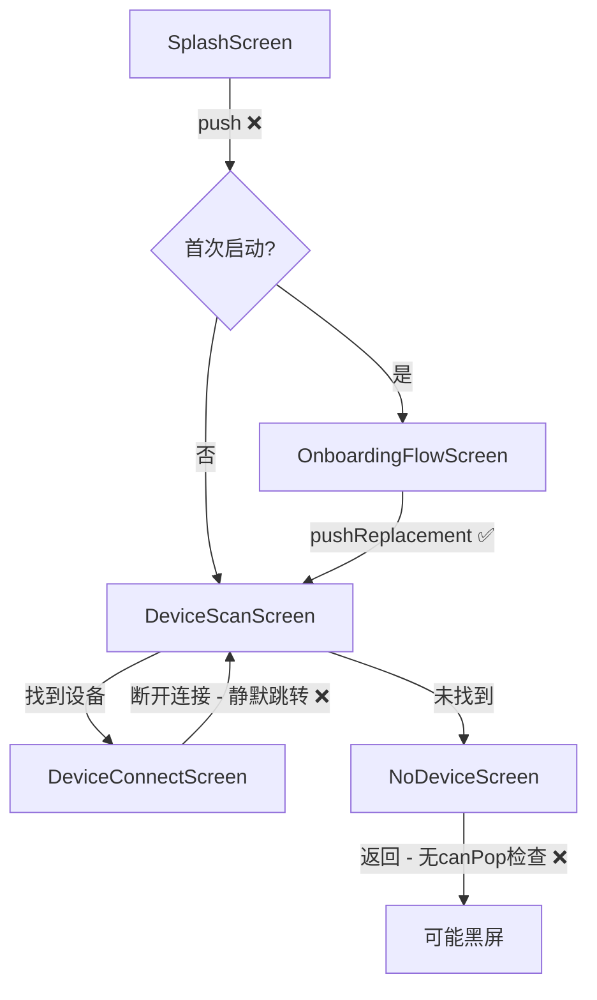
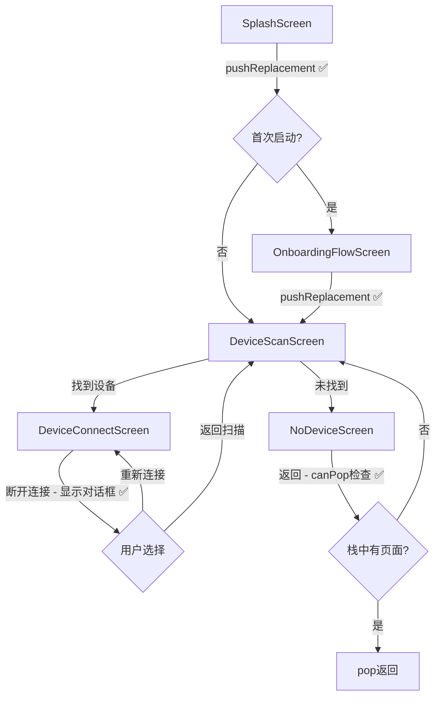
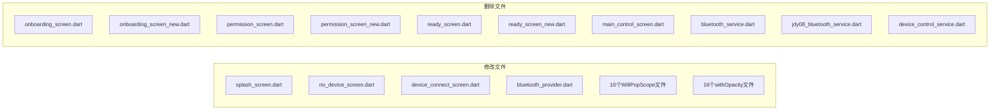

# 设计文档：RideWind APP 用户体验优化

## 概述

本设计文档描述 RideWind Flutter 蓝牙控制应用的用户体验优化方案。优化分为三个阶段：

1. **导航流程修复**：修复 SplashScreen 导航残留、NoDeviceScreen 安全返回、蓝牙断开提示、导航策略统一
2. **废弃 API 替换**：WillPopScope → PopScope、withOpacity() → withAlpha()
3. **冗余代码清理**：删除废弃页面文件和冗余服务文件

技术栈：Flutter 3.9.2 + Dart 3.0+、Provider 状态管理、flutter_blue_plus 蓝牙通信。

## 架构

### 当前导航流程



### 优化后导航流程



### 文件变更范围



## 组件与接口

### 1. SplashScreen 导航修复（需求 1, 4）

**文件**: `lib/screens/splash_screen.dart`

**变更**: 将 `_navigateToOnboarding()` 中的 `Navigator.of(context).push()` 替换为 `Navigator.of(context).pushReplacement()`。

```dart
// 修改前
Navigator.of(context).push(
  PageRouteBuilder(
    pageBuilder: (context, animation, secondaryAnimation) => targetScreen,
    transitionsBuilder: (context, animation, secondaryAnimation, child) {
      return FadeTransition(opacity: animation, child: child);
    },
    transitionDuration: const Duration(milliseconds: 500),
  ),
);

// 修改后
Navigator.of(context).pushReplacement(
  PageRouteBuilder(
    pageBuilder: (context, animation, secondaryAnimation) => targetScreen,
    transitionsBuilder: (context, animation, secondaryAnimation, child) {
      return FadeTransition(opacity: animation, child: child);
    },
    transitionDuration: const Duration(milliseconds: 500),
  ),
);
```

### 2. NoDeviceScreen 安全返回（需求 2）

**文件**: `lib/screens/no_device_screen.dart`

**变更**: 在 `_handleBackNavigation` 中添加 `canPop()` 检查。

```dart
Future<void> _handleBackNavigation(BuildContext context) async {
  debugPrint('🔙 未连接页面-返回按钮被点击');
  if (Navigator.of(context).canPop()) {
    Navigator.of(context).pop();
  } else {
    Navigator.of(context).pushReplacement(
      MaterialPageRoute(builder: (_) => const DeviceScanScreen()),
    );
  }
}
```

### 3. 蓝牙断开连接提示（需求 3）

**文件**: `lib/screens/device_connect_screen.dart`

**变更**: 替换当前的静默跳转逻辑，改为显示断开提示对话框。

当前逻辑（`_connectionSub` 监听器中）：
```dart
// 当前：静默跳转
if (!connected && mounted && !_navigatedOnDisconnect) {
  _saveDeviceSettings();
  _navigatedOnDisconnect = true;
  Navigator.of(context).pushReplacement(
    MaterialPageRoute(builder: (_) => const DeviceScanScreen()),
  );
}
```

优化后逻辑：
```dart
if (!connected && mounted && !_navigatedOnDisconnect) {
  _saveDeviceSettings();
  _navigatedOnDisconnect = true;
  _showDisconnectDialog();
}
```


**新增方法 `_showDisconnectDialog()`**：

```dart
void _showDisconnectDialog() {
  showDialog(
    context: context,
    barrierDismissible: false,
    builder: (dialogContext) => AlertDialog(
      backgroundColor: Colors.grey[900],
      shape: RoundedRectangleBorder(borderRadius: BorderRadius.circular(16)),
      title: const Row(
        children: [
          Icon(Icons.bluetooth_disabled, color: Colors.orange, size: 24),
          SizedBox(width: 8),
          Text('设备已断开', style: TextStyle(color: Colors.white, fontSize: 18)),
        ],
      ),
      content: const Text(
        '蓝牙连接已断开，请选择操作：',
        style: TextStyle(color: Colors.white70, fontSize: 14),
      ),
      actions: [
        TextButton(
          onPressed: () {
            Navigator.of(dialogContext).pop();
            Navigator.of(context).pushReplacement(
              MaterialPageRoute(builder: (_) => const DeviceScanScreen()),
            );
          },
          child: const Text('返回扫描', style: TextStyle(color: Colors.white54)),
        ),
        ElevatedButton(
          onPressed: () {
            Navigator.of(dialogContext).pop();
            _attemptReconnect();
          },
          style: ElevatedButton.styleFrom(backgroundColor: const Color(0xFF25C485)),
          child: const Text('重新连接'),
        ),
      ],
    ),
  );
}
```

**新增方法 `_attemptReconnect()`**：

```dart
Future<void> _attemptReconnect() async {
  final btProvider = Provider.of<BluetoothProvider>(context, listen: false);
  final device = widget.device; // DeviceConnectScreen 接收的设备参数
  
  final success = await btProvider.connectToDevice(device);
  if (mounted) {
    if (success) {
      _navigatedOnDisconnect = false; // 重置标志，允许再次检测断开
    } else {
      // 重连失败，显示失败提示并提供返回扫描选项
      _showReconnectFailedDialog();
    }
  }
}
```

### 4. WillPopScope → PopScope 替换（需求 5）

**替换模式**：

```dart
// 修改前
WillPopScope(
  onWillPop: () => _onWillPop(context),
  child: Scaffold(...),
)

// 修改后
PopScope(
  canPop: false,
  onPopInvokedWithResult: (didPop, result) async {
    if (!didPop) {
      await _handleBackNavigation(context);
    }
  },
  child: Scaffold(...),
)
```

**涉及 10 个文件**，每个文件的替换逻辑相同：
1. 将 `WillPopScope` 替换为 `PopScope`
2. 移除 `onWillPop` 参数
3. 添加 `canPop: false` 参数
4. 添加 `onPopInvokedWithResult` 回调，调用原有的返回处理方法
5. 移除不再需要的 `_onWillPop` 方法（返回 `Future<bool>` 的包装方法）

**特殊情况**：
- `audio_test_screen.dart` 和 `rgb_color_screen.dart` 的 `_onWillPop` 直接返回 bool，需要提取实际逻辑到 `onPopInvokedWithResult` 中
- `cleaning_mode_screen.dart` 使用 `SafeArea` 而非 `Scaffold` 作为子组件

### 5. withOpacity() → withAlpha() 替换（需求 6）

**转换公式**：
```dart
// 修改前
color.withOpacity(x)

// 修改后
color.withAlpha((x * 255).round())

// 常用值速查表：
// withOpacity(0.1) → withAlpha(26)
// withOpacity(0.15) → withAlpha(38)
// withOpacity(0.2) → withAlpha(51)
// withOpacity(0.25) → withAlpha(64)
// withOpacity(0.3) → withAlpha(77)
// withOpacity(0.4) → withAlpha(102)
// withOpacity(0.5) → withAlpha(128)
// withOpacity(0.54) → withAlpha(138)
// withOpacity(0.6) → withAlpha(153)
// withOpacity(0.66) → withAlpha(168)
// withOpacity(0.7) → withAlpha(179)
// withOpacity(0.75) → withAlpha(191)
// withOpacity(0.8) → withAlpha(204)
// withOpacity(0.85) → withAlpha(217)
// withOpacity(0.9) → withAlpha(230)
// withOpacity(1.0) → withAlpha(255)
```

涉及 16+ 个文件，共 50+ 处替换。每处替换为纯机械性文本替换，不改变逻辑。

### 6. 废弃文件删除（需求 7, 8）

**删除前依赖检查**：

废弃页面文件的引用链（均为废弃文件之间的互相引用）：
- `welcome_screen.dart` → imports `onboarding_screen.dart`（welcome_screen 本身无人引用）
- `onboarding_screen.dart` → imports `permission_screen.dart`
- `permission_screen.dart` → imports `ready_screen.dart`
- `onboarding_screen_new.dart` → imports `ready_screen.dart`

这些文件形成一个封闭的引用链，不被任何活跃代码引用，可安全删除。

冗余服务文件：
- `bluetooth_service.dart` — 无活跃代码引用
- `jdy08_bluetooth_service.dart` — 无活跃代码引用
- `device_control_service.dart` — 无活跃代码引用

**删除顺序**：先删除引用链末端文件，再删除引用链起始文件，最后删除服务文件。

## 数据模型

本次优化不涉及数据模型变更。所有修改均为 UI 层和导航层的代码变更。

现有数据模型保持不变：
- `DeviceModel` — 设备信息模型
- `SpeedReport` — 速度报告模型
- `GuideModels` — 引导数据模型


## 正确性属性

*正确性属性是一种在系统所有有效执行中都应成立的特征或行为——本质上是关于系统应该做什么的形式化陈述。属性作为人类可读规范与机器可验证正确性保证之间的桥梁。*

本次优化主要涉及 UI 层导航修复和代码迁移，大部分验收标准属于特定示例测试或静态代码分析检查。经过分析，以下属性可通过属性基测试验证：

### Property 1: withOpacity 到 withAlpha 转换公式正确性

*For any* Color 对象和任意透明度值 x（0.0 到 1.0 之间），`color.withAlpha((x * 255).round())` 产生的 alpha 通道值应等于 `(x * 255).round()`，且与 `color.withOpacity(x).alpha` 的值一致。

**Validates: Requirements 6.2**

### Property 2: 废弃 API 零残留

*For any* 项目中的 Dart 源文件，文件内容不应包含 `WillPopScope` 字符串引用，也不应包含 `.withOpacity(` 方法调用。

**Validates: Requirements 5.1, 5.3, 6.1, 6.3**

### Property 3: 已删除文件零引用

*For any* 项目中的 Dart 源文件，文件内容不应包含对已删除文件（onboarding_screen.dart、onboarding_screen_new.dart、permission_screen.dart、permission_screen_new.dart、ready_screen.dart、ready_screen_new.dart、main_control_screen.dart、bluetooth_service.dart、jdy08_bluetooth_service.dart、device_control_service.dart）的 import 引用。

**Validates: Requirements 7.2, 8.2**

## 错误处理

### 导航错误处理

| 场景 | 处理方式 |
|------|---------|
| NoDeviceScreen 返回时栈为空 | 使用 pushReplacement 跳转到 DeviceScanScreen |
| 蓝牙意外断开 | 显示对话框，提供重连和返回扫描选项 |
| 重连失败 | 显示失败提示，保留返回扫描选项 |
| SplashScreen 跳转后用户按返回键 | pushReplacement 确保 SplashScreen 不在栈中，无法回退 |

### 文件删除错误处理

| 场景 | 处理方式 |
|------|---------|
| 删除文件后存在残留引用 | 编译时报错，需清理对应 import 语句 |
| welcome_screen.dart 引用了 onboarding_screen.dart | welcome_screen.dart 本身无人引用，属于废弃链的一部分，一并删除或保留（welcome_screen 不在删除列表中，但其引用的 onboarding_screen 将被删除，需同步清理 import） |

### API 替换错误处理

| 场景 | 处理方式 |
|------|---------|
| PopScope 回调签名不匹配 | 使用 `onPopInvokedWithResult` 而非已废弃的 `onPopInvoked` |
| withAlpha 参数超出 0-255 范围 | 使用 `.round().clamp(0, 255)` 确保值在有效范围内 |

## 测试策略

### 测试框架

- **单元测试**: `flutter_test`（Flutter 内置）
- **属性基测试**: 由于本项目为 Flutter/Dart 项目，使用 `glados` 包（Dart 的属性基测试库）
- **静态分析**: `dart analyze` 检查编译错误和废弃 API 警告

### 属性基测试

每个属性基测试运行至少 100 次迭代。

**Property 1 测试**:
- **Feature: ux-optimization, Property 1: withOpacity 到 withAlpha 转换公式正确性**
- 生成随机 Color 和随机透明度值 (0.0-1.0)
- 验证 `color.withAlpha((opacity * 255).round()).alpha == (opacity * 255).round()`

**Property 2 测试**:
- **Feature: ux-optimization, Property 2: 废弃 API 零残留**
- 遍历所有 Dart 源文件
- 验证无 `WillPopScope` 和 `.withOpacity(` 引用

**Property 3 测试**:
- **Feature: ux-optimization, Property 3: 已删除文件零引用**
- 遍历所有 Dart 源文件
- 验证无已删除文件的 import 引用

### 单元测试

| 测试项 | 验证内容 | 对应需求 |
|--------|---------|---------|
| SplashScreen 导航测试 | 验证使用 pushReplacement 跳转 | 1.1 |
| NoDeviceScreen 返回测试（栈非空） | 验证 canPop 为 true 时执行 pop | 2.1 |
| NoDeviceScreen 返回测试（栈为空） | 验证 canPop 为 false 时跳转 DeviceScanScreen | 2.2 |
| 蓝牙断开对话框测试 | 验证断开时显示对话框 | 3.1, 3.2 |
| 重连按钮测试 | 验证点击重连触发 connectToDevice | 3.3 |
| 返回扫描按钮测试 | 验证点击返回扫描跳转 DeviceScanScreen | 3.4 |
| 编译检查 | 验证删除文件后项目可正常编译 | 7.3, 8.3 |
